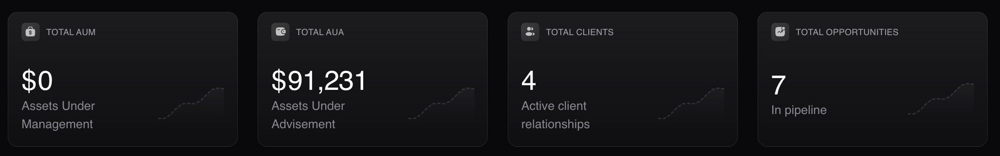
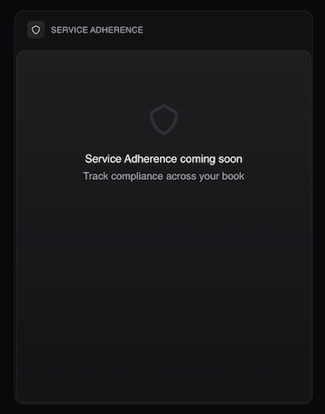
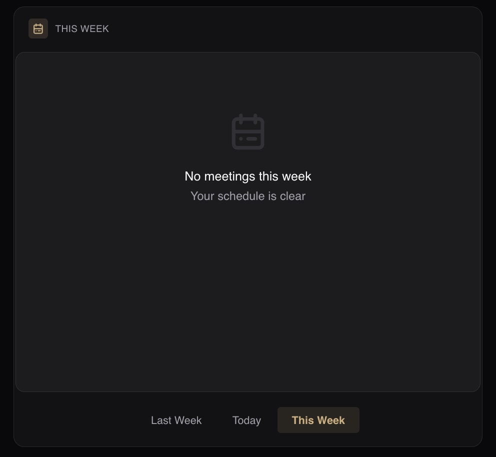
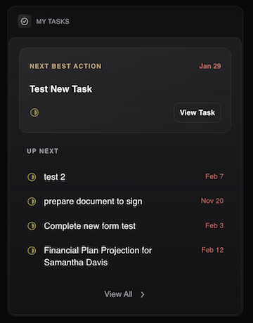
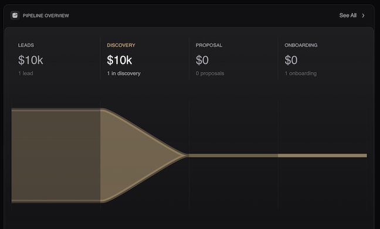
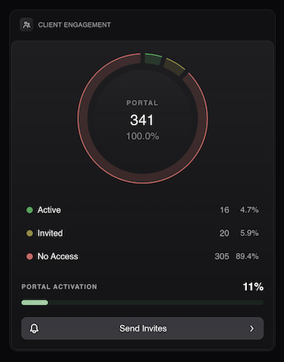
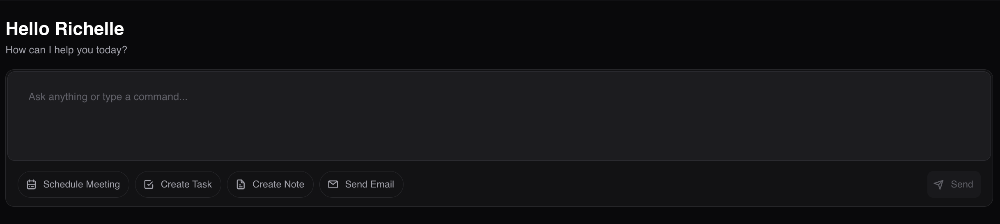

# Home Page

## Overview

The **Home Page** serves as the operational command center for your practice. It aggregates real-time data from across the platform — **CRM**, **Sales**, and **Operations** — into a single, interactive dashboard.

Unlike static reports, this dashboard is designed for immediate action. Whether you need to triage overdue tasks, forecast revenue using weighted pipeline data, or identify clients at risk of churn due to low engagement, the **Home Page** provides the necessary quick links to address these issues without navigating through complex sub-menus.

## Key Performance Indicators

The top banner provides a real-time financial snapshot of the firm. These cards serve as high-level health monitors and direct navigation points to your core databases.

* **Total AUM:** Assets Under Management. The aggregate value of all managed assets linked to households in the system.
* **Total AUA:** Assets Under Administration. The total value of assets tracked but held away (*e.g., 401k, external holdings*).
* **Total Active Clients:** The count of households or contacts currently marked with an **Active** status. This card redirects to the [**Contacts Page**](../contacts).
* **Total Opportunities:** The number of active deals currently sitting in your sales pipeline (*excluding Closed-Won or Closed-Lost*). This card redirects to the [**Opportunities Page**](../opportunities).

## Service Adherence

A compliance tool linked to your **Service Models** (*e.g., Gold, Silver, Bronze tiers*).

It automatically flags households that are "out of compliance" with their service tier requirements. For instance, if a Gold client requires 4 meetings a year but hasn't been seen in 6 months, they will appear here as a retention risk, allowing you to proactively schedule a check-in.

## Schedule

A comprehensive list of your scheduled client interactions. Unlike a standard calendar grid, this widget presents a streamlined agenda view synced with your connected Outlook or Google Calendar. For full calendar management settings, refer to the [**Meetings Page**](../meetings).

**Views:**
* **Last Week:** Critical for ensuring you completed follow-up tasks or meeting notes for past appointments.
* **Today:** Your immediate agenda.
* **This Week:** A look-ahead to help balance your workload.

Clicking any **Meeting Nam**e opens the agenda view, allows you to launch the video call (Zoom/Teams), or mark the interaction as complete.

## My Tasks

A personalized feed of action items assigned to you. It displays only the **Task Name** alongside its corresponding **Date**. The list is ordered based on recent dates. You need to click on the **Task** to view the details and mark it as complete. To perform bulk edits or reassign tasks to team members, click the **View All** button in the widget header to open the full [**Tasks Page**](../tasks).

## Pipeline Overview

A visual funnel chart representing the health of your sales process. Click the **See All** button to open the [**Opportunities Page**](../opportunities) for detailed pipeline management, including **Gross** vs **Adjusted Revenue** toggles.

## Client Engagement

A visual breakdown (Pie Chart) of Client Portal adoption rates. This widget tracks how many of your clients are digitally connected to your firm.

**Statuses:**
* **Active:** Clients who have logged in and are utilizing the portal.
* **Invited:** Clients sent a link who haven't registered yet.
* **No Access:** Clients who have never been invited.

Clicking the **Send Invites** button redirects to the **Portal Access Page**, where you can bulk-send invitations or troubleshoot login issues.

## Super Advisor AI Assistant

The **AI Assistant** is embedded directly into the **Home Page** to provide a "No-Click" alternative to navigation. Instead of manually clicking through menus to create tasks or log notes, you simply speak or type naturally.

**Capabilities:**
* **Multi-Tasking:** A single command can create a task, log a note, and draft an email simultaneously.
* **Smart Scheduling:** The AI handles timezone math and calendar scanning.

For advanced commands and setup instructions, please refer to [**AI Assistant**](../super-mode#ai-assistant).