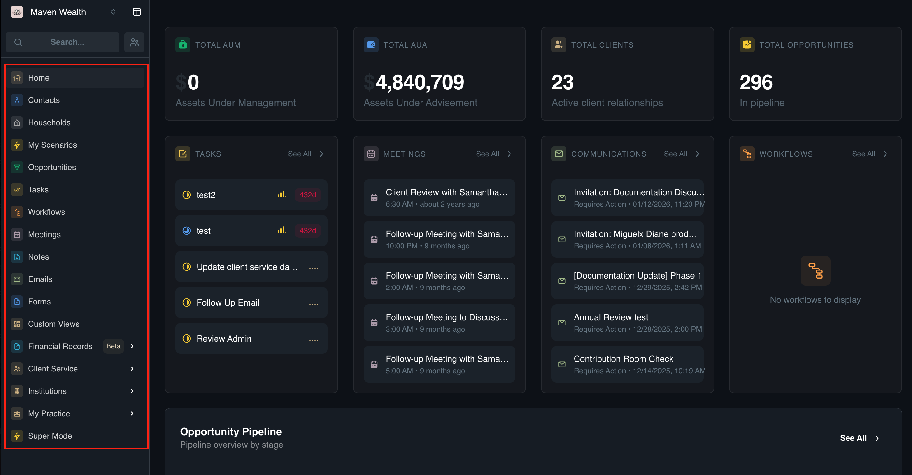
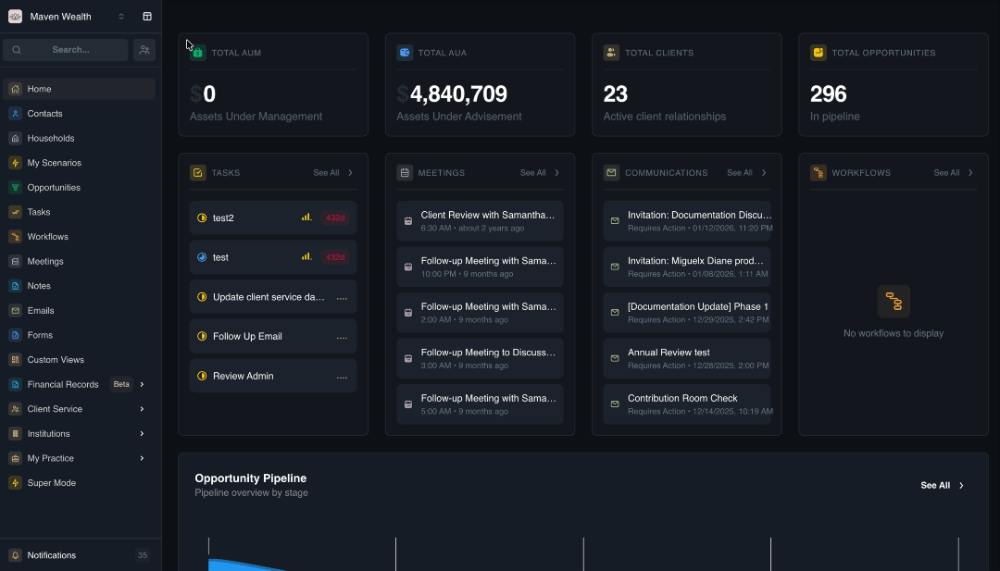
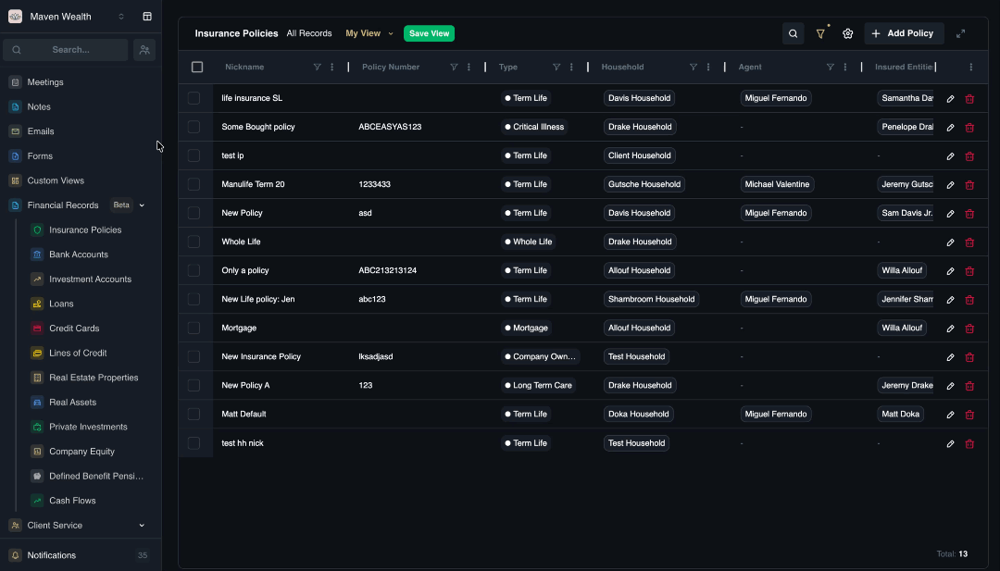

# Navigating SuperAdvisor

## Overview 

Mastering the **SuperAdvisor** interface is essential for efficiency. The platform is designed with a hierarchy that allows you to manage broad practice operations while quickly drilling down into specific client details. 

This guide covers the three pillars of platform navigation:
* [**Sidebar Menu:**](#sidebar-menu) Your primary tool for accessing modules and navigating to deep management pages.
* [**Global Search:**](#global-search) A feature enabling the instant retrieval of records, such as clients or notes, from anywhere in the platform.

## Sidebar Menu

**Overview** 

The **Sidebar Menu** is your primary navigation rail, located on the left-hand side of the screen. It organizes the platform’s modules into logical workflows, moving from client relationships to daily operations and practice settings.

* **Dashboard & Activity:** Click **Home** to access the **Executive Summary Metric**s and your **Daily Activity Stream**, which aggregates tasks, meetings, and communications.
* **SuperMode:** Click **SuperMode** to enter the high-velocity multitasking interface where you can utilize the AI Assistant and manage multiple tabs simultaneously.
* **Client Management:** Click [**Contacts**](../contacts/#) and [**Households**](../households/#) to manage your "Golden Record" of relationships, accessing detailed profiles, family hierarchies, and entity structures.
* **Sales & Pipeline:** Click [**Opportunities**](../opportunities) to view your sales funnel, tracking deal stages from "Lead" to "Onboarding" alongside revenue forecasts.
* **Work Management:** Click [**Workflows**](../workflows), [**Tasks**](../tasks), and [**Meetings**](../meetings/#) to manage operational processes, tracking standardized checklists, individual to-dos, and your calendar events.
* **Client Service:** Click **Client Service** to access the **KYC Updates** sub-page, where you can track and manage regulatory "Know Your Client" reviews across all households.
* **Records & Communications:** Click **Notes** and [**Emails**](../emails) to review comprehensive communication history, including internal memos, client emails, and team assignments.
* **Financial Records:** Click [**Financial Records**](../financial-records/#) to access a business-wide, spreadsheet-style view of all client assets for aggregate analysis beyond individual profiles.
* **Custom Views:** Click [**Custom Views**](../custom-views) to personalize your interface, creating tailored, saved lists of Contacts and Households that surface specific information exactly when you need it.
* **Institutions:** Click **Institutions** to manage your firm's external relationships with carriers, MGAs, insurance companies, investment firms, and banks.
* **My Practice:** Click [**My Practice**](../my-practice/#) to configure your firm's administrative hub, including Products, Service Models, Custom Fields, and Team permissions.

## Global Search

**Overview**

For immediate access to specific data points without clicking through multiple menus, SuperAdvisor creates a searchable index of your entire practice. This feature allows you to find contacts, households, and notes instantly across the business.

### Search by Keyword

Use this function to locate specific records or specific details buried within notes.

**Steps**

1. Click the **Search Bar** located at the top of the Sidebar Menu to activate the tool.
2. Type the name of a **Client**, **Household**, **Task**, **Meeting**, or **Opportunity**, or enter a specific keyword found in a **Note**.
3. Click the specific result from the list to view the item immediately.

### Navigation Commands
Use this function to jump instantly to main module pages using the command dropdown.

**Steps**

1. Click the **Search Bar** located at the top of the Sidebar Menu to activate the tool.
2. Scroll through the list and select a command, such as **View All Contacts**, **Go to Dashboard**, **View All Workflows**, or **View All Emails**, etc.
3. Click the command to jump instantly to that specific module page.

