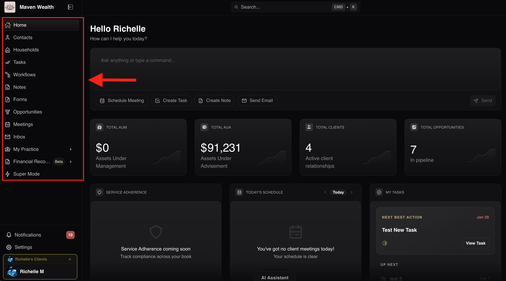
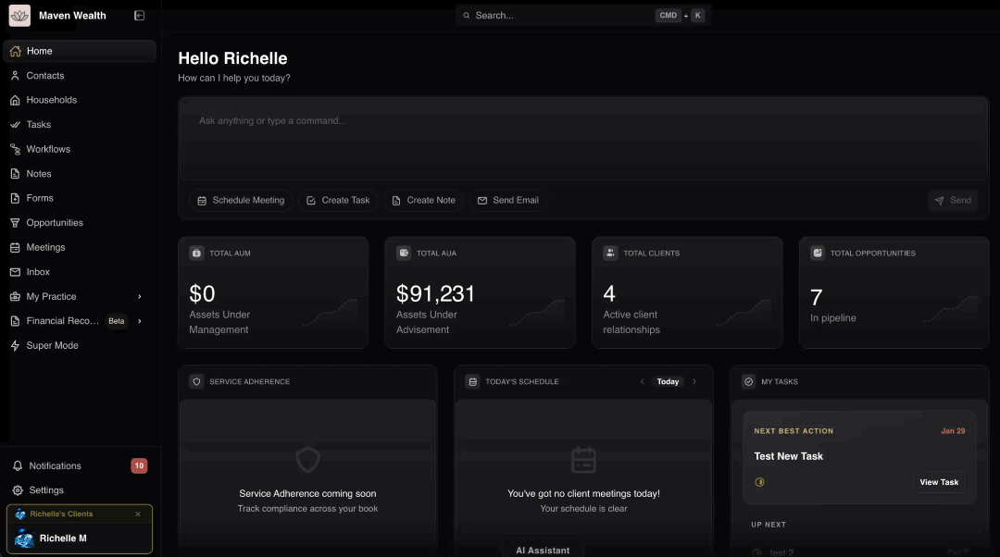
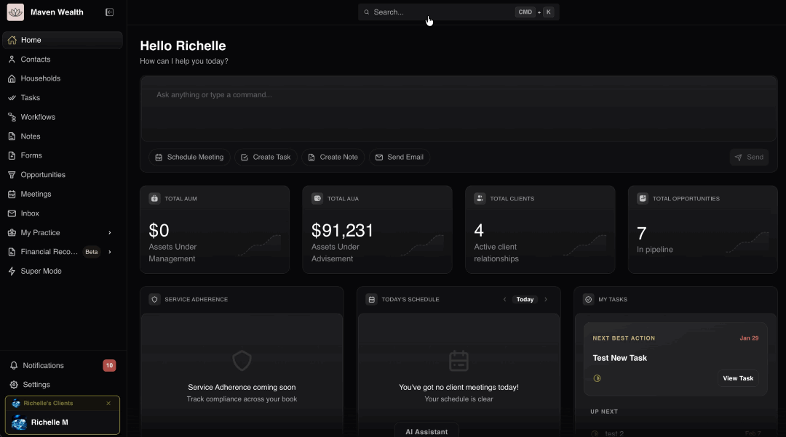
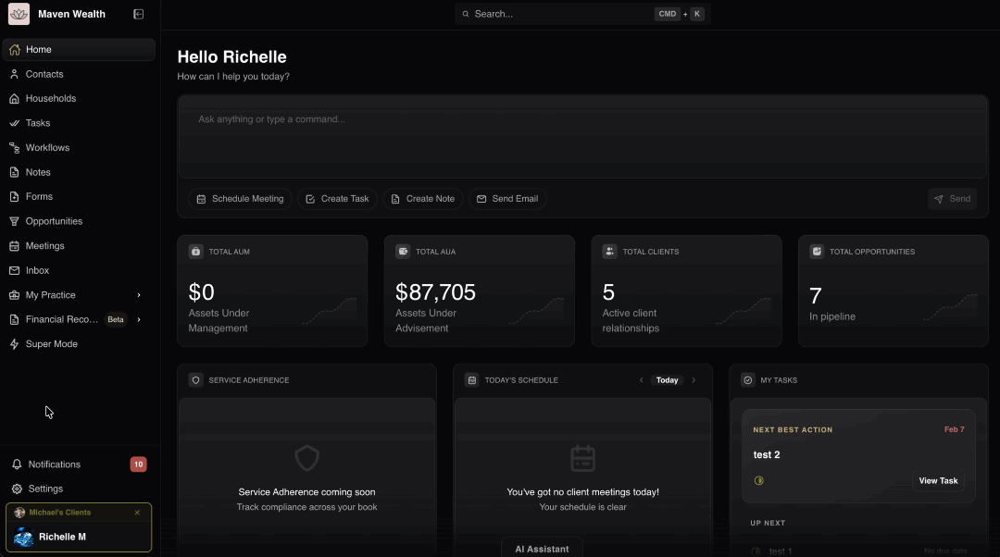

# Navigating Super Advisor

## Overview 

Mastering the **Super Advisor** interface is essential for efficiency. The platform is designed with a hierarchy that allows you to manage broad practice operations while quickly drilling down into specific client details. 

This guide covers the three pillars of platform navigation:
* [**Sidebar Menu:**](#sidebar-menu) Your primary tool for accessing modules and navigating to deep management pages.
* [**Global Search:**](#global-search) A feature enabling the instant retrieval of records, such as clients or notes, from anywhere in the platform.

## Sidebar Menu

**Overview**

The **Sidebar Menu** is your primary navigation rail, located on the left-hand side of the screen. It organizes the platform’s modules into logical workflows, moving from client relationships to daily operations and practice settings.

* **Dashboard & Activity:** Click [**Home**](../about/home) to access the **Executive Summary Metrics** and your **Daily Activity Stream**, which aggregates tasks, meetings, and communications.
* **Client Management:** Click [**Contacts**](../contacts/#) and [**Households**](../households/#) to manage your "Golden Record" of relationships, accessing detailed profiles, family hierarchies, and entity structures.
* **Work Management:** Click [**Tasks**](../tasks), [**Workflows**](../workflows), and [**Meetings**](../meetings/#) to manage operational processes, tracking standardized checklists, individual to-dos, and your calendar events.
* **Records & Communications:** Click [**Notes**](../notes) and [**Inbox**](../emails) to review comprehensive communication history, including internal memos, client emails, and team assignments.
* **Forms:** Click [**Forms**](../forms) to manage digital paperwork, data collection, and client questionnaires.
* **Sales & Pipeline:** Click [**Opportunities**](../opportunities) to view your sales funnel, tracking deal stages from "Lead" to "Onboarding" alongside revenue forecasts.
* **Client Service:** Expand this section to access [**Service Models**](../my-practice/service-models) and [**KYC Updates**](../my-practice/client-service), where you can track and manage regulatory "Know Your Client" reviews across all households.
* **Financial Records:** Expand this section to access individual record types including [**Insurance Policies**](../financial-records/pensions#insurance-policies), [**Bank Accounts**](../financial-records/assets#bank-accounts), [**Investment Accounts**](../financial-records/investments#investment-accounts), [**Loans**](../financial-records/liabilities#loans), [**Credit Cards**](../financial-records/liabilities#credit-cards), [**Lines of Credit**](../financial-records/liabilities#lines-of-credit), [**Real Estate Properties**](../financial-records/assets#real-estate-properties), [**Real Assets**](../financial-records/assets#real-assets), [**Private Investments**](../financial-records/investments#private-investments), [**Company Equity**](../financial-records/investments#company-equity), [**Defined Benefit Pensions**](../financial-records/pensions#defined-benefit-pensions), and [**Cash Flows**](../financial-records/pensions#cash-flows). Each record type links directly to its dedicated management page for aggregate analysis beyond individual household profiles.
* **My Practice:** Expand this section to configure your firm’s administrative hub, including [**Scenarios**](../my-scenarios), [**Carriers**](../my-practice/institutions#carriers), [**MGAs**](../my-practice/institutions#mgas-managing-general-agents), [**Products & Services**](../my-practice/products#products--services), [**Packages**](../my-practice/products#packages), [**Custom Fields**](../my-practice/custom-fields), **Manage Team**, **Manage Organization**, and **Data Sources**.
* **SuperMode:** Click [**SuperMode**](../super-mode) to enter the high-velocity multitasking interface where you can utilize the AI Assistant and manage multiple tabs simultaneously.

## Global Search

For immediate access to specific data points without clicking through multiple menus, **Super Advisor** creates a searchable index of your entire practice. This feature allows you to find contacts, households, and notes instantly across the business.

### Search by Keyword

Use this function to locate specific records or specific details buried within notes.

**Steps**

1. Click the **Search Bar** located at the top of any page to activate the tool.
2. Type the name of a *Client*, *Household*, *Task*, *Meeting*, *Opportunity*, or *Note*.
3. Filter the results (optional) by selecting a specific category type under the search bar (*e.g., Contact, Household, Task, Meeting, Note, or Opportunity*).
:::note NOTE
The available filter types displayed dynamically update based on your search results. For example, if your search term only yields results for Contacts and Households, only the Contact and Household types will be displayed as filter options.
:::
4. Click the specific result from the list to view the item immediately.
5. To clear an active filter, simply click the delete icon next to the selected filter type.

### Navigation Commands
Use this function to jump instantly to main module pages using the command dropdown.

**Steps**

1. Click the **Search Bar** located at the top of *any page* to activate the tool.
2. Scroll through the list and select a command, such as *View All Contacts*, *Go to Dashboard*, *View All Workflows*, or *View All Emails*, etc.
3. Click the command to jump instantly to that specific module page.

## Global Filters: The Primary Advisor View

For firms with multiple advisors or administrative support staff, Super Advisor features a powerful global filter that is accessible from anywhere in the platform—not just the Home Page. Whether you are viewing the main dashboard, navigating your Contacts list, or checking Opportunities, this tool allows you to instantly pivot the data you are viewing.

This feature is designed to help teams collaborate more effectively without getting overwhelmed by data. Advisors can use this filter to cut through firm-wide noise and focus strictly on their own tasks, meetings, and pipelines. Meanwhile, Admins and Support Staff can use it to "impersonate" an advisor's view, allowing support teams to step into an advisor's shoes to manage schedules or organize tasks without needing to log in and out of different accounts.

### How to Use the Global Filter

1. Locate your [**Profile Name**](../about/user-profile) at the bottom of the [**Sidebar**](#sidebar-menu) menu.
2. Click your name to open the user pop-up panel.
3. In the **Filter by Advisor** section, click the name of the specific advisor you wish to view.
4. The page you are currently on will automatically refresh. All relevant widgets, contact lists, and records will instantly repurpose themselves to show data exclusive to the selected individual.

