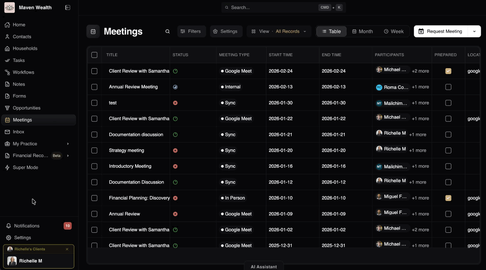
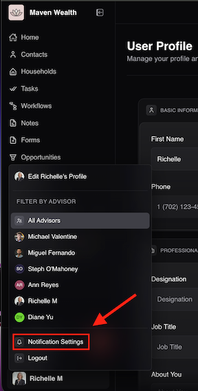
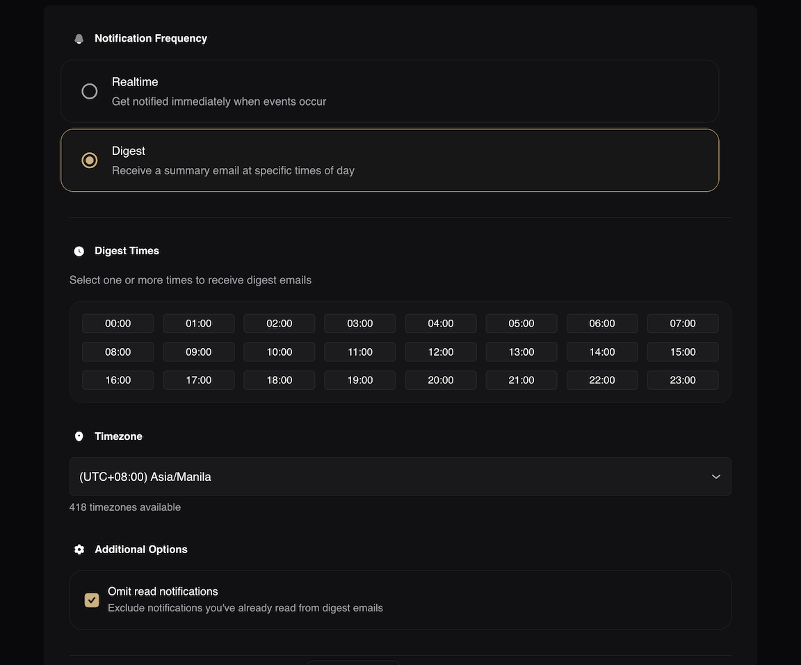
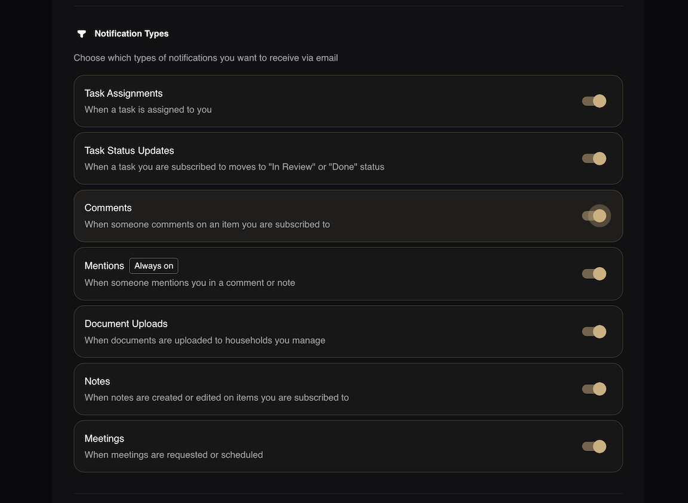

# Notifications 

## Understanding Notifications (Activity)

The **Notification Center** — often serving as your primary Activity feed—is the command post for advisor operations in Super Advisor. It automatically tracks and compiles critical updates regarding tasks, scheduled meetings, notes, and client interactions so that no important development slips through the cracks.

By centralizing these updates, the Activity feed ensures you maintain complete visibility over the households and contacts you manage, acting as a real-time pulse on your book of business.

### How to Access and Filter Notifications
You can access your activity feed directly through the global navigation bar to review updates without interrupting your current workflow.

1. Click the **Notifications** in the navigation bar.
2. A side pop-up will appear displaying a list of **All Notifications** (distinguished by **Read** and **Unread** statuses).
3. **Filter by Type:** Narrow down the list by selecting specific event categories:
    * Comment Created
    * Meeting Requested
    * Note Created
    * Note Edited
    * Task Assigned
    * User Mentioned
4. **Filter by Date:** Isolate notifications within specific timeframes:
    * **Years:** Last Year(2025), This Year(2026)
    * **Ranges:** 3M (Last 3 Months), 6M (Last 6 Months), or All.

## Notification Settings

To control how and when you receive external alerts (like emails) and define your subscription logic, you will need to configure your backend preferences. You can access this menu by clicking your **User Profile** icon and selecting **Notification Settings**.

### Configuring Notification Preferences
To manage your inbox and control how you receive external email alerts, configure your global notification preferences.

1. Navigate to the **Notification Settings** page.
2. Select your preferred **Notification Frequency**. Choosing the right frequency depends on your daily workflow:
    * **Realtime:** Select this to get notified immediately via email the exact moment an event occurs. 
        * *Use case: Ideal for solo advisors or those who rely on immediate updates to action high-priority items (e.g., responding the moment a client signs a form or a new lead comes in).*
    * **Digest:** Select this to receive a batched summary email at specific times of the day. 
        * *Use case: Ideal for advisors with high-volume practices who want to protect their focus time and minimize constant inbox distractions, reviewing all client activities during dedicated blocks of time.*
3. If you select **Digest**, configure your specific delivery settings:
    * **Digest Times:** Choose one or multiple specific times (e.g., 8:00 AM and 4:30 PM) to receive your summary.
    * **Timezone:** Select your local time from the available timezones to ensure the digest aligns perfectly with your working hours.
4. Set **Additional Options:** Check the **Omit read notifications** checkbox to exclude any items you have already viewed within the Super Advisor app, keeping your email digest strictly focused on unread updates.
5. Click **Save Settings** to apply your preferences.

### Selecting Notification Types
Customize specifically which events trigger an email notification.

1. Navigate to the **Notification Types** section within **Notification Settings**.
2. Toggle the following options on or off based on your preference:
    * **Task Assignments:** Alerts you when a task is assigned to you. 
        * *Use case: Keep this turned on to ensure you never miss a direct action item delegated to you by a team member or automated workflow.*
    * **Task Status Updates:** Alerts you when a task you are subscribed to moves to "In Review" or "Done" status.
        * *Use case: Ideal for monitoring the progress of tasks you’ve delegated to an assistant or junior advisor without having to constantly follow up.*
    * **Comments:** Alerts you when someone comments on an item you are subscribed to.
        * *Use case: Essential for collaborative teams discussing complex financial plans or troubleshooting issues directly within a task's activity feed.*
    * **Mentions:** Always on. Alerts you when someone explicitly mentions you in a comment or note. 
        * *Use case: This acts as a mandatory safety net, ensuring urgent questions or required approvals (@name) immediately flag your attention.*
    * **Document Uploads:** Alerts you when documents are uploaded to households you manage. 
        * *Use case: Crucial for advisors waiting on clients to securely submit required paperwork (like tax returns or statements) via the Client Portal, prompting you to take the next step.*
    * **Notes:** Alerts you when notes are created or edited on items you are subscribed to. 
        * *Use case: Keep this active if you manage shared clients and need real-time awareness of phone calls or meeting summaries logged by other team members.*
    * **Meetings:** Alerts you when meetings are requested or scheduled. 
        * *Use case: Ensures you are instantly aware when a client uses your scheduling link, allowing you to prepare the necessary meeting materials ahead of time.*

### Managing Auto-Subscribe Filters
Control the logic for which contacts or households automatically subscribe you to their activity streams. This setting prevents alert fatigue by ensuring you only follow relevant accounts automatically.

1. Navigate to the **Auto-Subscribe Filter** section.
2. Select one or multiple criteria for automatic subscription:
    * **All contacts:** Auto-subscribes you to activity for any contact/household in the entire organization.
        * *Use case: Ideal for solo practitioners, managing partners, or compliance officers who need complete oversight of every client interaction across the firm.*
    * **Contacts where I am Primary Advisor:** Auto-subscribes you only when you are listed as the Primary Advisor.
        * *Use case: Perfect for advisors in a multi-advisor firm who only want to track their specific book of business without getting overwhelmed by other advisors' client alerts.*
    * **Contacts for specific Primary Advisors:** Auto-subscribes you when the contact belongs to a specific advisor you select (useful for support staff).
        * *Use case: Essential for administrative support staff, paraplanners, or junior advisors who need to monitor the activity streams of the specific senior advisors they support.*
    * **Contacts with no Primary Advisor:** Auto-subscribes you to unassigned contacts.
        * *Use case: Great for business development managers or firm admins who need to track new inbound leads or prospects that haven't been routed to a specific advisor yet.*

:::note NOTE         
These settings control automatic subscriptions. You can still manually subscribe or unsubscribe to any specific entity (Task, Note, etc.) at any time.
:::