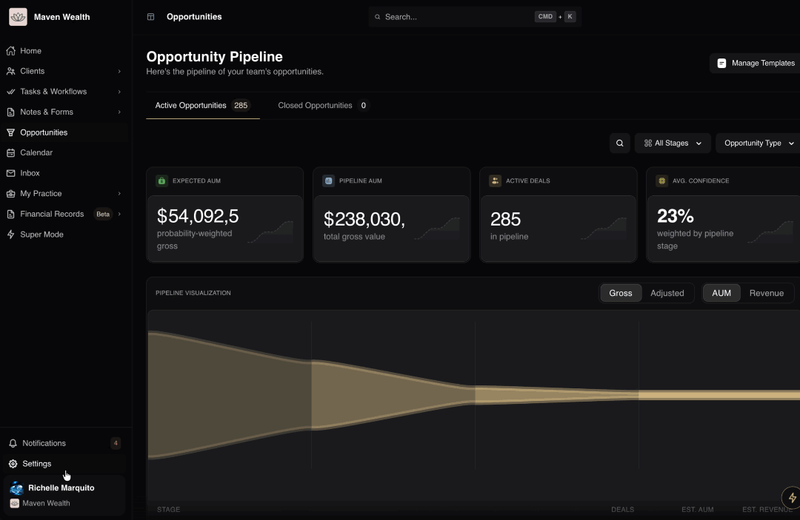
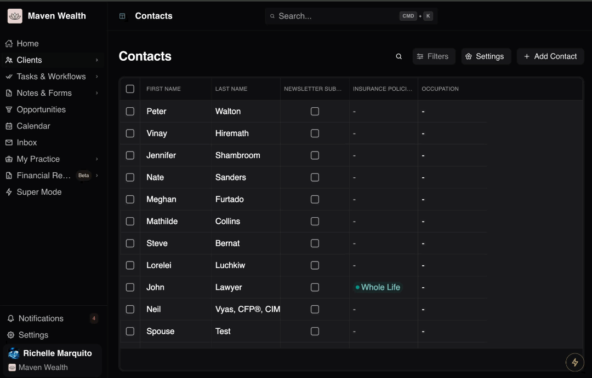
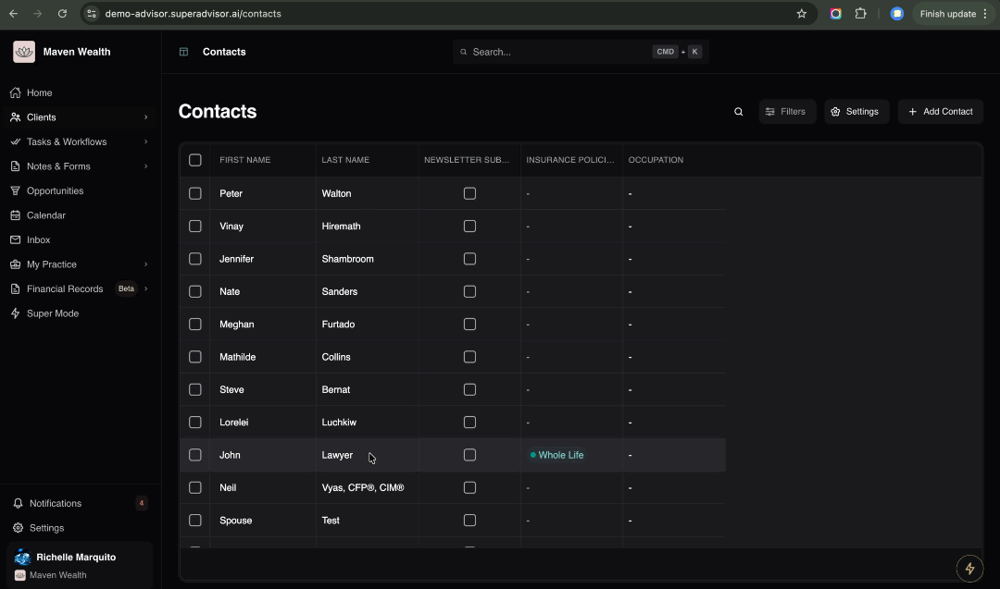

# Platform Settings

## Overview

The **Settings** menu allows you to tailor the **SuperAdvisor** interface to your personal preferences and workflow requirements. Whether you need to reduce eye strain, view more data rows at once, or focus without distractions, you can configure these options globally for your session.

## Light/Dark Mode

Adjust the platform's color palette to match your lighting environment or reduce eye strain during evening work.

### How to Switch Theme

1. Click your **Profile Name** at the bottom of the navigation sidebar.
2. Select **Settings** from the menu.
3. In the **Settings** pop-up, locate the **Mode** section.
4. Select your preferred option:
* **Light Mode:** Best for bright environments and high contrast (Default).
* **Dark Mode:** Best for low-light conditions and reducing glare.

## Text Size

Control the data density globally across the platform. This determines how much information appears on your screen at once, which is useful for general viewing when you need to see more content without scrolling.

### How to Adjust the Text Size

1. Click your **Profile Name** at the bottom of the navigation sidebar.
2. Select **Settings** from the menu.
3. In the **Settings** pop-up, locate the **Text Size** controls section.
* **Sm (Small):** Maximizes data density. Choose this to see the most rows and columns on the screen at once.
* **Md (Medium):** A balanced view for standard navigation.
* **Lg (Large):** Increases font size for better readability and accessibility.

## Beta Features

Grant access to experimental tools and early-release updates that are still in development.

### How to Enable Beta Features

1. Click your **Profile Name** at the bottom of the navigation sidebar.
2. Select **Settings** from the menu.
3. In the **Settings** pop-up, toggle the Beta Features switch to **On**.

:::note NOTE
Beta features may change frequently and are intended for testing new capabilities before they are widely released.
:::

## Full Screen

Expand the platform to fill your entire monitor, hiding browser tabs and bookmarks to create a distraction-free environment for presentations or deep work.

### How to Enable Full Screen

1. Click your **Profile Name** at the bottom of the navigation sidebar.
2. Select **Settings** from the menu.
3. In the **Settings** pop-up, click the **Full Screen** button.
:::note NOTE 
Press **Esc** on your keyboard or toggle the setting off in the menu to return to normal browser view.
:::

