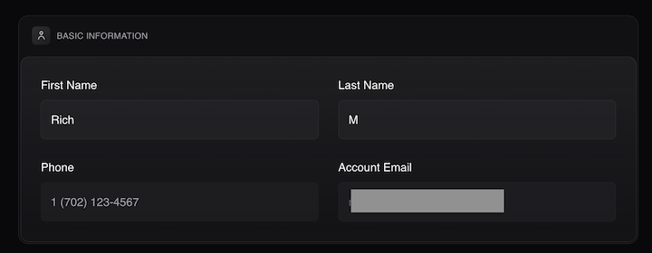
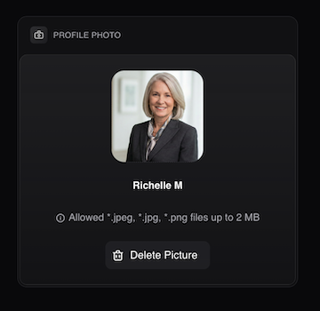
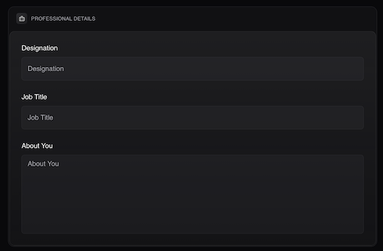
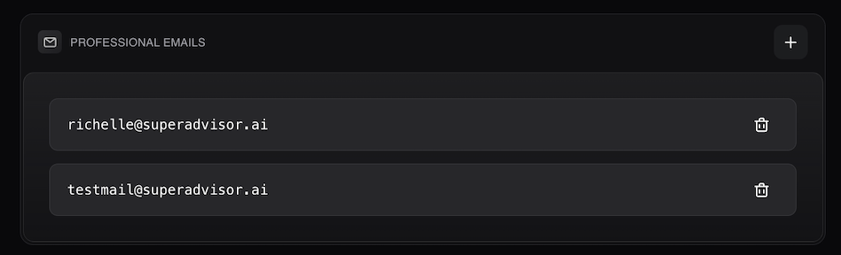
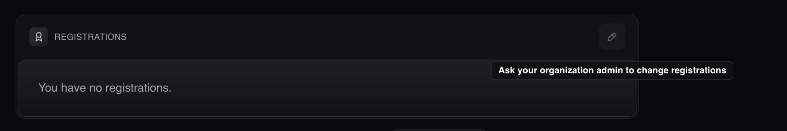

# User Profile

## Overview

THe **User Profile** acts as your central identity hub within the **Super Advisor** platform. It is not merely a settings page; it directly controls your professional presentation to clients and colleagues. The details you configure here populate your "digital business card" within the Client Portal, determine how you appear in meeting invitations, and ensure that your communications are accurately tracked across the system.

## Accessing Your Profile

1. Locate your **Name** in the bottom of the navigation menu.
2. Click on your name to open the user menu.
3. Select **Edit** to enter the profile configuration page.

## Profile Configuration Sections

### Basic Information

This section houses your core personal and contact data. Ensuring this is accurate guarantees that the platform's automated communications reach the correct destinations.

1. Navigate to the **Basic Information** section.
2. Click into the **First Name** and **Last Name** fields to update your legal or preferred professional name.
3. View your primary **Account Email**. 
:::note NOTE
This field is read-only and cannot be edited directly from this tab, as it is tied to your underlying login credentials.
:::
4. Input or update your direct **Phone** number where clients and team members can reliably reach you.
5. Click **Save Changes** to update.

### Profile Photo

Your profile photo is the primary visual identifier used throughout the platform, appearing in client chats, internal team task assignments, and the header of your dashboard.

1. Navigate to the **Profile Photo** section.
2. Click the **Upload Photo** placeholder to open the file uploader.
2. Make sure to follow the image specifications before uploading:
    * **File Formats:** *.jpeg, *.jpg, or *.png
    * **Size Limit:** Maximum 2 MB
:::tip TIP 
Use a high-resolution professional headshot to maintain trust and brand consistency with your clients.
:::

### Professional Details

This section houses your core personal and professional data. 

1. Go to the **Professional Details** section.
2. Enter your **Designation** (e.g., CFP®, CFA®) to highlight your formal certifications.
3. Enter your **Job Title** (e.g., Senior Wealth Advisor) to establish your role and expertise within the firm.
4. Complete the **About You** field with a professional biography. This text is often displayed to new clients during onboarding, providing a personal touch to your digital presence.
5. Click **Save Changes** to update.

### Professional Emails

This section manages the email identities associated with your account. **Super Advisor** uses these addresses to sync your calendar events, track email history, and identify you in third-party integrations (like Zoom).

1. Go to the **Professional Emails** section.
2. Review the list of currently active email addresses tied to your account.
3. Add any additional email addresses you operate with, such as aliases or distinct professional domains.

:::note NOTE
These emails serve as the "keys" for your integration connections (like Zoom). Listing all active addresses here ensures meetings and emails are properly attributed to you.
:::

### Registrations

This section tracks your underlying account access and security credentials.

1. Navigate to the **Registrations** tab.
2. Review your current registration status. If your account does not have specific registrations configured, this area will display: "You have no registrations."
:::note IMPORTANT
Registration settings are controlled at the firm level and are read-only for standard users. If you attempt to edit and receive a message stating "Ask your organization admin to change registrations," you must contact your firm's administrator to update your login attributes or access levels.
:::
