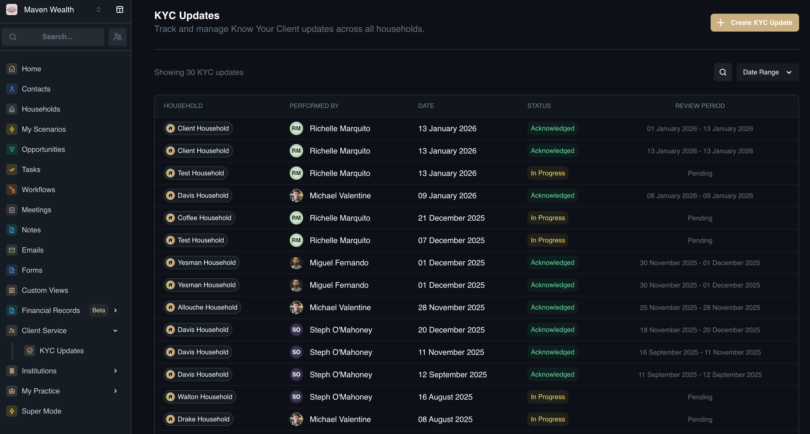
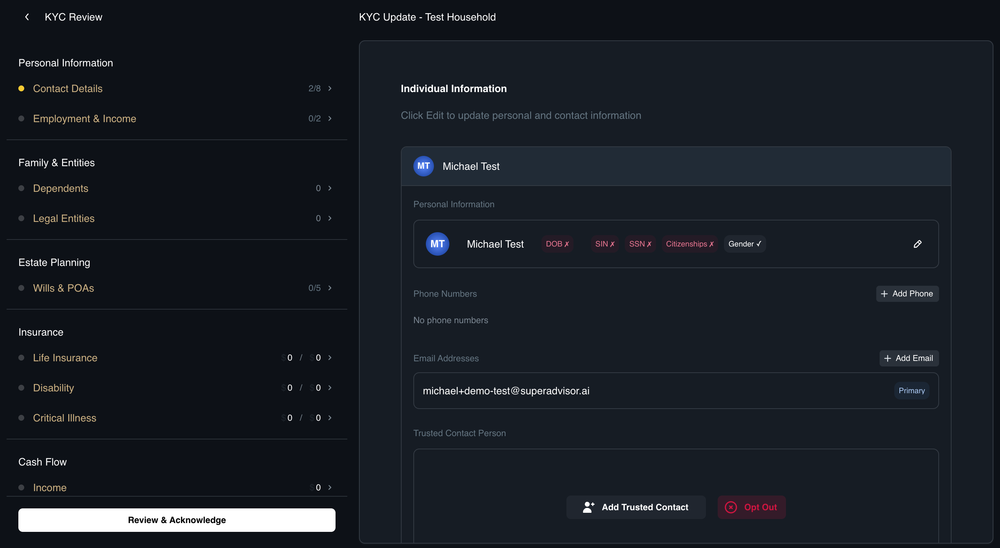
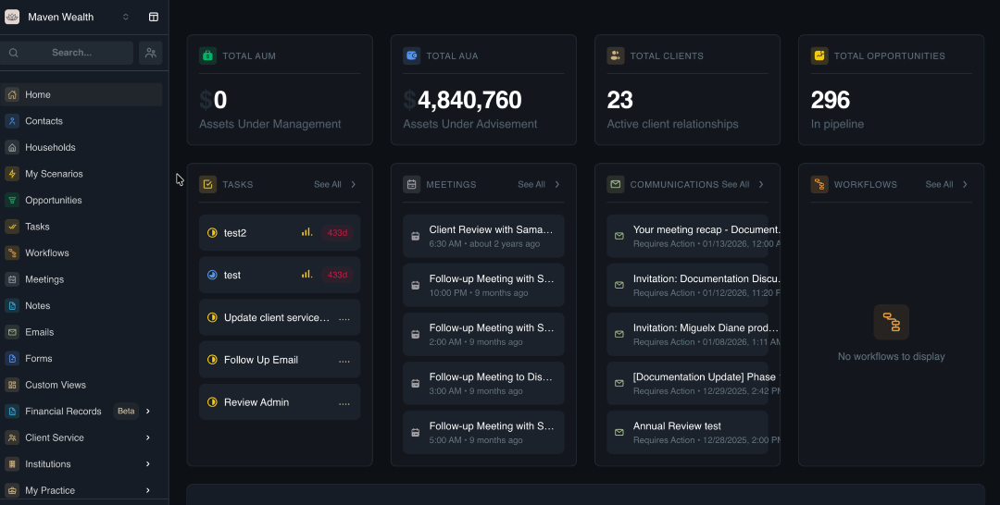
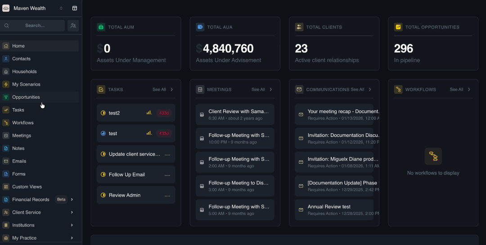

# KYC Updates

## Overview

The **KYC (Know Your Client) Updates** module is an essential compliance tool for tracking, managing, and auditing client reviews across your entire business portfolio. Accessible via Client Service > KYC Updates in the side navigation, this centralized dashboard ensures your firm maintains current client information in line with regulatory standards.

This module acts as the compliance "Command Center," enabling you to initiate and monitor reviews, while detailed data entry is conducted within specific Household records.

### The KYC Updates Dashboard

The main dashboard offers a comprehensive view of all compliance activities, ensuring no client review is overlooked.

**KYC Updates Columns**

* **Household:** The client family unit linked to the review.
* **Performed By:** The advisor responsible for the update.
* **Date:** The date the update was created.
* **Status:** The current workflow state (*e.g., In Progress, Acknowledged*).
* **Review Period:** The review workflow duration, from Start Date to Completion Date (timestamped when the Acknowledge KYC Review button is clicked).

**Management Tools**

* **Search:** Quickly find a specific household or advisor using the search bar.
* **Date Range Filter:** Filter reviews by specific quarter, year, or audit period.
* **Direct Navigation:** Click any row to access the specific Household's record, landing on their "KYC Updates" tab for detailed work.

## The KYC Review Page

This page provides a categorized overview of the client's financial and personal profile for a thorough review.

### How to Access the KYC Review page

1. From the sidebar, click on the **Client Service**, then **KYC Updates**.
2. Click the **KYC Update** item from the dashboard page.
3. Alternatively, go to the individual household structure and locate the **Client Service**, then **KYC Updates**.

### Review Categories

The page is organized into sections with relevant sub-modules:

* **Personal Information:** Contact Details, Employment & Income.
* **Family & Entities:** Dependents & Legal Entities.
* **Estate Planning:** Wills & Power of Attorneys (POAs).
* **Insurance:** Life Insurance, Disability, Critical Illness.
* **Cash Flow:** Income, Expenses.
* **Assets:** Bank Accounts, Company Equity, Defined Benefit Pensions, Investment Accounts, Private Investments, Real Assets, Real Estate Properties.
* **Liabilities:** Credit Cards, Lines of Credit, Loans.

### How to Navigate & Update

1. Hover over any category card to see a summary list of items within that section (e.g., "3 Investment Accounts"), helping identify areas needing attention.
2. Click any category to open the corresponding page for direct data editing.

## The KYC Workflow

The KYC process follows a structured lifecycle to ensure data integrity:

* **Initiation:** A new review is triggered from the central **Client Service** hub.
* **Execution:** The advisor verifies accuracy and updates data across Review Page categories (Assets, Personal Info, etc.).
* **Completion:** The review is finalized by acknowledging updates, and locking the record for future updates.

### Initiating a New KYC Update

1. Select **Client Service**, then **KYC Updates** from the side navigation.
2. Select the **Create KYC Update** button in the top right corner.
3. Search for and select the target Household in the modal.
4. Click **Create Update**.
5. A new record with "In Progress" status is created.
6. Click on the item to redirecting you to the Household's **KYC Review** page for data entry.

### Completing a Review
1. Click a **KYC Update** item  with "In Progress" status from the dashboard.
2. You will be redirected to the **KYC Review** page.
3. Hover over sections like **Assets** or **Personal Information** to see item counts and click to make updates.
4. Note material changes in the KYC Update form (e.g., "Client retired, income source changed to Pension").
5. Click the **Review & Acknowledge** button on the review page.
6. Ensure the **Review Period** is correct and review the household information changes that occurred during this period.
7. Check the **Recent Updates to Household Information**.
8. Review the **Acknowledgement** items.
9. Click the **Acknowledge KYC Review** button.
10. Status changes to **Acknowledged**, with the current date stamped as the "Date of Completion."

:::note NOTE
Only one active compliance workflow per household is allowed to prevent conflicting data versions. 
:::