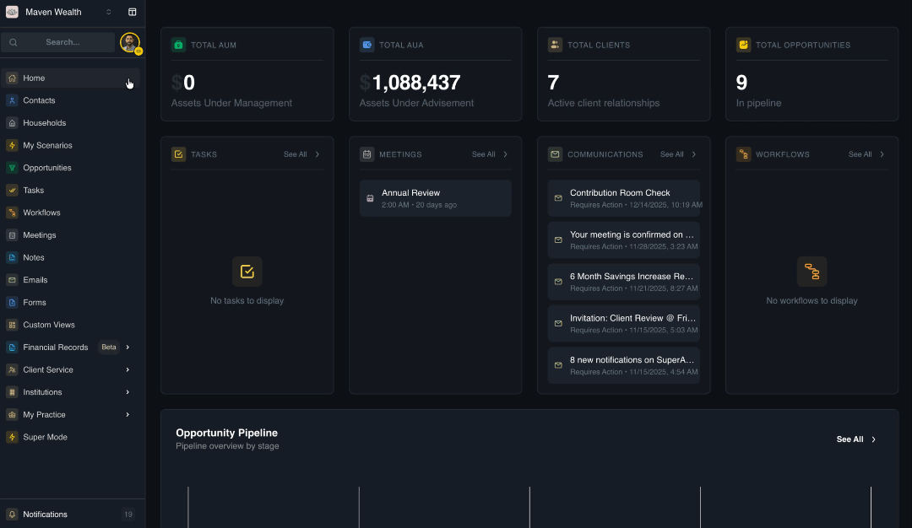
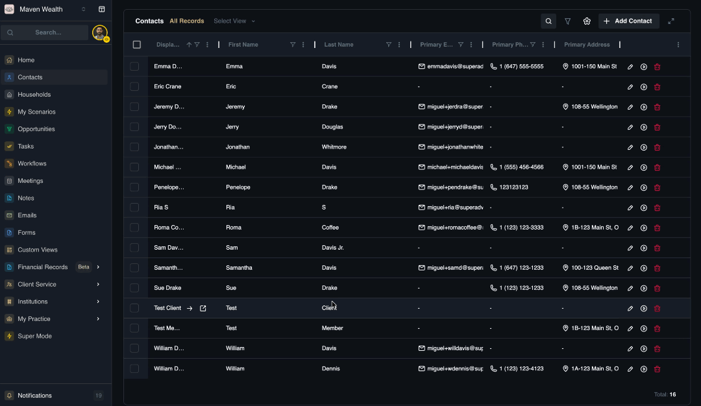

# Contact Management

These operational tools allow you to find specific records, initiate processes, or manage the database structure.

## How to Search and Filter Records

**Option 1: Global Search (Known Contact)**

*Use this when you know the exact name of the person you are looking for.*

1. Click the **Global Search** bar at the top-left of the screen.
2. Type the contact's *Name*.
3. Select the correct result to jump directly to their profile.

**Option 2: List Search (Filtering)**

*Use this when you want to filter your current view to see a subset of people.*

1. Navigate to the **Contacts** page.
2. Locate the **Search Bar** directly above the data table.
3. Type a *Name* or keyword to filter the current list instantly.
4. Click the **Navigate to record** icon to view their details.

## How to Add a New Contact

Use this feature to create a new "Golden Record."

**Prerequisites**

    * Ensure you have the contact's basic identity information (Legal Name) and at least one communication method.

**Steps**

1. Navigate to the **Contacts** dashboard.
2. Click the **Add Contact** button.
3. **Section 1: Contact Details**
    * Select the **Type** (e.g., *Lead, Client*).
    * Enter the **Identity** details: First Name, Last Name.
    * Select the **Gender** and input **Tax IDs**.
4. **Section 2: Opportunity**
    * Select the **Discovery Method** and **Source**.
    * Choose an **Opportunity Template** (e.g., *Onboarding*).
5. **Section 3: Contact Information**
    * Enter the **Primary Email** and **Phone Number**.
6. **Section 4: Advisor Assignment**
    * Select a **Primary Advisor**.
7. **Section 5: Address & Compliance**
    * Enter the **Address Information** and select **Jurisdictions**.
8. Click **Save**.

:::note NOTE
You will be returned to the list view; search for the name you recently added to open their profile.
:::

### Launching Workflows from Contacts

Workflows can be triggered directly from the Contacts dashboard or an individual profile to automate follow-up tasks. For step-by-step instructions, see How to Launch a Workflow in the Workflows module.