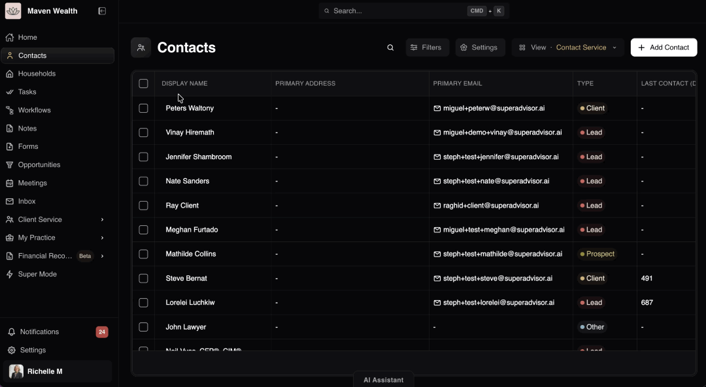
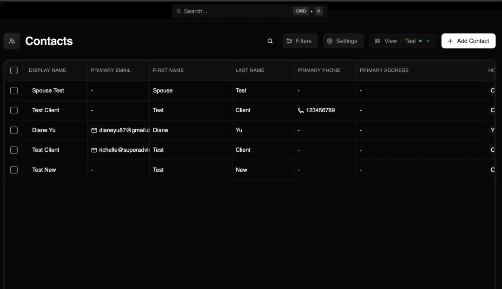
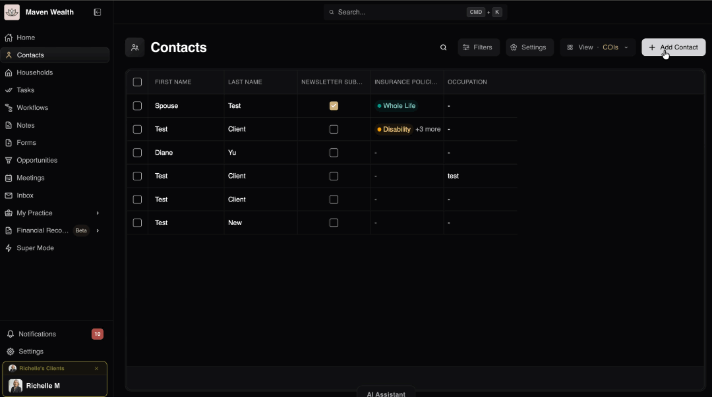

# Contact Management

These operational tools allow you to find specific records, initiate processes, or manage the database structure.

## Using the Bottom Action Toolbar

The platform utilizes a fast, checkbox-driven workflow for managing records instead of horizontal scrolling.

1. Select single or multiple contacts using the checkboxes located on the left-hand side of the table.
2. Selecting these checkboxes automatically triggers a bottom action toolbar to appear.
3. From this toolbar, you can easily execute bulk actions including: **Edit**, **Delete**, **Merge**, and **Launch Workflow**.

### Using the Global Search (Known Contact)

*Use this when you know the exact name of the person you are looking for.*

1. Click the **Global Search** bar at the top-left of the screen.
2. Type the contact's *Name*.
3. Select the correct result to jump directly to their profile.

## How to Add a New Contact

Use this feature to create a new "Golden Record."

1. Navigate to the **Contacts** dashboard.
2. Click the **Add Contact** button.
3. **Contact Details:** Enter the personal information for this contact.
    * Select the **Type** (*e.g., Lead, Client*).
    * Enter the identity details: **First Name** (Required), **Middle Name**, and **Last Name** (Required).
    * Enter the **Preferred Name** and **Short Name** (Optional).
    * Select the **Gender**.
    * Input Tax IDs: **Social Insurance Number** or **Social Security Number**.
4. **Opportunity:** Specify how this lead was discovered and assign it to an opportunity pipeline.
    * Select the **Discovery Method** and **Source**.
    * Choose an **Opportunity Template** (Optional).
5. **Contact Information:** Add email and phone number details.
    * Enter the **Email**.
    * Select the **Country Code** and enter the **Phone Number**.
    * Select the **Phone Type** and enter a **Phone Label**.
6. **Advisor Assignment:** Assign a primary advisor to this contact.
    * Select a **Primary Advisor**.
7. **Address Information & Jurisdictions:**
    * Enter the optional **Address Information** details for this contact.
    * Under **Jurisdictions**, select the **Supported Jurisdictions** where this household operates.
8. Click **Save**.

:::note NOTE
You will be returned to the list view; search for the name you recently added to open their profile.
:::

## Launching Workflows from Contacts

**Workflows** can be triggered directly from the **Contacts** dashboard or an individual profile to automate follow-up tasks. For step-by-step instructions, see [**How to Launch a Workflow in the Workflows**](../workflows#how-to-launch-a-workflow) module.