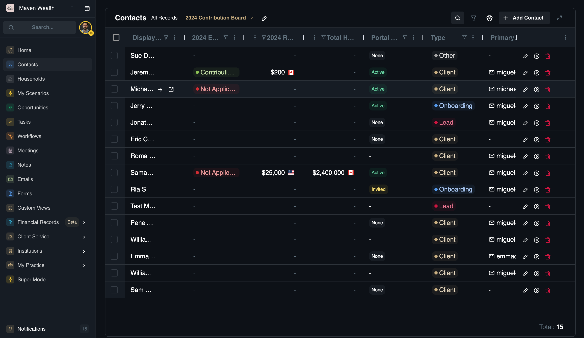

# Dynamic Contact List

## Overview
The **Contacts** page features a dynamic list view that can be customized to show exactly the data you need.

:::note NOTE
You can customize this dashboard by filtering data, toggling columns, and saving your configurations. For detailed instructions on creating and managing these views, please refer to the **Custom Views** module.
:::

## View Options
  * **All Records:** The default view showing every contact in the system.
  * **Custom Views:** You can create and save filtered lists (e.g., "High Net Worth Leads"). See the separate "Custom Views" topic for advanced setup.

## Search & Column Settings
  * **Search Option:** A global search bar to quickly find individuals by name.
  * **Column Settings:** Access this menu to toggle columns on/off and reorder them. Detailed instructions are in the "Custom Views" topic.

:::note NOTE
If your selected filters do not match any records, the system will display a "No records yet.
Try adjusting your filters or add a new record to get started." message.
:::
  
## Contacts List Columns

The table displays the following key information by default:
  * **Display Name:** The full name of the contact as shown in the system.
  * **First Name / Last Name:** Separated name fields for sorting.
  * **Primary Email:** The main email address for correspondence.
  * **Primary Phone:** The contact's preferred phone number.
  * **Primary Address:** The main residential or mailing address.
  * **Household:** Household which the contact belongs.
  * **Type:** The classification of the contact relationship (*Prospect, Client, Lead, Onboarding, Other*).
  * **Portal Access:** Indicates the status of the client's access to the SuperAdvisor portal (*Active, None, Revoked, Invited*).
  * **Last Contact (days):** The number of days since the last recorded interaction (email, call, etc.).
  * **Last Meeting (days):** The number of days since the last scheduled meeting occurred.
  * **Custom Fields:** Any user-defined data points added to the view.