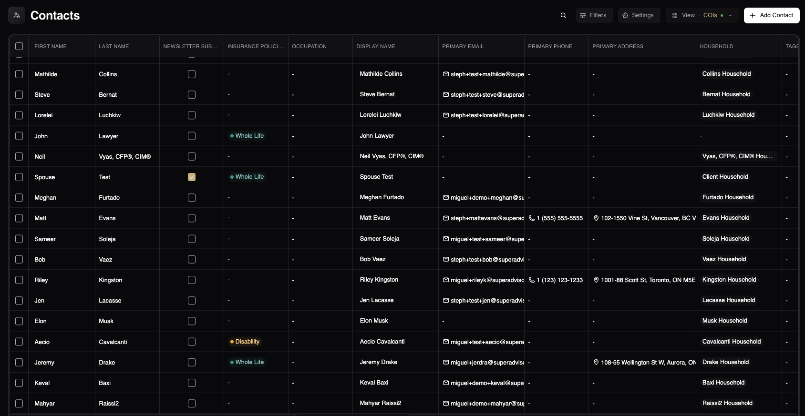
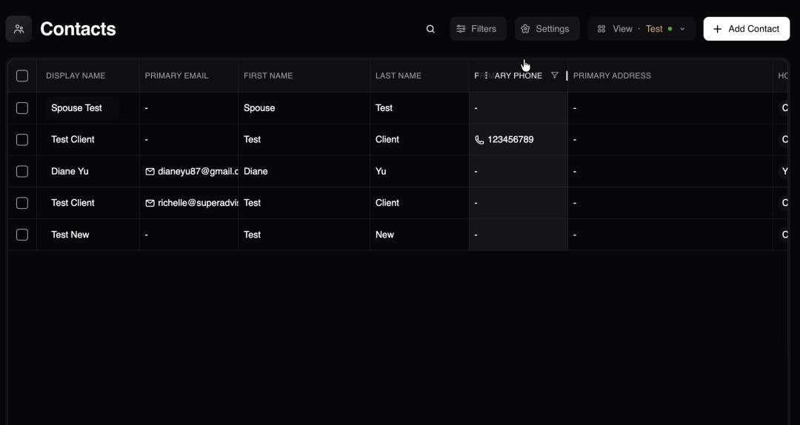

# The Dashboard

## Overview
The **Contacts** page features a dynamic list view that can be customized to show exactly the data you need.

## View Options
  * **All Records:** The default view showing every contact in the system.

## Search & Column Settings
  * **Search Option:** A global search bar to quickly find individuals by name.
  * **Column Settings:** Access this menu to toggle columns on/off and reorder them.

:::note NOTE
If your selected filters do not match any records, the system will display a "No records yet.
Try adjusting your filters or add a new record to get started." message.
:::
  
## Contacts List Columns

The table displays key information categorized into two types: Standard and Custom.
* **Standard Columns:**
  * **Display Name:** The full name of the contact as shown in the system.
  * **First Name / Last Name:** Separated name fields for sorting.
  * **Primary Email:** The main email address for correspondence.
  * **Primary Phone:** The contact's preferred phone number.
  * **Primary Address:** The main residential or mailing address.
  * **Household:** The family or group unit to which this contact belongs.
  * **Type:** The classification of the contact relationship (*Prospect, Client, Lead, Onboarding, Other*).
  * **Portal Access Status:** Indicates the status of the client's access to the **Super Advisor** portal (*Active, None, Revoked, Invited*).
  * **Last Contact (Days):** The number of days since the last recorded interaction (email, call, etc.).
  * **Last Meeting (Days):** The number of days since the last scheduled meeting occurred.
  * **Managed AUM:** Assets Under Management; the total financial value of the assets managed by your firm for this contact.
  * **Service Tier:** The designated level of service assigned to the contact (e.g., Gold, Silver, Platinum), helping you prioritize touchpoints.
* **Custom Columns:**
    * **Custom Fields:** Any user-defined data points added to the view.

