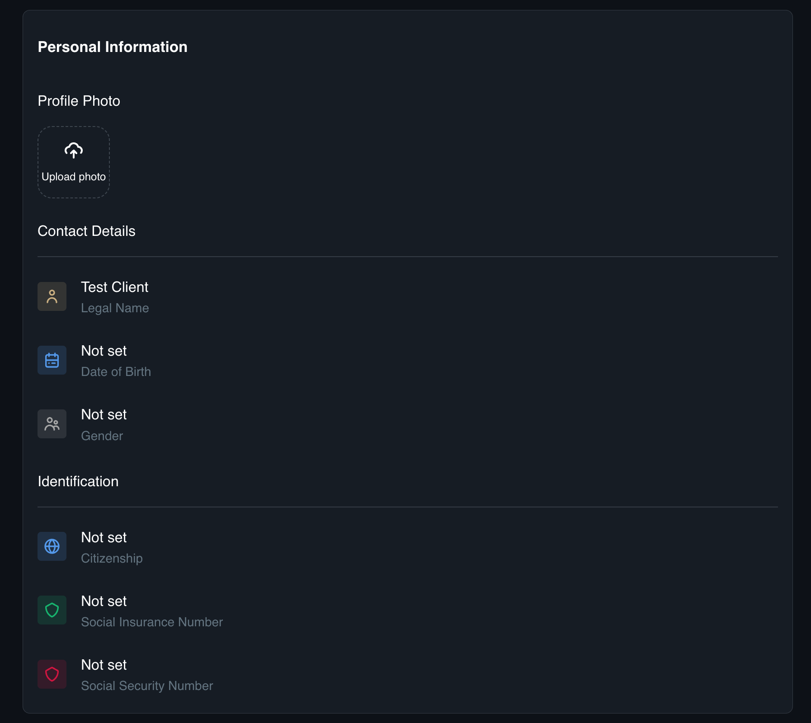
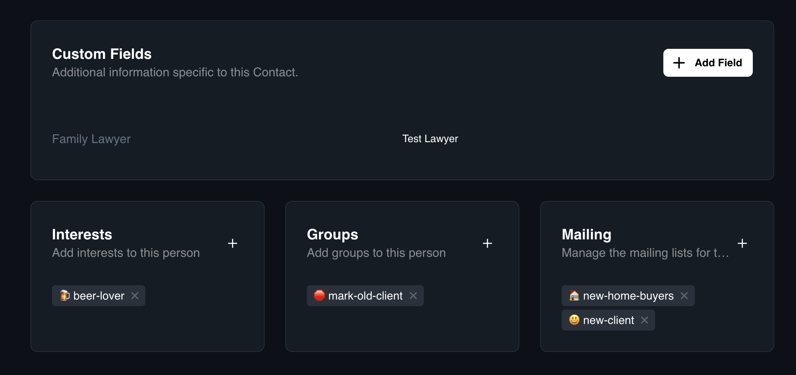
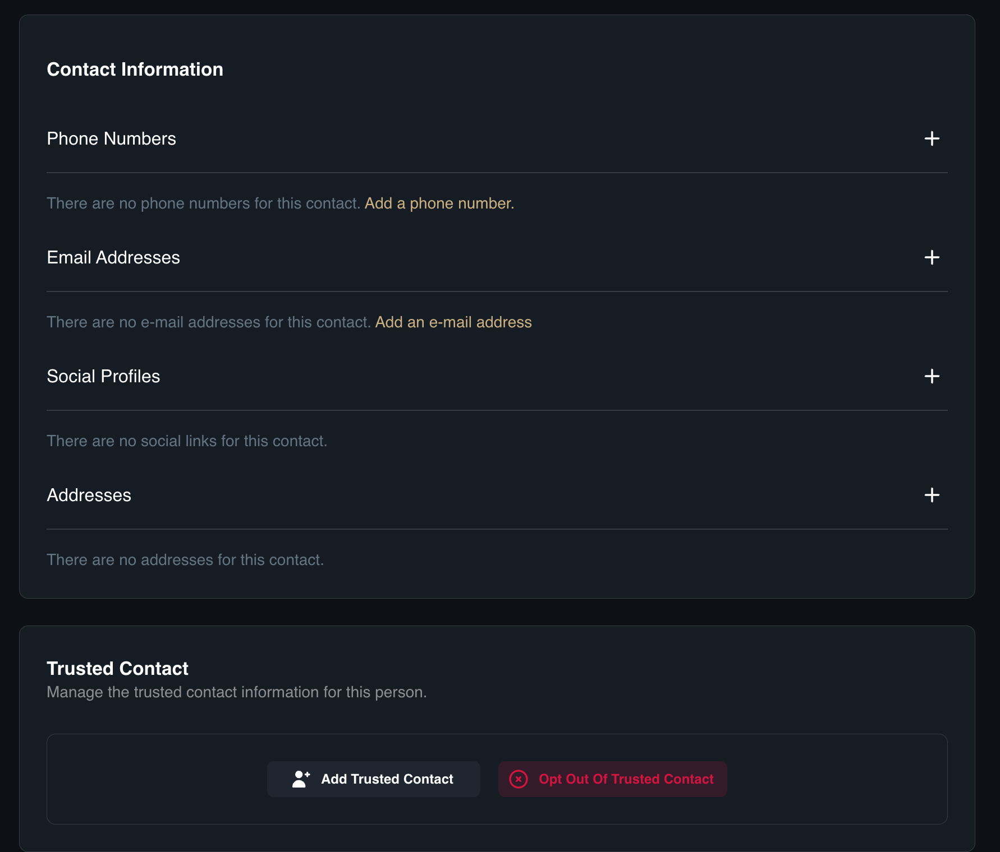
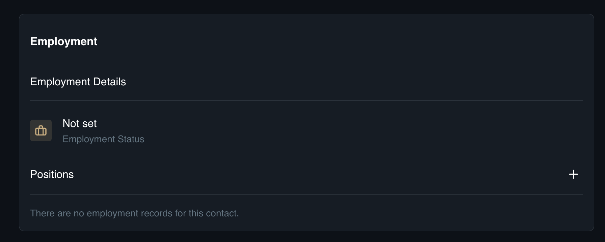
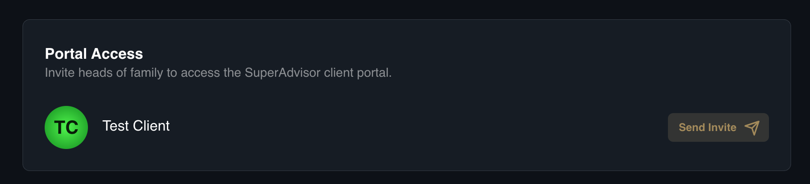

# Contact Profile
This is the detailed profile view for a single person. Unlike the main list, which is used for quick scanning, this page is designed for managing specific information. It gathers everything you know about an individual—from official records like birthdays to personal notes like hobbies—into one central location.

## Profile Layout
* **Personal:** Review core identity information and official Identification.
* **Custom Fields:** Manage Tags (e.g., Interests, Groups).
* **Contact:** View and edit Phone Numbers, Emails, and Addresses.
* **Employment:** Update Employment Status and Position.
* **Portal Access:** Send an invitation to the client portal.

### How to Edit Personal Identity and Tax Information
1. Open the specific **Contact Profile**.
2. Click the **Personal** tab.
3. Review or edit the **Profile Photo**, **Contact Details**, and **Identification**.

### How to Manage Custom Fields and Tags
1. Open the **Contact Profile**.
2. Click the **Custom Fields** tab.
3. Locate the **Tags** field.
4. Categorize the client using **Tags** (*e.g., Interests, Groups, or Mailing Lists*)

### How to Update Contact Methods
1. Open the **Contact Profile**.
2. Click the **Contact** tab.
3. Update the **Contact Information** and **Trusted Contact**.

### How to Update Employment
1. Open the **Contact Profile**.
2. Click the **Employment** tab.
3. Update the relevant fields such as **Status** and **Position**.

**Employment:** Update professional details such as Employment Status and Position.

### How to Invite a Head of Family to the Portal
1. Open the **Contact Profile.**
2. Click the **Portal Access** tab.
3. Click **Send Invite**.
4. If the contact does not have an email address on file, you will be prompted to enter one now.

:::note NOTE
An invitation link will be sent directly to the contact's email address.
:::

