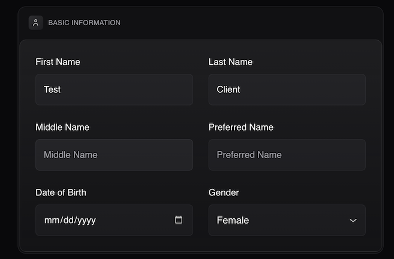
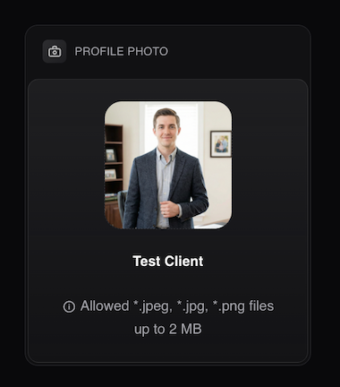
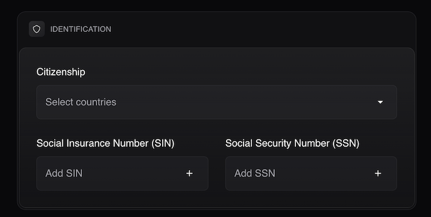
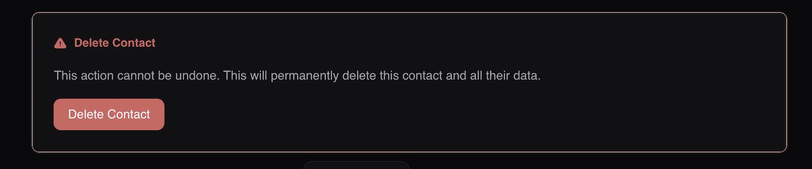
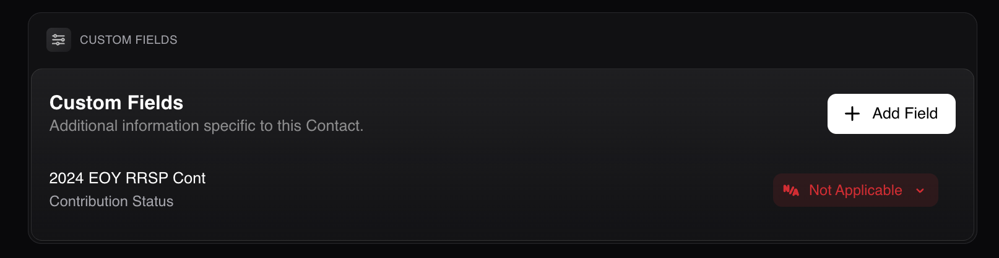
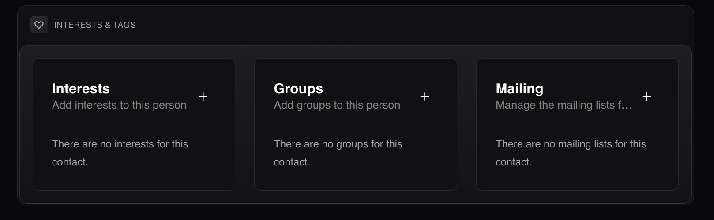
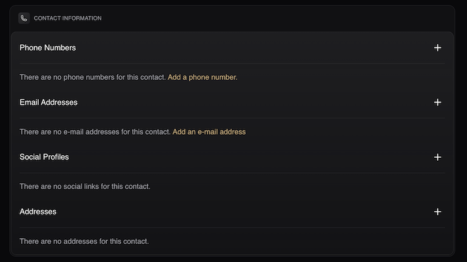
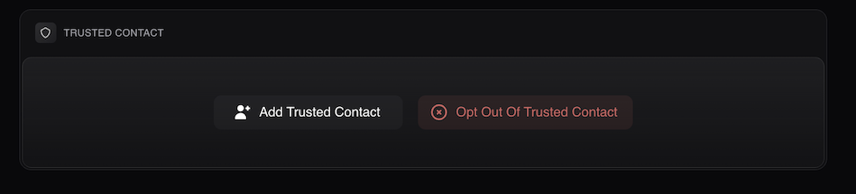
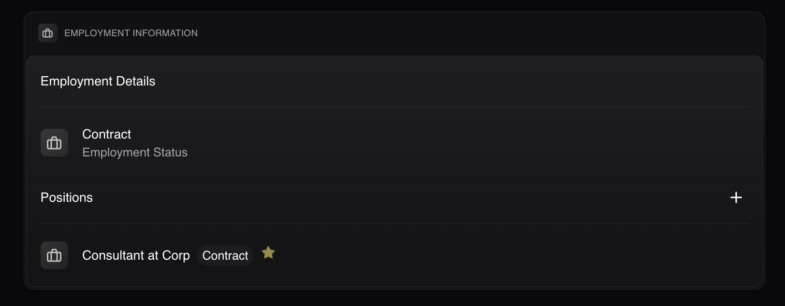
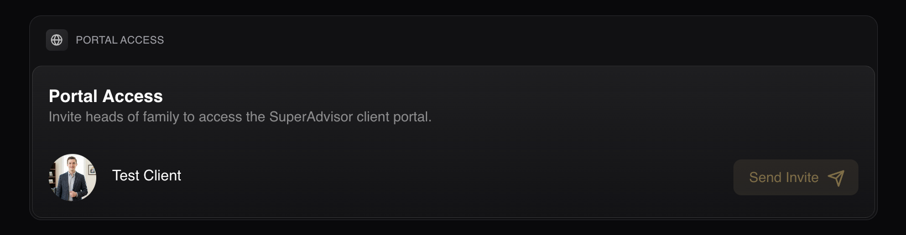

# Contact Profile
This is the detailed profile view for a single person. Unlike the main list, which is used for quick scanning, this page is designed for managing specific information. It gathers everything you know about an individual—from official records like birthdays to personal notes like hobbies—into one central location.

## Profile Layout
* **Personal:** Review core identity information and official identification.
* **Custom Fields:** Manage Tags (e.g., Interests, Groups).
* **Contact:** View and edit Phone Numbers, Emails, and Addresses.
* **Employment:** Update Employment Status and Position.
* **Portal Access:** Send an invitation to the client portal.

### Personal

The **Personal** tab is the primary area for core identity and system management. It includes the following sections:

* **Basic Information:** Contains the foundational identity fields including First Name, Last Name, Middle Name, Preferred Name, Date of Birth, and Gender.

* **Profile Photo:** Allows you to visually identify the contact by uploading an image (Allowed *.jpeg, *.jpg, *.png files up to 2 MB).

* **Identification:** Houses official government information such as Citizenship, Social Insurance Number (SIN), and Social Security Number (SSN).

* **Delete Contact:** The administrative control to permanently remove a contact from the platform.

:::warning WARNING
This action cannot be undone. This will permanently delete this contact and all their data. If this contact is the sole head of family, deleting this contact will also delete the entire household.
:::

### Custom Fields

This section allows you to manage firm-specific data points and categorizations that fall outside of the standard system fields.

* **Custom Data:** Any specialized fields created by your organization (e.g., Risk Tolerance, Hobbies) are housed and updated here. For detailed instructions on creating and managing these custom data points, please refer to the [**Custom Fields**](../my-practice/custom-fields) module.

* **Tags:** Use this field to classify the client using customizable labels. Tags make it easy to group individuals by Interests, Memberships, Groups, or Mailing Lists for targeted outreach.

### Contact

The **Contact** tab manages all communication and geographical data associated with the individual. It is composed of two primary areas: Contact Information and Trusted Contact.

**Contact Information**

* **Phone Numbers:** Add one or multiple phone numbers to the record. If none exist, click Add a phone number. You can designate a specific number as the primary contact method.

* **Email Addresses:** Store multiple email addresses and select one to serve as the primary address.

* **Social Profiles:** Link the client's online presence. Set the specific type (e.g., Blog, Facebook, Instagram, LinkedIn, etc.) and input the corresponding URL.

* **Addresses:** Add physical locations. You can seamlessly use the built-in address lookup tool or edit the details manually. You can add multiple addresses and set one as the primary.

**Trusted Contact**
Designate an individual to be contacted in the event of an emergency or for compliance purposes.

* **Add Trusted Contact:** You can either select from an existing contact list to be the Trusted Contact, or directly add a new contact to a household to serve in this role.

* **Opt Out of Trusted Contact:** If the client declines to provide a contact, use the Opted Out of Trusted Contact function. The system will log a note stating: "This person has explicitly chosen not to designate a trusted contact at this time."

### Employment

The **Employment** tab tracks the professional details of the contact, providing valuable context for income projections, retirement planning, and understanding their professional background. Within this tab, you can manage the following details:

* **Employment Status:** Specify the current overall employment status of the contact. Options include retirement, student, unemployed, and other.

* **Positions:** Add specific job roles to build a comprehensive career history. When adding a position, you are required to input the **Employer Name**, **Employer Industry**, **Employment Type**, and **Job Title**. You can also provide the **Start Date** and **End Date** to track their timeline. You can add multiple positions and select one to designate as the primary role.

### Portal Access

This section controls the individual's ability to log into the SuperAdvisor client portal. From here, you can view their access status and initiate the onboarding experience by sending a portal invitation directly to the contact. If the individual does not have an email address on file, the system will prompt you to provide one before the invitation link is sent out.

