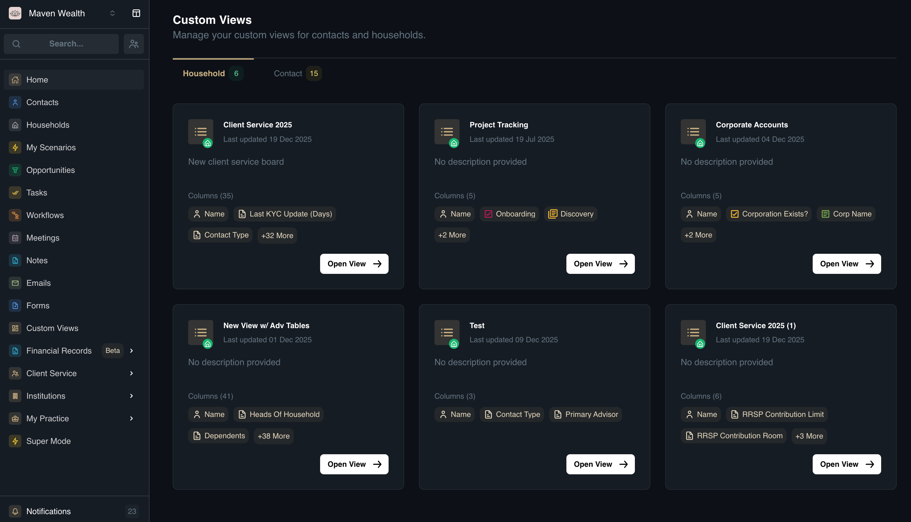
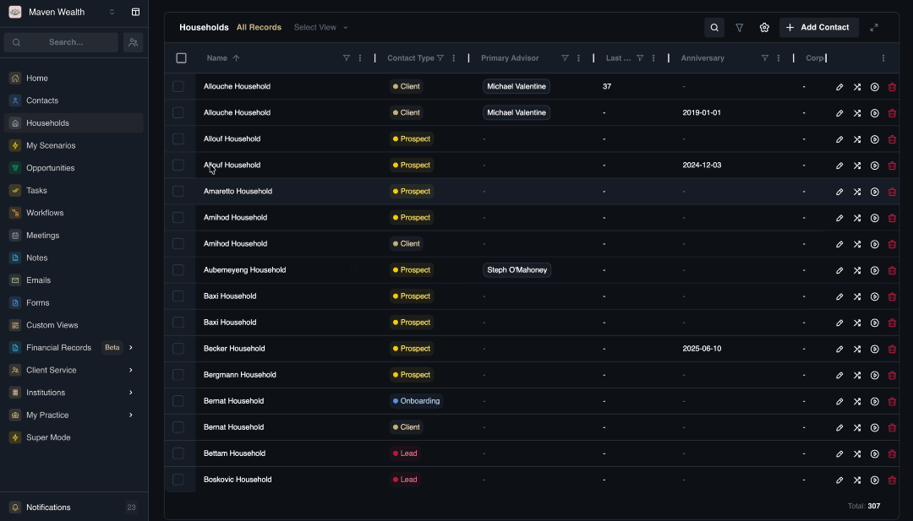

# Custom Views

## Overview

The **Custom Views** module acts as your personalization engine for managing lists of **Contacts** and **Households**. It allows you to move beyond the default "All Records" display by creating tailored, saved views that surface exactly the information you need, when you need it. You can also customize your view directly from the Household or Contact records.

Instead of repeatedly applying the same filters every time you log in, Custom Views let you build specific dashboards—like "High Net Worth Clients" or "Leads Needing Follow-up"—that persist. This feature empowers you to segment your book of business efficiently and focus on the relationships that matter most at any given moment.

## Dashboard View

The **Custom Views** page is organized into two primary tabs: **Contacts** and **Households**, allowing you to manage views for each entity type separately.

**Widgets:**
Each saved view is represented by a card (widget) displaying key metadata:
* **Name:** The custom title of the view (e.g., "VIP Clients").
* **Description:** Brief notes on what this view filters for.
* **Last Updated:** The timestamp of the most recent modification.
* **Columns:** A preview of the data fields included in this view.
* **Open View Button:** A direct link to launch the filtered list.

### How to Manage Custom Views

1. Go to the **Custom Views** page from the main sidebar.
2. Select **Contacts** or **Households** tab.
3. Click the **Open View** button on an existing widget.
4. Customize the columns:
    * **Remove:** Click on the arrow down in the column header to hide columns.
    * **Reorder:** Drag and drop column header to change their display order.
5. Use the **Filter** menu to set criteria.
6. Use the search bar to find specific records within your filtered view.

### How to Customize the Contacts or Households List (Custom Views)

You can create personalized dashboard views to quickly access specific segments of your database (e.g., "High Priority Leads" or "NYC Clients").

1. Click **Contacts** (*or Household)* in the main sidebar.
2. Click the **Select View** dropdown button at the top of the page and select **Create View**.
3. Enter a descriptive **View Name** for your new layout.
4. **Configure Columns:**
    * **Show/Hide:** Click the **Column Settings** button to check or uncheck standard and custom fields to determine what data is displayed.
    * **Adjust Layout:** Click the **Kebab Menu** (vertical dots) on any column header to **Sort** (*Ascending/Descending*), **Pin the column** to the side, or **Autosize** the width.
5. Click the **Filter** icon on specific columns to define your criteria.
6. Click **Save View** to store your configuration.
7. Open the **Select View** dropdown to switch between lists. You can click the **Star** icon next to a view to set it as your default, or use **View Settings** to rename it later.

### How to Apply Custom Views

Once created, these views become available throughout the platform:

1. Navigate to the main **Contacts** or **Households** module (or open the module from a record page).
2. Locate the **View Selector** dropdown.
3. Select your custom view (e.g., "VIP Clients") from the list.
4. The dashboard will instantly update to show only the records and columns defined in your custom configuration.

