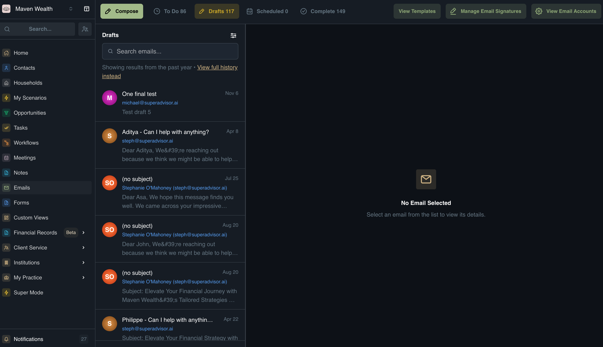
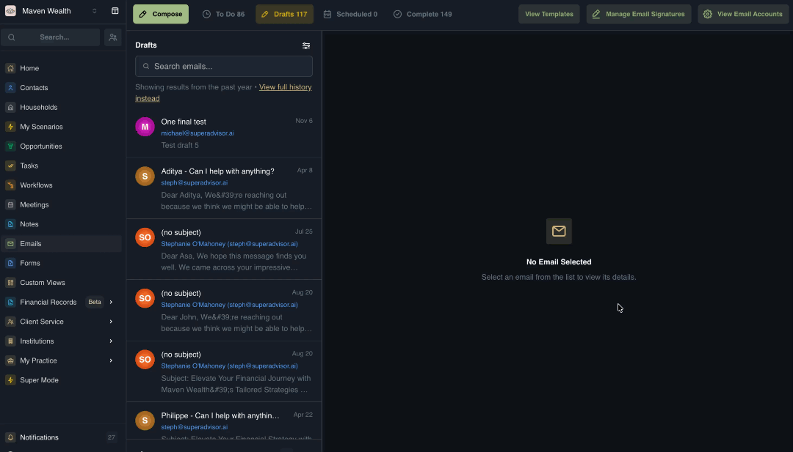
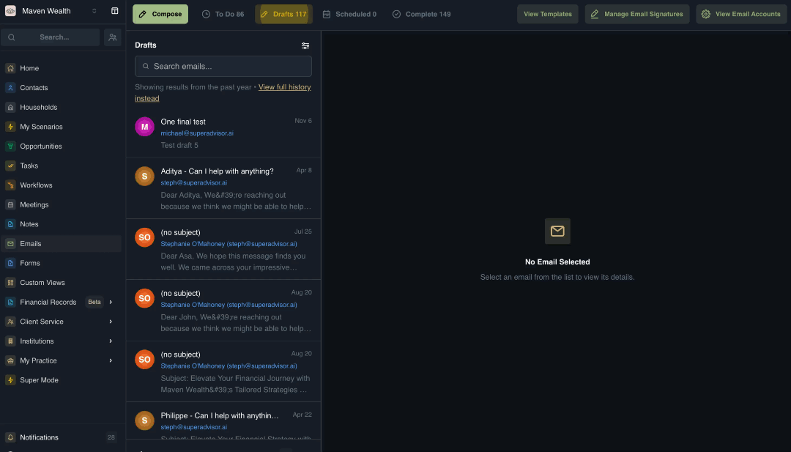
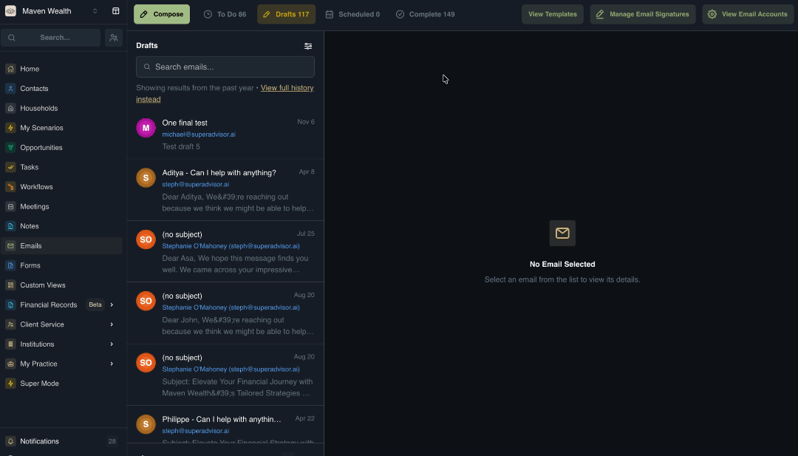

# Emails
## Overview

The **Emails** module serves as your integrated communication hub, allowing you to compose, send, and track messages directly from the platform. It functions similarly to other email applications but is designed to keep your client correspondence centralized and actionable within your SuperAdvisor workflow.

This module provides a unified view of your team's communication, enabling you to filter inboxes by specific team members, track the status of messages (Drafts, Scheduled, Sent), and maintain a clear history of client interactions without switching between different email providers.

## Dashboard Views

The main interface is organized to help you manage your inbox and outgoing messages efficiently:

* **Inbox Filter:** Toggle between viewing the entire team's inbox or drilling down to a specific team member's messages.
* **Status Tabs:**
    * **To Do:** Emails requiring action or follow-up.
    * **Drafts:** Messages started but not yet sent.
    * **Scheduled:** Emails queued for future delivery.
    * **Complete:** Sent and archived messages.
* **History Views:** Switch between viewing your complete email history or just recent communications.

## Email Signatures

Email signatures ensure consistent, professional branding across your team's communications. The Email Signatures section allows you to create, manage, and assign custom signatures for different advisors or use cases.

## How to View Email Signatures
The Email Signatures page serves as a library for all your saved signature templates.

1. Navigate to the **Emails** module.
2. Click the **Manage Email Signatures** button.
3. The system will display a list of all existing templates. For each record, you can see:
    * **Name:** The internal title of the signature.
    * **Description:** Context on when to use it.
    * **Status:** Whether it is active or inactive.
    * **Usage:** Metrics on how often it is used.
4. **Actions:** Hover over a specific signature row to **View**, **Edit**, **Duplicate**, or **Delete** the record.

### How to Create or Edit an Email Signature

Use this feature to standardize your professional branding on all outgoing communications.

1. Navigate to the **Emails** module and select the **Manage Email Signatures** link.
2. Click **Create Signature** to start a new design, or locate an existing signature in the list and click the **Edit** icon to modify it.
3. **Basic Information:**
    * **Signature Name:** Enter a clear name for internal reference (e.g., "Standard Client Sig").
    * **Description:** Add optional context about when this signature should be used.
4. **Signature Content:**
    * **Quick Start Templates:** Select a pre-built layout such as Professional (clean business format), Minimal (simple one-line), or Creative (design-focused).
    * **Custom Editor:** Use the rich text editor to build your own design from scratch, adding images, links, or custom formatting.
5. **Set Default:** Toggle this option to automatically append this specific signature to all new emails you compose.
6. Click **Save**.

:::note DESIGN TIP
Keep your signature concise and professional. Ensure you use consistent fonts and check how the design looks on mobile devices before finalizing.
:::

### How to Compose and Send an Email

1. Click the **Compose** button to open the email editor pop-up.
2. Enter the recipient's address, subject line, and message body.
3. Select a **Template** to use pre-written content for consistency.
4. Apply your **Signature** to professionalize the message.
5. Choose your delivery method:
    * Click **Send** to dispatch the email immediately.
    * Click **Schedule Send** to pick a future date and time for delivery.

## Email Templates

### How to View Email Templates

1. Navigate to the **Emails** module.
2. Click the **View Templates** button.
3. In the **Email Templates** page, you can browse existing templates, viewing details such as:
    * Type
    * Name
    * Description
    * Reference Entities (Contact/Household)
    * Last Updated date

### How to Create a New Email Template

1. Navigate to the Email Templates page (see above).
2. Click **Create Template**.
3. Fill in the template details:
    * **Template Name:** (Required) Give the template a descriptive title.
    * **Record Type for Merge Fields:** Select the entity type (e.g., Contact) to enable dynamic data insertion.
    * **Template Description:** Add notes about when to use this template.
    * **Attachments:** Drag and drop or browse to upload files (Images, PDF, Word, Excel, Text) up to 10MB.
4. Enter the **Subject** line.
5. Compose the **Body of the email**, inserting merge fields as needed.
6. Click **Save**.

## E-mail & Calendar Accounts

Before sending emails or scheduling meetings, you must connect your external accounts to SuperAdvisor. This syncs your inbox and calendar for a seamless experience.

### Connecting Accounts

1. Navigate to **Emails** and click the **View Email Accounts** button.
2. Choose your provider:
    * Connect Gmail
    * Connect Outlook
    * Connect to Zoom
3. Follow the prompts to authorize the connection.
4. Once connected, you can configure imports or setup imports. Follow the onscreen instructions to exclude any emails or filter subject lines from the inbox's imports.

