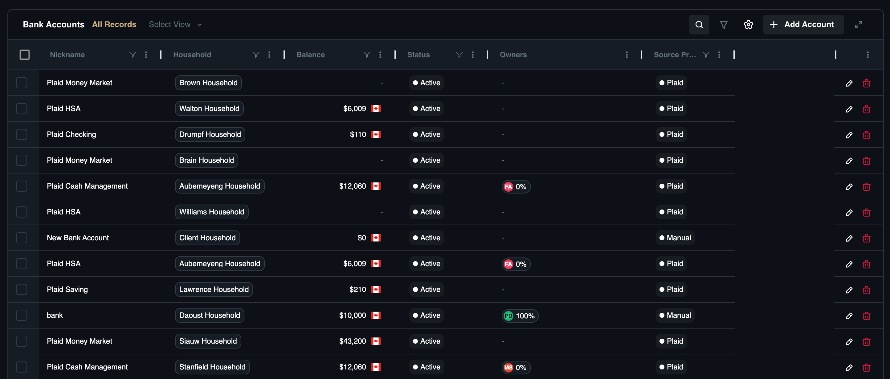
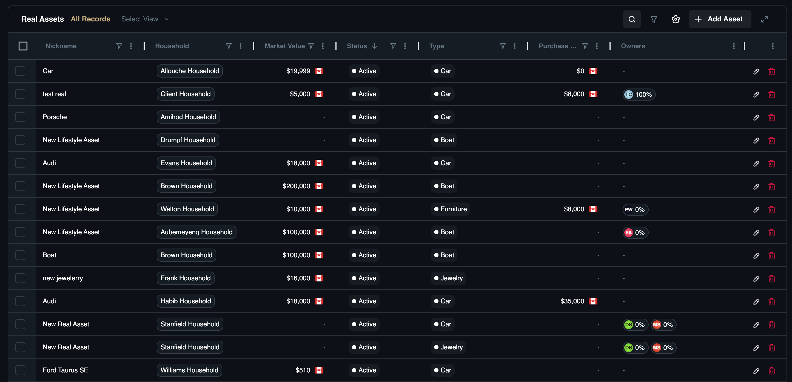
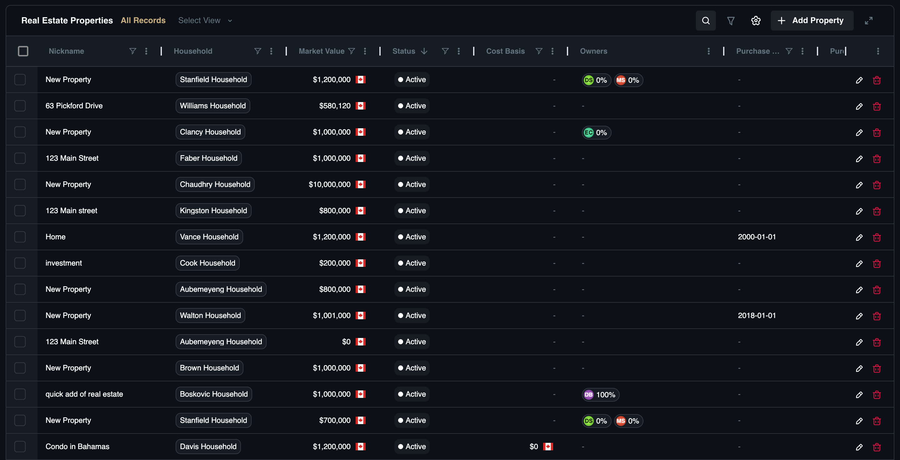

# Assets

## Overview
The **Assets** category serves as the foundation for your client's Net Worth statement, aggregating all tangible and liquid value owned by the household. This section is designed to distinguish between different types of ownership and liquidity profiles, ensuring a clear picture of what a client actually owns versus what is merely controlled.

It is divided into three distinct sub-modules to address different planning needs:

* [**Bank Accounts:**](assets#bank-accounts) Manage immediate liquidity and cash reserves.
* [**Real Estate Properties:**](assets#real-estate-properties) Track significant, illiquid holdings like primary residences and commercial buildings.
* [**Real Assets:**](assets#real-assets) Catalog physical valuables such as art, vehicles, or jewelry that require specific insurance or estate planning considerations.

## Bank Accounts
This sub-module tracks liquid cash holdings such as checking accounts, savings accounts, and money market funds. Accurate cash flow modeling requires precise knowledge of available liquidity to identify emergency fund sufficiency and funding sources for near-term goals. 

For example, if a client wants to buy a vacation home in six months, you need to identify which accounts hold "cash on hand" versus funds locked in long-term investments. By tracking a "High Yield Savings" account separately from a "Daily Checking" account, you can clearly differentiate between strategic cash reserves and operational funds.

### Dashboard View

The **Bank Accounts** sub-page offers a consolidated view of client cash holdings and liquid assets.

**View Options:**

* **All Records:** A complete list of all bank accounts.
* **Custom View:** create and save specific filtered lists.

**Search & Filter Settings:**

* **Search:** Locate accounts by nickname.
* **Filter:** Refine by status, type, or value.
* **Column Settings:** Adjust table columns to fit your workflow.

**Bank Account List Standard Columns:**
* **Nickname:** The account identifier (*e.g., "Primary Checking"*).
* **Household:** The family associated with the account.
* **Balance:** The current value of the account.
* **Status:** The account's state (*e.g., Active, Closed*).
* **Owners:** The individuals listed as account holders.
* **Source Provider:** The institution or feed source (if connected).

### How to Add a Bank Account

1. Navigate to **Financial Records**, then **Bank Accounts**.
2. Click the **Add Account** button.
3. **Select Household:** Search for and choose the household to associate with this account.
4. **Basic Information:**
    * **Nickname:** Enter a name for the account.
    * **Account Type:** Select the type (*e.g., Checking, Savings*).
    * **Status:** Set the account status (*Active, Closed, Frozen*).
    * **Jurisdiction:** Select the governing region.
5. **Account Owners:**
    * Select the owners and assign their ownership percentages.
    * **Joint Account:** Toggle this option if applicable.
6. **Valuation:**
    * **Balance:** Enter the current account balance and select the currency.
7. **Interest:**
    * **Interest Rate (%):** Enter the applicable interest rate.
8. **Additional:**
    * **Overdraft Limit:** Specify any overdraft protection limits.
9. Click **Add Bank Account** to add the account.

## Real Assets
This sub-module tracks physical valuables such as art, jewelry, vehicles, or collectibles. These assets often require specific insurance coverage riders and distinct estate planning considerations regarding the distribution of physical goods. 

For instance, if a client owns a vintage car collection, you need to track these assets to ensure the insurance coverage matches the Appraised Value. This creates a clear record for items like a "1967 Mustang" or a "Rolex Collection".

### Dashboard View
The **Real Assets** sub-page offers a consolidated view of physical goods.

**View Options:**

* **All Records:** A complete list of all real assets.
* **Custom View:** Create and save specific filtered lists.

**Search & Filter Settings:**

* **Search:** Locate records by keyword.
* **Filter:** Refine by nickname, type, or status.
* **Column Settings:** Adjust table columns to fit your workflow.

**Real Assets Standard List Columns:**

* **Nickname:** The description of the asset.
* **Household:** The family associated with the asset.
* **Market Value:** The current estimated value.
* **Owners:** The legal owners.
* **Purchase Price:** The amount paid.
* **Status:** The current state (*e.g., Active, Sold*).
* **Type:** The category (*e.g., Vehicle, Art*).

### How to Add a Real Asset

1. Navigate to **Financial Records**, then **Real Assets**.
2. Click the **Add Real Asset** button.
3. **Select Household:** Select a household to link the asset.
4. **Basic Information:**
    * **Nickname:** Enter a descriptive name.
    * **Asset Type**: Select the category (*e.g., Boat, Car, Cash, Art*).
    * **Status:** Set to **Active** or **Sold**.
5. **Owners:**
    * Select the **Owner** and assign the **Percentage**.
6. **Valuation:**
    * **Market Value:** Enter the current value.
    * **Market Value Type:** Select Estimated or Appraised.
7. Purchase:
    * Enter the **Purchase Price** and **Purchase Date**.
8. Click **Add Real Asset** to save the record.

## Real Estate Properties

This sub-module tracks physical property assets, including residential, commercial, and land holdings. Real estate often comprises a significant portion of a client's Net Worth but is highly illiquid, so tracking Cost Basis versus Market Value is essential for tax planning upon sale. When a client wants to downsize, you can compare the Purchase Price (Cost Basis) to the current Market Value to estimate tax liability. 

Common examples include tracking a "Downtown Condo" investment property distinct from a "Family Home" primary residence.

### Dashboard View

The **Real Estate Properties** sub-page offers a consolidated view of property assets.

**View Options:**

* **All Records:** A complete list of all real estate properties.
* **Custom View:** Create and save specific filtered lists.

**Search & Filter Settings:**

* **Search:** Locate records by keyword.
* **Filter:** Refine by nickname, status, or subtype.
* **Column Settings:** Adjust table columns to fit your workflow.

**Real Estate Properties Standard List Columns:**

* **Nickname:** The description or name of the property.
* **Cost Basis:** The original value for tax purposes.
* **Household:** The family associated with the property.
* **Market Value:** The current estimated value.
* **Owners:** The legal owners.
* **Purchase Date:** When the property was acquired.
* **Purchase Price:** The amount paid for the property.
* **Status:** The current state (*e.g., Active, Sold*).
* **Subtype:** The classification (*e.g., Residential, Commercial*).

### How to Add a Property

1. Navigate to **Financial Records**, then **Real Estate Properties**.
2. Click the **Add Property** button.
3. **Select Household:** Link the asset to the client.
4. **Basic Information:**
    * **Nickname:** Enter a descriptive name.
    * **Property Type:** Select the category (*Farm, Industrial, Residential, Commercial, Land*).
    * **Status:** Set to **Active** or **Sold**.
    * **Primary Residence:** Check the box if this is the client's main home.
5. **Owners:**
    * Select the **Owner** and assign the **Percentage**.
    * **Owner Type:** Select the legal structure (*Corporation, Joint Tenants, Life Estate, Sole, Tenants in Common, Trust*).
6. **Valuation:**
    * **Market Value:** Enter the current value.
    * **Market Value Type:** Select **Estimated** or **Appraised**.
    * **Cost Basis Value:** Enter the cost basis amount.
7. **Purchase:**
    * Enter the **Purchase Price** and **Purchase Date**.
8. Click **Add Property** to save the record.