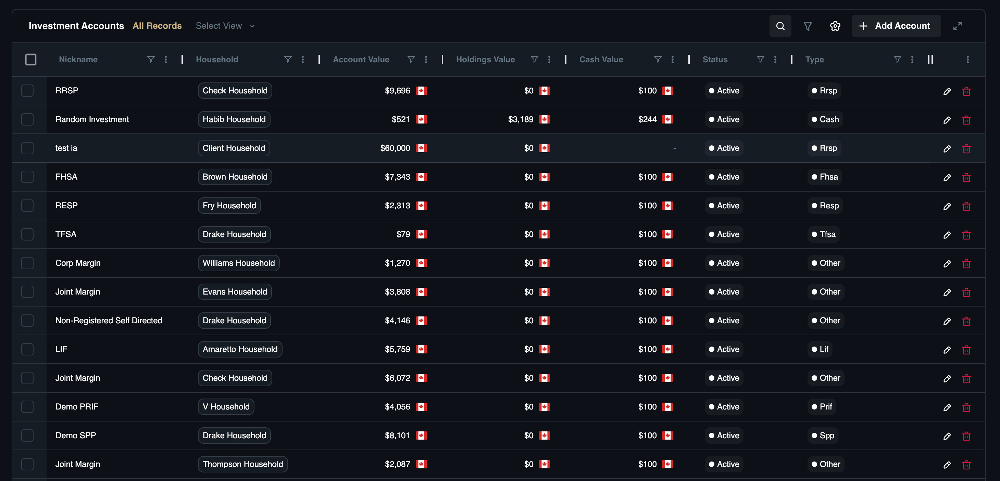
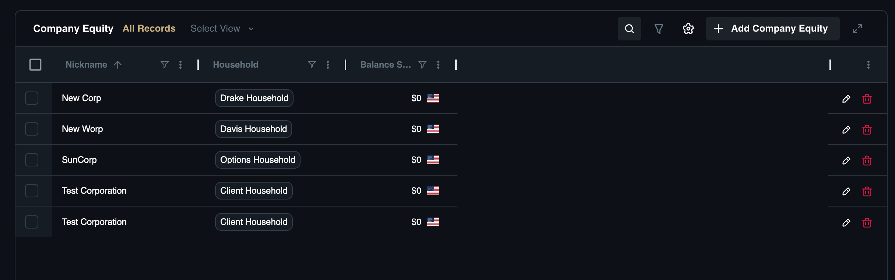
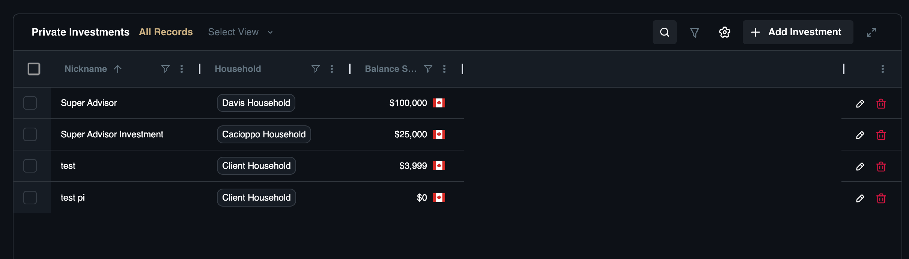

# Investments

The **Investments** category captures the growth engines of the client's portfolio, spanning both public markets and complex private holdings. This section is critical for analyzing asset allocation, tax diversification, and long-term wealth accumulation strategies, moving beyond simple balance tracking to strategic wealth management.

It includes specialized sub-modules to manage different asset classes:

* [**Investment Accounts:**](investments#investment-accounts) Track traditional market-based assets (IRAs, Brokerage) where tax status is key.
* [**Private Investments:**](investments#private-investments) Monitor alternative, illiquid holdings like venture capital that require tracking committed vs. called capital.
* [**Company Equity:**](investments#company-equity) Manage complex compensation packages involving stock options and vesting schedules.

## Investment Accounts

This sub-module tracks brokerage accounts, retirement accounts (IRAs, 401ks, RRSPs), and specific security holdings. These accounts are often the primary engine for wealth growth, making granular tracking essential for asset location strategies (tax-deferred vs. taxable) and performance reporting. 

For instance, when a client is retiring and needs to draw down funds, this record helps determine whether to pull from a Tax-Free or Tax-Deferred account to minimize tax impact. A common example is managing a "Fidelity 401(k)" that contains a mix of mutual funds and cash positions.

### Dashboard View

The **Investment Accounts** sub-page offers a consolidated view of client cash holdings and liquid assets.

**View Options:**
* **All Records:** A complete list of all investment accounts.
* **Custom View:** Create and save specific filtered lists.

**Search & Filter Settings:**

* **Search:** Locate accounts by nickname.
* **Filter:** Refine by status, type, or value.
* **Column Settings:** Adjust table columns to fit your workflow.

**Investment Account List Columns:**

* **Nickname:** The account identifier (*e.g., "Primary Checking"*).
* **Account Value:** The total worth of the account (Cash + Holdings).
* **Cash Value:** The liquid cash portion within the account.
* **Holdings Value:** The value of the securities held.
* **Household:** The family associated with the account.
* **Joint Account:** Indicates if the account is shared.
* **Jurisdiction:** The governing region.
* **Owners:** The individuals listed as account holders.
* **Source Provider:** The institution or feed source.
* **Status:** The account's state (*e.g., Active, Closed, Frozen*).
* **Tax Status:** The tax treatment (*e.g., Taxable, Tax Deferred*).
* **Type:** The classification (*e.g., RRSP, TFSA, Cash*)

### How to Add an Investment Account

1. Navigate to **Financial Records**, then **Investment Accounts**.
2. Click the **Add Investment Account** button.
3. **Select Household:** Search for and choose the household to associate with this account.
4. **Basic Information:**
    * **Nickname:** Enter a name for the account.
    * **Account Type:** Select the type (*e.g., Cash, TFSA, RRSP, Crypto*).
    * **Status:** Set the account status (*Active, Closed, Frozen*).
    * **Tax Status:** Choose the tax treatment (*Deductible Free, Taxable, Tax Deferred, Tax Exempt*).
    * **Jurisdiction:** Select the governing region.
5. **Account Owners:**
    * Select the owners and assign their ownership percentages.
    * Toggle the **Joint Account** option if applicable.
6. **Valuation:**
    * **Balance:** Enter the current account balance and select the currency.
7. Click **Add Investment Account** to save the record.

## Company Equity

This sub-module is a specialized tool for managing complex compensation packages like Stock Options, RSUs, and Grants. Equity compensation often has vesting schedules and expiration dates that act as "financial cliffs," where missing an exercise window can cost a client millions. 

For an executive client with 10,000 ISOs vesting over 4 years, mapping out the Vesting Schedule allows you to advise on whether to exercise and hold or exercise and sell. This is essential for managing grants like a "Google RSU Grant 2024".

### Dashboard View

The **Company Equity** sub-page offers a specialized view for managing complex compensation packages.

**View Options:**

* **All Records:** A complete list of all company equity records.
* **Custom View:** Create and save specific filtered lists.

**Search & Filter Settings:**

* **Search:** Locate records by keyword.
* **Filter:** Refine by nickname, household, or balance sheet value.
* **Column Settings:** Adjust table columns to fit your workflow.

**Company Equity Standard List Columns:**

* **Nickname:** The description of the equity.
* **Balance Sheet Value:** The current value.
* **Household:** The family associated with the equity.

### How to Add Company Equity

1. Navigate to **Financial Records**, then **Company Equity**.
2. Click the **Add Equity** button.
3. **Select Household:** Select a household to link the equity.
4. *Corporation Details:*
    * **Corporation:** Choose from an **Existing Corporation** or **Create a New Corporation**.
    * **Attributes:** Check boxes for **Company Assets over $50M**, **Is CCPC**, or **Is QSBS Qualified** (if applicable).
5. **Securities:**
    * Click **Add Security**.
    * Enter **Name**, **Description**, **Price Per Share**, **Valuation Method**, **Total Shares Outstanding**, and **Ticker** Symbol.
6. **Account Owners:**
    * Select the owner from the household contacts.
7. **Grant Details:**
    * Click **Add Grant**.
    * **Security:** Select the **Security** added in step 5.
    * **Details:** Select **Owner**, **Grant Type**, **Strike Price**, **Shares Issued**, **Issue Date**, and **Expiration Policy Duration**.
    * **Vesting Terms:**
        * Select **Vest Immediately** (Toggle this option can be exercised early if applicable).
        * Or select **Vest Over Time** (**Configure Cliff**, **Timeline**, **Frequency**, **Grant Termination Date**, and **Early Exercise** options).
    * **Exercised:** If applicable, enter S**hares Exercised Quantity** and **Exercise Date**.
8. Click **Add Company Equity** to save the record.

## Private Investments

This sub-module tracks alternative investments like Private Equity, Hedge Funds, or Venture Capital. These are high-risk, illiquid assets with complex structures where tracking "Committed Capital" versus "Called Capital" is vital for liquidity planning. If a client invests in a startup, tracking the Investment Stage and Exit Date is crucial for planning around potential liquidity events like an IPO or acquisition. Use this to manage records like a "Series A Investment in TechStart Inc."

### Dashboard View

The **Private Investments** sub-page offers a view of non-public market holdings.

**View Options:**

* **All Records:** A complete list of all private investments.
* **Custom View:** Create and save specific filtered lists.

**Search & Filter Settings:**

* **Search:** Locate records by keyword.
* **Filter:** Refine by nickname, type, or subtype.
* **Column Settings:** Adjust table columns to fit your workflow.

**Private Investments Standard List Columns:**

* **Nickname:** The description of the investment.
* **Balance Sheet Value:** The current book value.
* **Household:** The family associated with the investment.

### How to Add a Private Investment

1. Navigate to **Financial Records**, then **Private Investments**.
2. Click the **Add Investment** button.
3. **Select Household:** Select a household to link the investment.
4. **Basic Information:**
    * **Nickname:** Enter a name for the record.
    * **Currency:** Select the currency.
    * **Company Name:** Enter the entity name.
    * **Investment Status:** Set to Active, Exited, or Failed.
5. **Investment Details:**
    * *Enter ***Issue Date** and **Exit Dat**e.
    * Select **Investment Stage**, **Type**, and **Investment Vehicle**.
    * **Platform Hold On:** Specify the platform where the asset is held.
6. **Ownership:**
    * Add the **Owner** and set the **Percentage**.
7. **Valuation:**
    * **Estimated Value:** Enter the current value.
    * **Investment Account:** Link to a specific account if applicable.
    * **Original Ownership Percentage:** Enter the initial share.
8. Click **Add Private Investment** to save the record.
