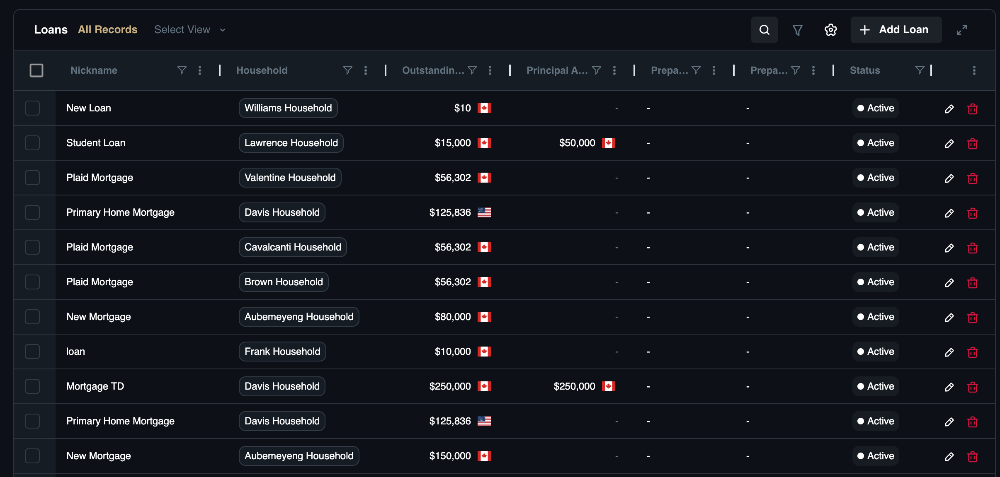

# Liabilities

## Overview
The **Liabilities** category provides a consolidated view of all financial obligations, allowing you to effectively manage debt-to-income ratios and interest rate exposure. Since liabilities directly offset assets in Net Worth calculations, accuracy here is paramount for assessing true financial health and identifying "wealth leaks" caused by high interest rates.

This section categorizes debt by its structure and purpose:

* [**Loans:**](liabilities#loans) Cover fixed-term obligations with set amortization schedules like mortgages.
* [**Credit Cards:**](liabilities#credit-cards) Monitor revolving high-interest consumer debt that impacts short-term cash flow.
* [**Lines of Credit:**](liabilities#lines-of-credit) Track flexible borrowing instruments like HELOCs that serve as both a liability and a potential source of emergency liquidity.

## Loans
This sub-module tracks fixed-term debts such as mortgages, personal loans, auto loans, and student debt. Since liabilities directly reduce Net Worth, tracking terms and amortization is critical for making informed "debt vs. invest" decisions—such as determining if it makes sense to pay off a 3% mortgage when rates are 7%. 

If a client wants to refinance their home, having the current principal, interest rate, and maturity date allows you to run a precise cost-benefit analysis. A typical record here might be a "30-Year Fixed Mortgage" with a specific balance and interest rate.

### Dashboard View

The **Loans** sub-page offers a consolidated view of client cash holdings and liquid assets.

**View Options:**
* **View All Records:** A complete list of all loan accounts.
* **Custom View:** create and save specific filtered lists.

**Search & Settings:**
* **Search:** Locate accounts by nickname.
* **Filter:** Refine by status, type, or value.
* **Column Settings:** Adjust table columns to fit your workflow.

**Loan Account Standard List Columns:**

* **Nickname:** The account identifier (*e.g., "Primary Mortgage"*).
* **Account Number:** The official ID from the lender.
* **Amortization Period:** The total length of time to pay off the loan.
* **Asset:** The underlying asset (if secured).
* **Borrowers:** The primary individuals responsible for the loan.
* **Cosigners:** Any secondary individuals responsible for the loan.
* **Household:** The family associated with the debt.
* **Interest Rate:** The annual interest rate percentage.
* **Issue Date:** The date the loan originated.
* **Outstanding Payment:** Any current due amounts.
* **Prepayment Option Lump Sum:** Allowable lump sum payments without penalty.
* **Prepayment Option Monthly:** Allowable extra monthly payments without penalty.
* **Principal Amount:** The original loan amount.
* **Secured:** Indicates if collateral is attached.
* **Secured Loan Type:** The category of collateral.
* **Source Provider:** The institution or feed source.
* **Status:** The account's state (*e.g., Active, Paid Off*).
* **Type:** The classification (*e.g., Mortgage, Student Loan*).

### How to Add a Loan Account

1. Navigate to **Financial Records**, then **Loans**.
2. Click the **Add Loan** button.
3. **Select Household:** Search for and choose the household to associate with this account.
4. **Basic Information:**
    * **Nickname:** Enter a name for the account.
    * **Loan Type:** Select the type (*e.g., Personal, Secured, Student*).
    * **Status:** Set the account status (*Active, Closed, Defaulted, Paid Off, Refinanced, Suspended*).
    * **Lender Name:** Enter the institution name.
    * **Options:** Check **Forgiveable** or **Receivable** if applicable.
5. **Balance:**
    * **Principal Amount:** Enter the original loan value.
    * **Outstanding Amount:** Enter the current remaining balance.
6. **Interest:**
    * **Interest Rate:** Enter the percentage.
    * **Interest Rate Period:** Define the timeframe.
    * **Interest Rate Type:** Select **Fixed** or **Variable**.
7. **Loan Owners:**
    * Assign the **Borrowers**.
    * Assign any **Cosigners**.
8. **Payment and Term:**
    * Enter the **Issue Dat**e and **Maturity Date**.
    * Define the **Amortization Period**.
    * Enter **Prepayment Lump Sum** and **Prepayment Monthly allowances**.
9. Click **Add Loan** to add the account.

## Credit Cards

This sub-module acts as your radar for detecting high-interest consumer debt, often the most significant "wealth leak" in a financial plan. By tracking specific utilization rates and balances, you can distinguish between harmless transactional spending—like business expenses on an "Amex Platinum"—and dangerous revolving debt (e.g., a "Visa" carrying a balance) that requires immediate intervention. 

Using this tool ensures you can spot cash flow issues early and implement repair strategies before interest payments erode your client's net worth.

### Dashboard View

The **Credit Cards** sub-page offers a consolidated view of revolving credit liabilities.

**View Options:**

* **All Records:** A complete list of all credit card accounts.
* **Custom View:** Create and save specific filtered lists.

**Search & Settings:**
* **Search:** Locate accounts by nickname.
* **Filter:** Refine by status, balance, or limit.
* **Column Settings:** Adjust table columns to fit your workflow.

**Credit Card Account List Standard Columns:**

* **Nickname:** The account identifier (*e.g., "Amex Platinum"*).
* **Balance:** The current amount owed.
* **Borrowers:** The primary cardholders.
* **Cosigners:** Secondary responsible parties.
* **Credit Limit:** The total borrowing capacity.
* **Household:** The family associated with the account.
* **Secured:** Indicates if the card is backed by an asset.
* **Secured Loan Type:** The category of collateral.
* **Status:** The account's state (*e.g., Active, Closed, Defaulted, Suspended*).

### How to Add a Credit Card Account

1. Navigate to **Financial Records**, then **Credit Cards**.
2. Click the **Add Credit Card** button.
3. **Select Household:** Search for and choose the household to associate with this account.
4. **Basic Information:**
    * **Nickname**: Enter a name for the account.
    * **Lender Name:** Enter the issuing bank.
    * **Status:** Set the account status (*Active, Closed, Defaulted, Suspended*).
5. **Balance:**
     * **Balance:** Enter the current account balance and select the currency.
6. **Interest:**
    * **Interest Rate (%):** Enter the applicable APR.
    * **Credit Limit:** Enter the max limit.
    * **Purchase / Cash Advance:** Enter specific rate details if applicable.
7. **Owners:**
    * Assign the **Borrowers** and **Cosigners**.
8. **Secured By:**
    * **Secured:** Check this box if the card is secured.   
    * Select the securing asset.
9. Click **Add Credit Card** to add the account.

## Lines of Credit

This sub-module tracks flexible borrowing instruments like Home Equity Lines of Credit (HELOC) or business lines. Lines of credit represent both a liability (drawn amount) and potential liquidity (available limit), making them key components of emergency funding strategies. For example, if a client needs bridge financing for a new home purchase, you can instantly check their HELOC to see available room. 

This is useful for tracking instruments like a "$50k Home Equity Line" used for renovations.

### Dashboard View

The **Lines of Credit** sub-page offers a consolidated view of flexible borrowing instruments.

**View Options:**

* **All Records:** A complete list of all line of credit accounts.
* **Custom View:** Create and save specific filtered lists.

**Search & Settings:**
* **Search:** Locate accounts by nickname.
* **Filter:** Refine by status, type, or value.
* **Column Settings:** Adjust table columns to fit your workflow.

**Line of Credit Account List Standard Columns:**

* **Nickname:** The account identifier (*e.g., "Home Equity Line"*).
* **Balance:** The current value of the account.
* **Borrowers:** The primary account holders.
* **Cosigners:** Secondary responsible parties.
* **Household:** The family associated with the account.
* **Secured:** Indicates if collateral is attached.
* **Secured Loan Type:** The category of collateral.
* **Source Provider:** The institution or feed source.
* **Status:** The account's state (*e.g., Active, Closed, Defaulted, Suspended*).

### How to Add a Line of Credit Account

1. Navigate to **Financial Records**, then **Lines of Credit**.
2. Click the **Add Line of Credit** button.
3. **Select Household:** Search for and choose the household to associate with this account.
4. **Basic Information:**
    * **Nickname:** Enter a name for the account.
    * **Status:** Set the account status (*Active, Closed, Defaulted, Suspended*).
    * **Lender Name:** Enter the financial institution.
5. **Interest Rate:** Enter the current applicable rate.
6. **Owners:**
    * Assign the **Borrowers** and **Cosigners**.
7. **Balance:**
    * **Balance:** Enter the current amount drawn.
    * **Credit Limit:** Enter the total available limit.
8. **Secured By:**
    * **Secured:** Check this box if the line is secured by an asset.
9. Click **Add Line Of Credit** to add the account.