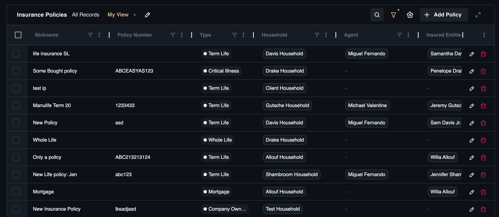
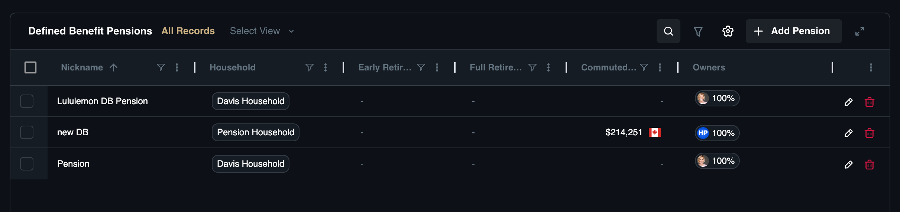
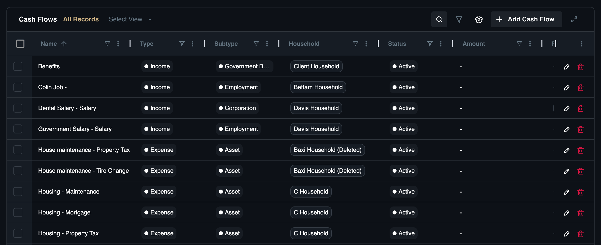

# Insurance, Pensions & Cash Flows

The **Insurance**, **Pensions** & **Income** category focuses on the stability and protection of the client's financial future. Unlike net worth items which represent current value, these records often represent future promises, risk mitigation, or the ongoing engine of the household economy.

This section consolidates these elements to ensure comprehensive planning:

* [**Insurance Policies:**](pensions#insurance-policies) Ensure adequate coverage against major life risks (death, disability).
* [**Defined Benefit Pensions:**](pensions#defined-benefit-pensions) Value future guaranteed income streams that act as a "bond floor" in retirement planning.
* [**Cash Flows:**](pensions#cash-flows) Monitor the detailed inflows and outflows that determine a client's saving capacity and budget health.

## Insurance Policies

This sub-module tracks risk management contracts, including Life, Disability, and Critical Illness coverage. Wealth protection is as important as wealth accumulation, and you must track Expiry Dates and Beneficiaries to ensure coverage doesn't lapse and assets go to the right people. 

For example, if a client just had a child, you can review their Term Life policies to ensure the Coverage Benefit is sufficient to replace income. This organizes policies such as a "SunLife Term-20 Policy" or "Manulife Whole Life".

### Dashboard View

The **Insurance Policies** sub-page offers a consolidated view of client risk coverage.

**View Options:**

* **All Records:** A complete list of all insurance policies.
* **Custom View:** Create and save specific filtered lists.

**Search & Filter Settings:**

* **Search:** Locate policies by keyword.
* **Filter:** Refine by nickname, policy number, agent, or beneficiaries.
* **Column Settings:** Adjust table columns to fit your workflow.

**Insurance Policies Standard List Columns:**

* **Nickname:** The account identifier (*e.g., "John's Term Life"*).
* **Agent:** The broker of record.
* **Beneficiaries:** Individuals designated to receive the benefit.
* **Carrier:** The insurance company.
* **Cash Surrender Value:** The accumulated cash value (if applicable).
* **Coverage Benefit:** The face value amount.
* **Coverage Start Date:** When the policy goes into force.
* **Expiry Date:** When the coverage ends.
* **Household:** The family associated with the policy.
* **Insured Entities:** The individuals covered by the policy.
* **MGA:** The Managing General Agent.
* **Policy Number:** The unique ID from the carrier.
* **Premium Payment:** The cost and frequency.
* **Purpose Description:** Notes on why the policy was purchased.
* **Rollover Date:** The date for policy renewal or conversion.
* **Status:** The current state (*e.g., Active, Lapsed*).
* **Term in Years:** The duration of the coverage.
* **Type:** The classification (*e.g., Term Life, Whole Life*).

### How to Add an Insurance Policy

1. Navigate to **Financial Records**, then **Insurance Policies**.
2. Click **Add Policy**.
3. **Select Household:** Search for and link the policy to the correct client family.
4. **Basic Information:**
    * **Nickname:** Enter a descriptive name (*e.g., "John's Term Life"*).
    * **Policy Type:** Select the classification (*e.g., Term Life, Company Owned, Critical Illness*).
    * **Policy Number:** Enter the official ID.
    * **Insurance Company:** Select from existing carriers (*e.g., Manulife, Sunlife*) or add a new one.
    * **MGA:** Select from existing list or add new.
5. **Policy Details:**
    * **Dates:** Enter **Coverage Start Date**, **Rollover Date**, and **Expiry Date**.
    * **Term (Years):** Specify the duration.
    * **Purpose Description:** Add context for the policy.
    * **Agent:** Assign the broker of record.
6. **Coverage Details:**
    * **Coverage Benefit:** Enter the amount and frequency (*One Time, Monthly, Daily*).
    * **Beneficiaries:** Select contacts (including entities) and assign ownership percentages.
    * **Trustee:** Select a contact if a trustee is involved.
7. **Premium Payment:**
    * **Premium Payment:** Enter the amount and frequency (*One Time, Monthly, Daily*).
    * **Paid Up:** Toggle this option if the policy is fully paid up.
8. **Policy Owners:** Select who owns this insurance policy and assign their ownership percentages.
9. **Status:** Set the current status (*Active, Cancelled, Expired, Lapsed, Pending, Surrendered*).
10. Click **Add Insurance Policy** to add the record.

## Defined Benefit Pensions

This sub-module tracks future fixed-income streams from employer pension plans. Pensions are a "bond-like" asset that provides an income floor in retirement, so accurate tracking helps determine the "funding gap" a client's portfolio must cover. 

When a teacher is retiring, you can compare the Monthly Payout annuity option against the Commuted Value (lump sum) to advise on the best option. This is the place to track plans like the "Ontario Teachers' Pension Plan".

### Dashboard View

The **Defined Benefit Pensions** sub-page offers a consolidated view of pension assets and future income.

**View Options:**

* **All Records:** A complete list of all defined benefit pensions.
* **Custom View:** Create and save specific filtered lists.

**Search & Filter Settings:**

* **Search:** Locate records by keyword.
* **Filter:** Refine by nickname, or owner.
* **Column Settings:** Adjust table columns to fit your workflow.

**Defined Benefit Pensions Standard List Columns:**
* **Nickname:** The identifier for the pension plan.
* **Commuted Value:** The lump-sum present value of the pension.
* **Early Retirement Date:** The earliest date benefits can be accessed.
* **Full Retirement Date:** The date unreduced benefits begin.
* **Household:** The family associated with the pension.
* **Owners:** The individual owning the pension rights.

### How to Add a Pension

1. Navigate to **Financial Records**, then **Defined Benefit Pensions**.
2. Click the **Add Pension** button.
3. **Select Household:** Link the pension to the client.
4. **Basic Information:**
    * **Account Owner:** Select who owns this pension and their employment details (**Pension Owner** and **Percentage**).
    * **Date of Birth:** Verify the pensioner's DOB.
    * **Employment:** Select employment associated with the pensioner profile (or add new).
5. **Benefit Formula:**
    * **Formula Type:** Select the calculation method (*Career Average Earnings, Final Average Earnings, Flat Benefit, Other*).
    * **For Career Average Earnings:** Set the **Accrual Rate (%)**, **Maximum Accrued (%)**, **Maximum Years of Service**
    * **For Final Average Earnings:** Set the **Accrual Rate (%)**, **Maximum Accrued (%)**, **Averaging Period (Years)**, **Maximum Years of Service**
    * **For Flat Benefit:** Set the **Amount Per Year**, **Maximum Years of Service**
6. **Retirement Information:**
    * Enter **Early Retirement Date** and **Full Retirement Date**.
    * Enter **Early Retirement Penalty Rate** and **Penalty Cap**.
7. **Formula Inputs:** Enter the required inputs based on the selected formula:
    * **Career Average Earnings:** Set the **Career Average Salary**, **Years of Service**, **Still Actively Accruing Service**.
    * **Final Average Earnings:** Set the **Final Average Salary**, **Years of Service**, **Still Actively Accruing Service**.
    * **Flat Benefit:** Set the **Years of Service**, **Still Actively Accruing Service**.
8. **Payouts:**
    * Configure pension payouts.
    * Select **Use Computed Payouts** or enter **Estimated Pension Payouts**.
9. **Commuted Value:**
    * Enter the commuted value details.
    * Toggle **Use Computed Commuted Value** if applicable.
10. Click **Add Defined Benefit Pension** to add the record.

## Cash Flows

This sub-module monitors regular income streams (Inflows) and recurring expenses (Outflows). Understanding the "Surplus/Deficit" is the foundation of financial planning, as this tracks the engine of the household economy. For a client who feels "house poor," mapping their Debt Payments and Expenses against Income allows you to calculate their true debt-to-income ratio. 

Use this to track line items like "Monthly Salary," "Rental Income," or "Mortgage Payment".

### Dashboard View

The **Cash Flows** sub-page offers a clear view of all money entering and leaving the household.

**View Options:**

* **All Records:** A complete list of all cash flows.
* **Custom View:** Create and save specific filtered lists.

**Search & Filter Settings:**

* **Search:** Locate records by keyword.
* **Filter:** Refine by nickname, type, or subtype.
* **Column Settings:** Adjust table columns to fit your workflow.

**Cash Flows Standard List Columns:**

* **Name:** The description of the flow (*e.g., Salary*).
* **Amount:** The value of the transaction.
* **Household:** The family associated with the flow.
* **Payees:** Who is receiving the money.
* **Payers:** Who is paying the money.
* **Subtype:** Specific category (*e.g., Rental Income*).
* **Type:** General category (*Income, Expense, or Debt Payment*).

### How to Add a Cash Flow

1. Navigate to **Financial Records**, then **Cash Flows**.
2. Click the **Add Cash Flow** button.
3. **Select Type:** Choose the specific category of cash flow:
* **Income:** Track sources like salary, rental income, or investment returns.
* **Expense:** Track outflows like rent or non-debt payments.
* **Debt Payment:** Track payments toward liabilities like a mortgage or loan.
4. Complete Fields based on Type:
* **If Income:**
    * Select **Household**.
    * **Basic Information:** Enter **Type**, **Name** (*e.g., Salary, Bonus*).
    * **Details:** Set **Status** (*Active, Inactive*).
    * **Payers and Payees:** Select who is paying (source) and who is receiving (client) for this cash flow.
* **If Expense:**
    * Select **Household**.
    * **Basic Information:** Enter **Name**, set **Status** (*Active, Inactive*), and enter **Amount**.
    * **Payers and Payees:** Select who is paying (client) and who is receiving (vendor).
    * **Additional Details:** Select which Asset this expense is associated with (if applicable).
* **If Debt Payment:**
    * Select **Household**.
    * **Basic Information:** Enter **Name**, set **Status** (*Active, Inactive*).
    * **Payers and Payees:** Select who is paying (client) and who is receiving (lender).
    * **Additional Details:** Link this cash flow to relevant accounts or assets (What debt is being paid down?).
5. Click **Add Cash Flow** to complete the record.