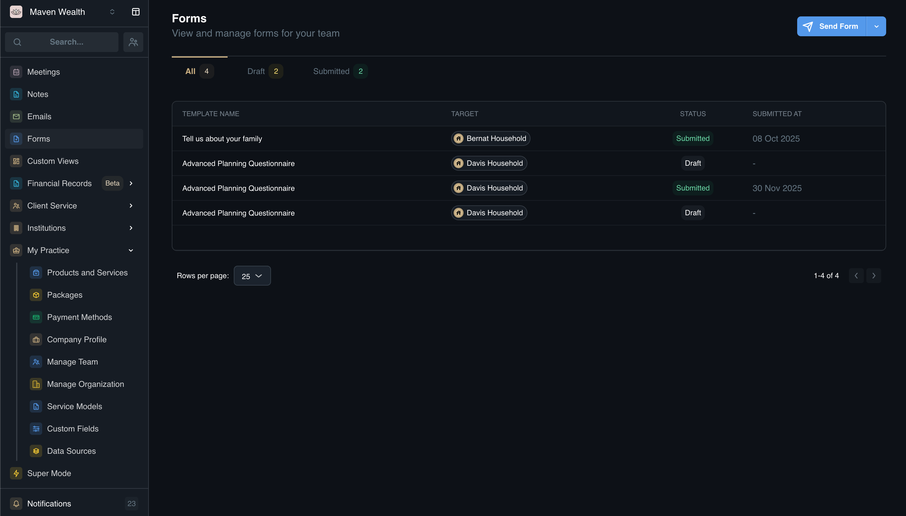
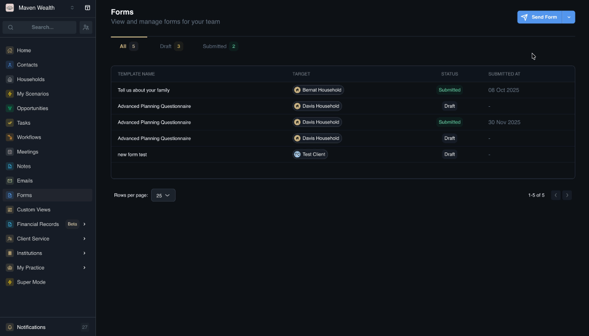
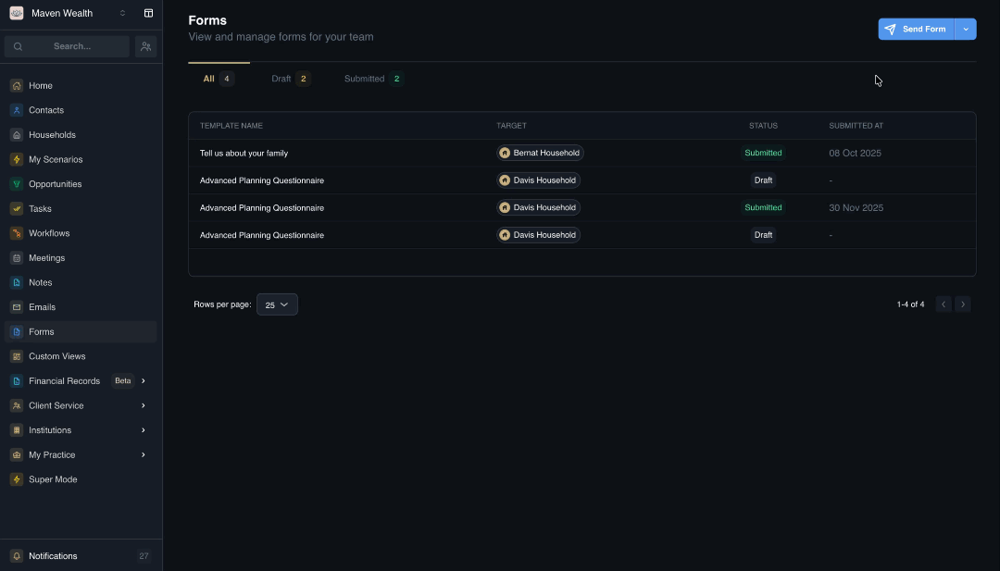

# Forms

## Overview

The **Forms** module empowers your team to gather structured data from clients efficiently. Instead of relying on back-and-forth emails or manual data entry, you can create customized digital questionnaires for everything from risk assessments to new account applications.

Forms can be sent directly to clients for self-completion or used internally by your team to ensure all necessary data is captured during meetings. This module tracks the lifecycle of every form—from draft to submission—ensuring no information is lost.

## Dashboard Views

The main **Forms** dashboard provides a clear overview of all data collection activities.

### View Options

- **All:** A comprehensive list of every form record.
- **Draft:** Forms that are being built or have been started but not yet sent.
- **Submitted:** Completed forms returned by clients or finished by the team.

### Forms List Columns 
* **Forms List:** The table displays key details for tracking progress:
    * **Template Name:** The specific questionnaire used (*e.g., "Risk Profile 2024"*).
    * **Target:** The recipient (*Client or Household*) the form is assigned to.
    * **Status:** Current state (*Draft, Submitted*).
    * **Submitted at:** The timestamp of completion.

## How to Edit Templates

Use this feature to modify existing questionnaires or update the specific data collection fields within a form.

1. Navigate to the **Forms** module and click on the **Manage Templates** link.
2. Locate the specific template you want to change and click the **Edit** icon.
3. Update the **Name** and **Description** in the template to ensure the form's purpose is clear.
4. Click **Add Question** to insert a new question block, or update existing blocks by typing your query in the Question text and adding context in the Description field.
5. Click **Add Field** to select the specific input type, such a s**Text**, **Text Area**, **Number**, **Date**, **Currency**, **Checkbox**, **Single Select**, **Multi Select**, **URL**.
5. For each new field, decide where the data goes:
    * **Track in form only:** Data lives only in this submission record.
    * **Save to custom fields:** Data automatically updates the client's profile record.
6. Save your template.

### How to Preview a Form

1. Navigate to the **Forms** page and select the **Manage Templates** link.
2. Locate the specific template you wish to review and click the Edit button to enter the builder interface.
3. Click the **Preview** button to generate a mock view of the document.
4. The system will open a new window displaying the form exactly as the recipient will see it, allowing you to verify that all questions and fields are formatted correctly.

### How to Send a Form

1. Click the **Send Form** button on the dashboard.
2. Search for and select the specific client or contact in the **Select Recipient (Who will receive this form?)** dropdown.
3. Choose the appropriate document structure from the **Select Template** library.
4. Specify a deadline in the **When is this due?** field to ensure the recipient knows the timeline.
5. Choose Completion Method:
    * **Client completes:** The system emails the form link to the client for them to fill out remotely.
    * **Team member completes:** The form opens immediately for you or a colleague to fill out (*e.g., during a live meeting*).
6. Click **Send Form**.

