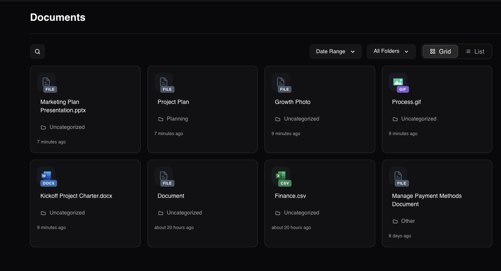
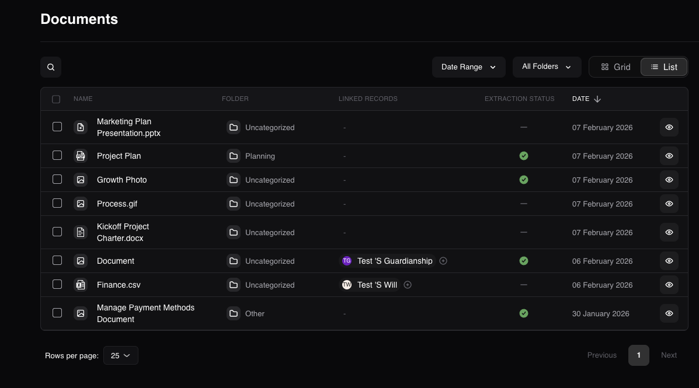
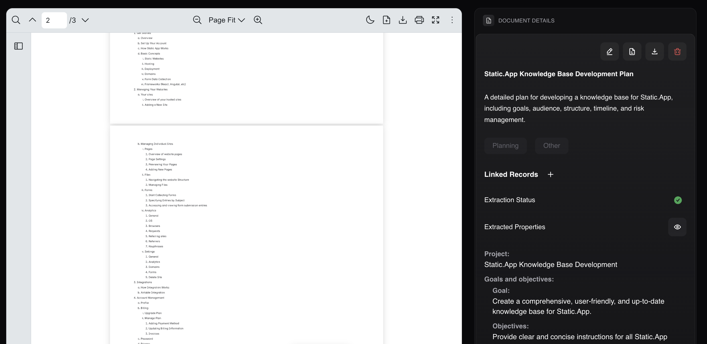
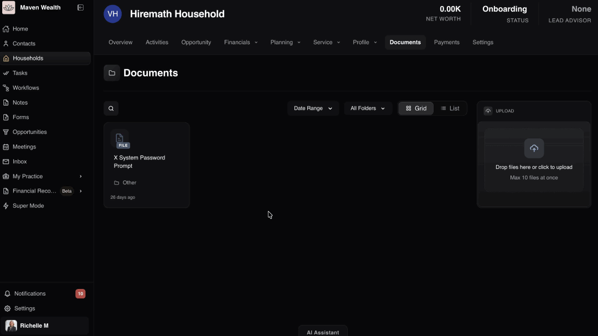

# Documents

## Overview

The **Documents** page acts as the central digital repository for the household, enabling you to securely store, organize, and manage all files associated with the family. From compliance records to client deliverables, this module ensures that critical information is easily retrievable and linked directly to the relevant entity.

It features robust search capabilities and flexible viewing options, ensuring you can quickly locate specific records amidst a growing library of files.

## The Documents Dashboard

### Overview

The main dashboard serves as the command center for file management.

### View Options

* **Grid View:** Displays files as visual tiles with icons representing the file type (*e.g., CSV, Word*). This view highlights the **File Name**, **Folder**, and **Time Elapsed Since Upload** (*e.g., 2 minutes, 5 months*).

* **List View:** Displays a detailed row for each file, offering a comprehensive look at metadata such as **Name**, **Folder**, **Linked Records**, and **Extraction Status**.

### Search & Filters

* **Search Bar:** Locate files instantly by name.
* **Filters:** Refine results by **Date Range** or specific **Folders** (*e.g., "All Folders" vs. specific sub-folders*).

## Document Details Page

### Overview

When you select a file (by clicking the **View** button), you enter the **Document Details** page.

* **Preview:** The left pane displays the file content (if supported). For unsupported formats, you will see the message: "Preview not available for this file type".
* **Details Panel:** The right pane displays editable metadata and action buttons for managing the specific file record.

## Document Management

This section covers the core functions for handling your digital library, from uploading new assets to editing their metadata.

### How to Upload Documents

1. Drag and drop your files directly onto the dashboard, or click the upload area to select files from your computer.
:::note NOTE
You can upload a maximum of 10 files at once.
:::
2. Ensure your files are in a supported format.
    * **Supported Formats:** PDF, Word, Excel, PowerPoint, Text, Markdown, CSV, RTF, and common image formats (JPEG, PNG, TIFF, GIF, BMP, WebP).
:::warning WARNING
If you attempt to upload an unsupported file, you will receive the following error message: File "xxxx.extension" rejected: Invalid File Type: Accepted types are PDF, Word, Excel, PowerPoint, Text, Markdown, CSV, RTF, and common image formats (JPEG, PNG, TIFF, GIF, BMP, WebP).
:::

### How to Edit Document Details

1. Select a specific document to view its details.
2. Click the **Edit** button in the details panel.
3. Update the following fields as needed:
    * **Name:** Rename the file for better clarity.
    * **Description:** Add notes about the file's contents.
    * **Category:** Select from options like *Account Application, Account Transfer, Career, Collectibles, Corporate, etc*.
    * **Type:** Select from options like *Articles of Incorporation, Business Number Assignment Letter, Compliance Documents, Corporate Bylaws, etc*.
4. Click the **Update Document** button to save changes.

### Document Actions
Within the **Document Details** section, you can perform several key actions:

* **Download File:** Save a local copy of the document.
* **Extract Properties:** Initiate the system's data extraction tool.
* **Delete:** Permanently remove the file from the system.
* **Review Data:** You can also review **Linked Records** (associated Entity) and the current **Extraction Status**.