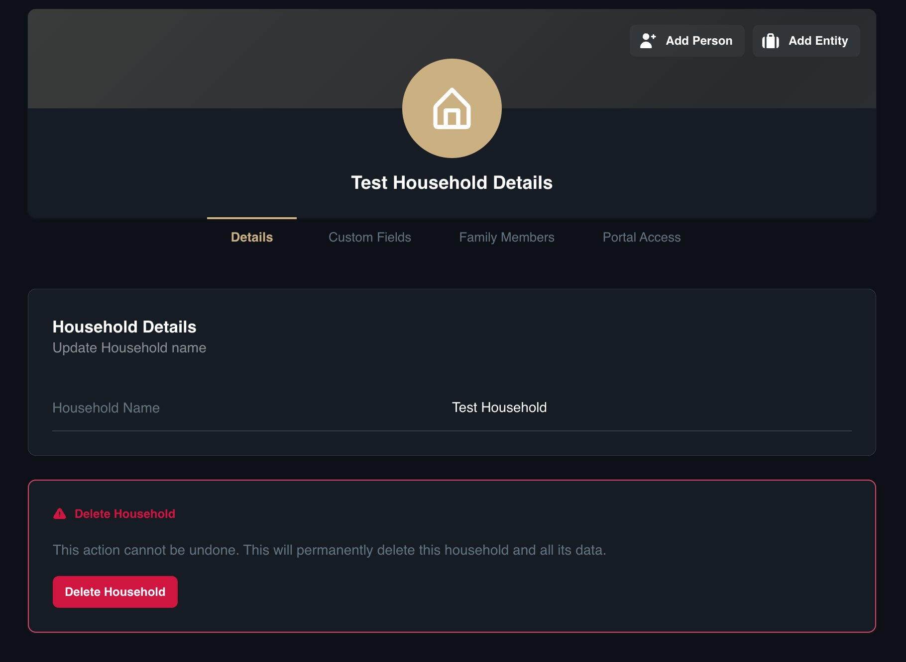
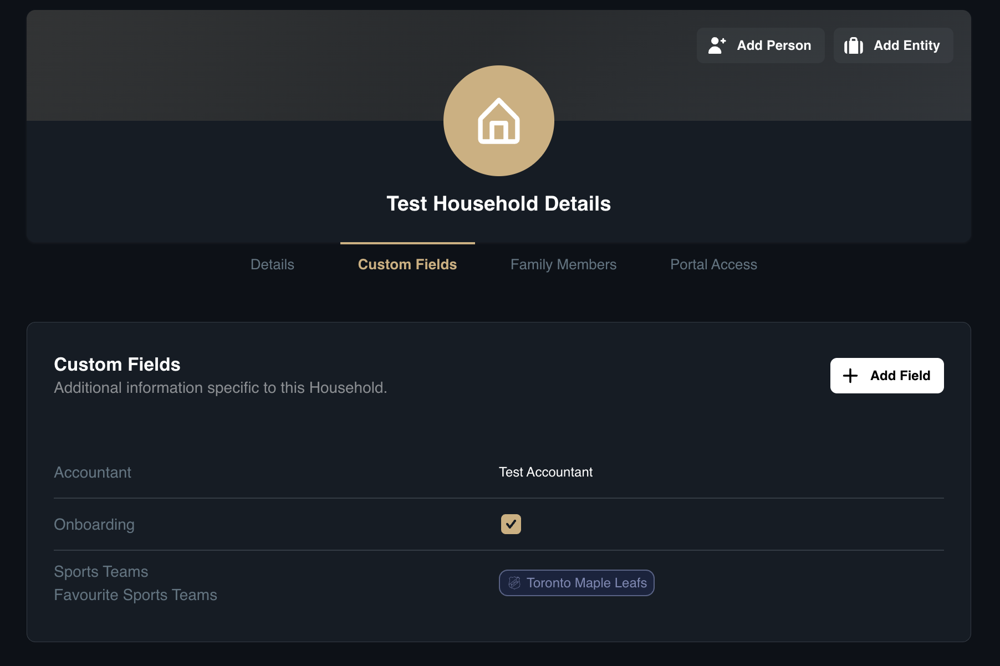
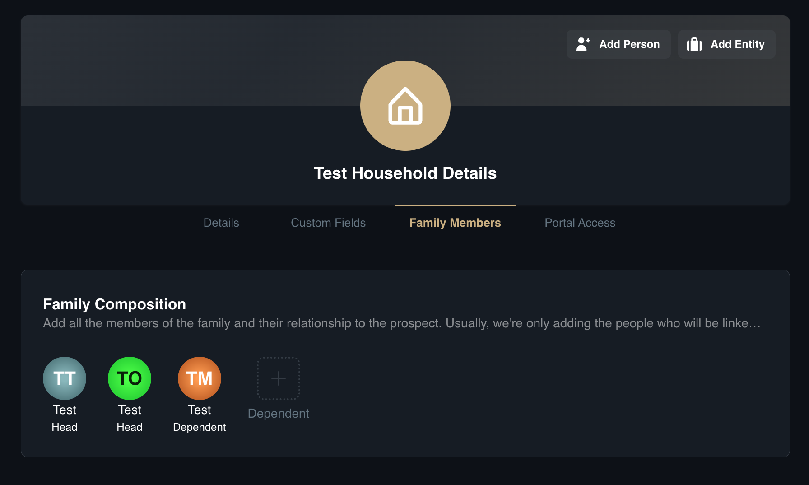
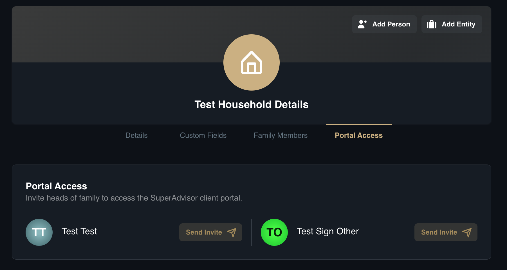
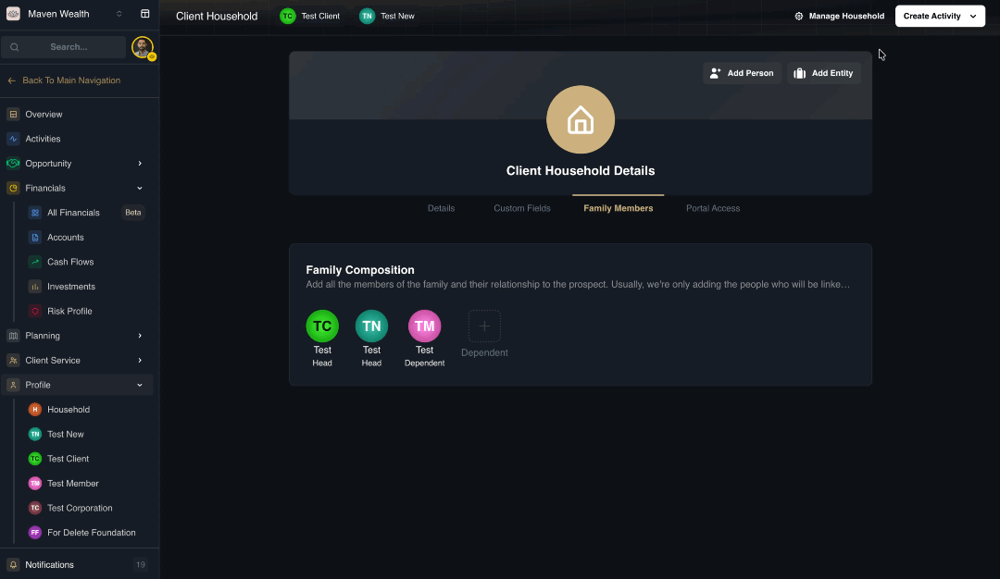
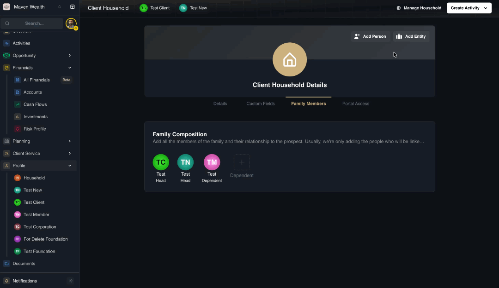

# Household Profile Page

The **Household Profile** is the central hub for managing a family's aggregate information. It is organized into four key tabs:

## Profile Layout

The household profile is organized into four key tabs:

* **Details:** Modify the Household Name or perform a Delete Household action. 

* **Custom Fields:** Manage additional information and specific data points relevant to the entire family unit.

* **Family Members:** Use this section for relationship management to add and link individuals like the Household Head, Significant Other, and Dependents.

* **Portal Access:** Manage access to the client portal and send email invitations directly to the heads of the family.

### How to Update Household Details
1. Open the specific **Household Profile**.
2. Click the **Details** tab.
3. Update the Household Name to change the display name for the family unit.

### How to Manage Household Custom Fields
1. Open the **Household Profile**.
2. Click the **Custom Fields** tab.
3. Select from existing custom fields or add a new field.

### How to Manage Family Members
1. Open the **Household Profile**.
2. Click the **Family Members** tab.
3. Add or link individuals to define the family structure, assigning Member Types such as Significant Other, or Dependent.

### How to Invite a Household to the Portal
1. Open the **Household Profile**.
2. Click the **Portal Access** tab.
3. Click **Send Invite** to grant the heads of the family access to the client portal.
4. If a contact does not have an email address on file, you will be prompted to enter one before the invitation can be sent.

## How to Add Members

Use this to link individuals to the household.

1. Navigate to the **Household Profile** page.
2. Click **Add Person**. 
3. Enter the **Contact Details** (Name, Email, etc.).
4. Go to the **Family Members** section of the details page.
5. **To Add a Significant Other:**
    * Select the **Relationship Type** (e.g., Married, Engaged).
    * Select an existing contact or enter new details.
6. **To Add a Dependent:**
    * Set the relationship to the **Head of Family** (e.g., Parent).
    * If applicable, set the relationship to the **Significant Other**.
7. Click **Save**.

## How to Manage Corporate Entities and Trusts

Use this feature to add legal entities to the household for a complete financial picture.

1. Navigate to the **Profile** tab within the Household record.
3. Select Household.
3. Click the **Add Entity** button.
4. Select the **Entity Type** you wish to create.

### How to Add a Corporation
1. Enter the **Corporation Name** and click **Create Corporation**.
3. Select the newly created entity to manage the following tabs:
    * **Details:** Define the **Structure** (e.g., C Corp, Co-Operative), enter the **Nature of Business**, and set the **Establishment Date** and **Incorporation Jurisdiction**.
    * **Contact:** Input the physical **Addresses**, **Emails**, and **Phone Numbers** specifically for the business.
    * **Regulatory:** * Mark if the entity is a **Reporting Issuer** or **Regulated**, providing the ticker symbols or regulator names as required.
        * Set the entity's **Status** (For Profit or Solicits Donations).
        * Disclose **Ownership** details if the entity owns 10% or more shares of a publicly traded company.

### How to Add a Foundation
1. Enter the **Foundation Name**.
2. Click **Create Foundation**.
3. Review the **Details** tab to verify the Foundation Name.

### How to Add a Trust
1. Enter the Trust Name.
2. Click **Create Trust**.
3. Navigate to **Trust Details** to verify the **Trust Name**.

