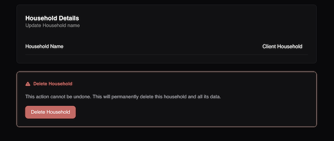
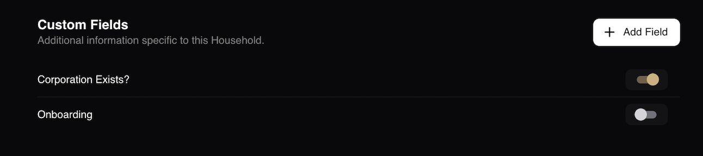
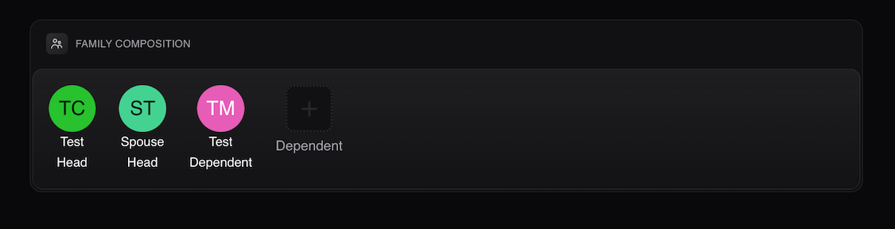
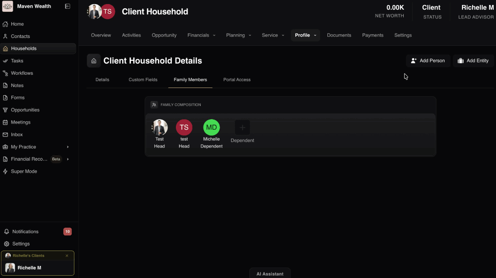
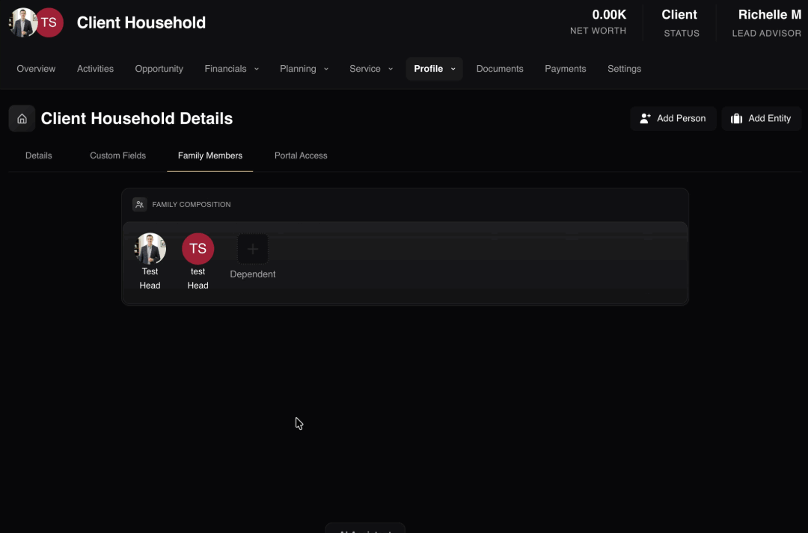
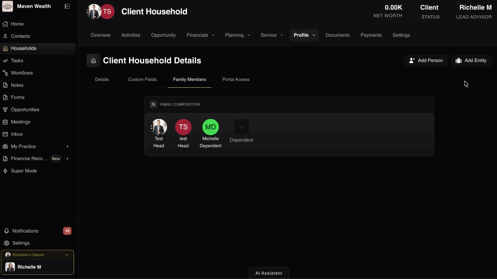
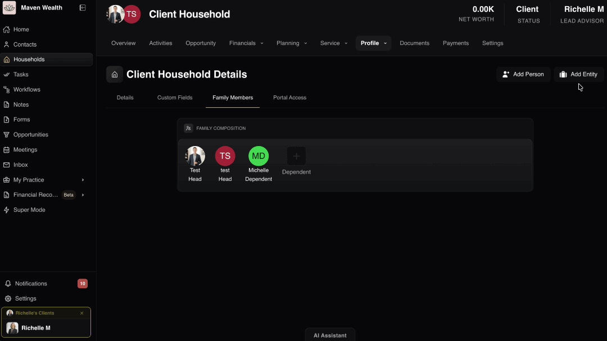

# Household Profile

The **Household Profile** is the central hub for managing a family's aggregate information. Unlike the main list, which is used for quick scanning, this page is designed for managing specific information and mapping out the complete structure of a family unit or legal entity.

## Profile Layout

The household profile is organized into four key tabs:

* **Details:** Review and modify the core household name or delete the record.
* **Custom Fields:** Manage additional information and specific data points relevant to the entire family unit.
* **Family Members:** Use this section for relationship management to add and link individuals like the **Household Head**, **Significant Other**, and **Dependents**.
* **Portal Access:** Manage access to the client portal and send email invitations directly to the heads of the family.

### Details

The **Details** tab serves as the primary area for core household management. Here, you can update the Household Name to change the display name for the family unit. This section also includes the administrative control to permanently Delete Household. 

:::warning WARNING
This action cannot be undone and will remove all associated data for the household.
:::

### Custom Fields

This section allows you to manage firm-specific data points that fall outside of the standard system fields but are relevant to the entire household (e.g., Anniversary Date, Accountant Name). For detailed instructions on creating and managing these custom data points, please refer to the [**Custom Fields**](../my-practice/custom-fields) module.

### Family Members

The Family Members tab is the structural core of the household. It maps out the relationships between different contacts and legal entities. Use this section to define the family structure by assigning roles such as Household Head, Significant Other, and Dependents. You can also manage associated corporate entities, foundations, and trusts directly from this tab.

### Portal Access

This section controls the household's ability to log into the SuperAdvisor client portal. From here, you can view the access status and grant the heads of the family access by clicking Send Invite. If a contact does not have an email address on file, the system will prompt you to provide one before the invitation link is sent out.

## How to Add Family Members
Use these steps to link new or existing individuals to the household and establish their specific roles within the family unit.

### How to Add a Person

This added person can then be used to select an existing contact when adding a significant other or a dependent, so you don't have to create them manually.

1. Click **Add Person**. 
2. Enter the **Contact Details** (*Name, Email, etc.*).
3. In the **Add Household Member** pop-up, fill up the following:
    * **Contact Details:** Enter the personal information for this contact, including First Name (Required), Middle Name, Last Name (Required), Preferred Name, Short Name, Gender, Social Insurance Number, and Social Security Number.
    * **Contact Information:** Add email and phone number details, including Email, Country Code, Phone Number, Phone Type, and Phone Label.
    * **Advisor Assignment:** Assign a primary advisor to this contact.
    * **Address Information:** Add optional address details for this contact.
4. Click **Save**.

### How to Add a Significant Other

1. Go to the **Family Members** section of the household details page.
2. Click **Significant Other**.
3. Select the **Relationship Type** (Required - e.g., Married, Engaged).
4. Select an existing contact (from the **Add Person** step) or choose to create a new person.
5. If creating a new person, enter the following details: **First Name**, **Middle Name**, **Last Name**, **Gender**, **Email**, **Date of Birth**, **Social Insurance Number**, and **Social Security Number**.
6. Click **Save**.

### How to Add a Dependent

1. Go to the **Family Members** section of the household details page.
2. Click **Dependent**.
3. Set the **Relationship type 1** (Required) and specify if the Head of Family is this child's: Parent, Step Parent, or Guardian.
4. If applicable, set the relationship to the Significant Other.
5. Select an **Existing Person** (from the **Add Person** step) or choose to create a New Person.
6. If creating a new person, enter the following details: **First Name**, **Middle Name**, **Last Name**, **Gender**, **Date of Birth**, **Social Insurance Number**, and **Social Security Number**.
7. Click Save.

## How to Manage Corporate Entities and Trusts

Use this feature to add legal entities to the household for a complete financial picture.

1. Navigate to the **Profile** tab within the Household record.
3. Select Household.
3. Click the **Add Entity** button.
4. Select the **Entity Type** you wish to create.

### How to Add a Corporation
1. Enter the **Corporation Name** and click **Create Corporation**.
3. Select the newly created entity to manage the following tabs:
    * **Details:** Define the **Structure** (*e.g., C Corp, Co-Operative*), enter the **Nature of Business**, and set the **Establishment Date** and **Incorporation Jurisdiction**.
    * **Contact:** Input the physical **Addresses**, **Emails**, and **Phone Numbers** specifically for the business.
    * **Regulatory:** * Mark if the entity is a **Reporting Issuer** or **Regulated**, providing the ticker symbols or regulator names as required.
        * Set the entity's **Status** (**For Profit or Solicits Donations**).
        * Disclose **Ownership** details if the entity owns 10% or more shares of a publicly traded company.

### How to Add a Foundation
1. Enter the **Foundation Name**.
2. Click **Create Foundation**.
3. Review the **Details** tab to verify the **Foundation Name**.

### How to Add a Trust
1. Enter the Trust Name.
2. Click **Create Trust**.
3. Navigate to **Trust Details** to verify the **Trust Name**.

