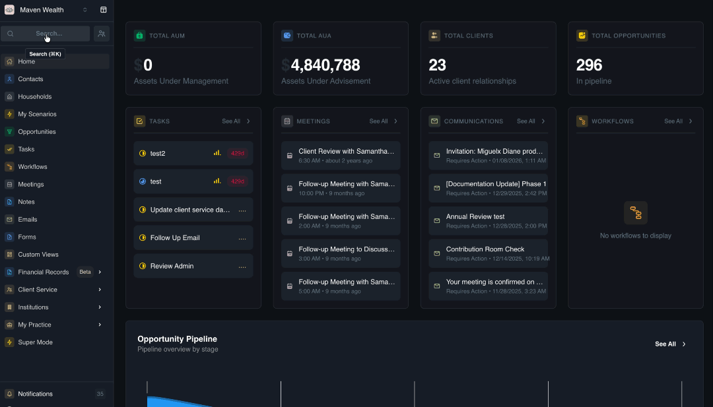
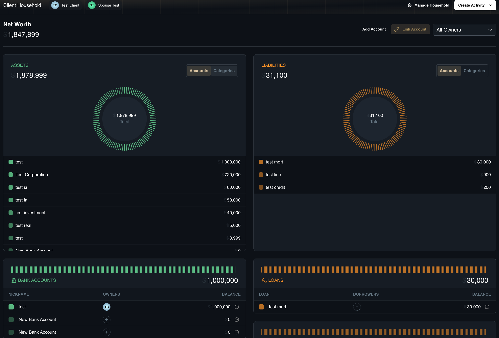
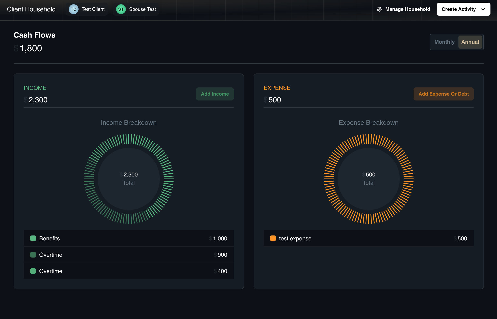

# The Financials Section

## Overview

The **Financials** section serves as the central repository for a client’s entire economic life. It consolidates fragmented data points—ranging from bank balances and investment holdings to insurance policies and real estate—into a unified, real-time database.

While deeply integrated with the [**Household**](../households) record to generate live Net Worth statements, Financials functions as a distinct module for detailed asset and liability management. By maintaining this comprehensive view, advisors can accurately identify coverage gaps, assess liquidity requirements, and deliver holistic financial advice based on a complete picture of a client's wealth.

### Accessing Financials Section

To view and manage financial data for a specific client:

1. Navigate to the specific **Household** record.
2. Locate the **Financials** link in the side navigation menu.
3. Select the appropriate sub-page based on your task (*e.g., All Financials, Accounts, or Cash Flows*).

## The "All Financials" Dashboard

This dashboard serves as the master registry for every financial record associated with the household. It aggregates data into dedicated tables for each specific financial category.

Users can simply select the **Financial** category they wish to view, and the dashboard will display the respective table customized for that data type. For detailed information on the specific fields and functions for each category, please refer to the individual articles linked below:

* [**Bank Accounts**](../financial-records/assets#bank-accounts)
* [**Investment Accounts**](../financial-records/investments#investment-accounts)
* [**Credit Cards**](../financial-records/liabilities#credit-cards)
* [**Loans**](../financial-records/liabilities#loans)
* [**Lines of Credit**](../financial-records/liabilities#lines-of-credit)
* [**Company Equity**](../financial-records/investments#company-equity)
* [**Defined Benefit Pensions**](../financial-records/pensions#defined-benefit-pensions)
* [**Private Investments**](../financial-records/investments#private-investments)
* [**Real Assets**](../financial-records/assets#real-assets)
* [**Real Estate Properties**](../financial-records/assets#real-estate-properties)
* [**Insurance Policies**](../financial-records/pensions#insurance-policies)
* [**Income Cash Flows**](../financial-records/pensions#cash-flows)
* [**Expense Cash Flows**](../financial-records/pensions#cash-flows)

**Customizing Views:**
Users can also customize their views by changing columns, sorts, and filters to better organize their data. For more details on these capabilities, please refer to the article on [Custom Views](../custom-views).

**To manage records here:**

* **Detailed Entry:** Click the primary **Add** button to open the full entry form. 
:::note NOTE
The button label changes dynamically based on the selected view (e.g., it will appear as **Add Bank Account** or **Add Investment Account**). When you click this button, you must complete the form specific to that category; for step-by-step instructions on filling out these forms, please refer to the separate **Financial Category** articles linked in the list above.
:::

* **Quick Add:** Click the **Add Row** button at the bottom of the list to create a new line item with default values, enabling rapid inline editing.

## The "Accounts" Dashboard

The **Accounts** sub-page shifts focus from data entry to high-level visualization, displaying the household's real-time Net Worth calculation. The dashboard is distinctly divided into two primary parts: **Assets** and **Liabilities**.

Each part features its own dedicated widgets, allowing for independent analysis of wealth and debt.

**To visualize data:**

* **Check Net Worth:** 
    * View the banner at the top for the real-time calculation of **Total Assets** - **Total Liabilities**.
* **Analyze Allocations:** 
    * Both the **Assets** and **Liabilities** widgets include interactive toggles and allocations visualizations. 
    * You can switch the view between **Categories** (e.g., Real Assets vs. Bank Accounts) and **Accounts** (specific holding names). 
    * Hover over the pie chart slices to see specific percentage weightings for each allocation.

**Adding & Linking Accounts:**
You can populate this dashboard by manually adding holdings or connecting external institutions directly from this page.

* **Add Account:** 
    * Click the **Add Account** button. 
    * You will be prompted to select a specific Category (*e.g., Real Assets, Bank Account*) to ensure you are filling out the correct form.

* **Link Account:** 
    * Select this option to connect external institutions. 
    * You can **Link to Bank** or **Link to Investment** accounts to establish a secure connection for automated balance updates.

## The "Cash Flows" Dashboard

This module provides a detailed analysis of the client's budget health by tracking the timing and magnitude of funds entering and leaving the household. It visualizes income versus expenses over monthly or annual timeframes, helping advisors identify surplus liquidity for saving or pinpoint spending habits that may hinder long-term goals.

**To track budget health:**

* **Analyze Trends:** Review **Summary Widgets** for **Total Income**, **Total Expenses**, and **Net Cash Flow**. Use the timeframe toggle to switch between **Monthly** and **Annual**.
* **Add Inflows/Outflows:**
    * Click **Add Income** to record sources like Salary or Dividends. For more information on how to add these records, please refer to [Cash Flows](../financial-records/pensions#cash-flows).
    * Click A**dd Expense or Debt** to record general spending or liability repayments.

