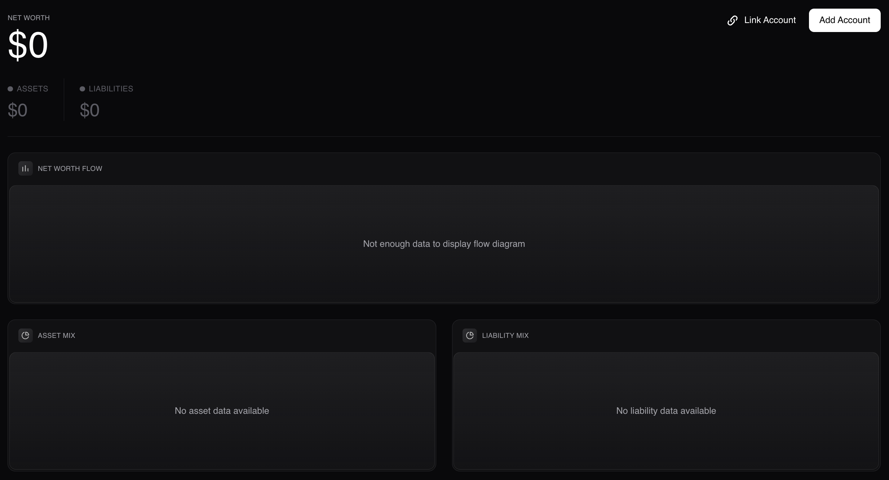
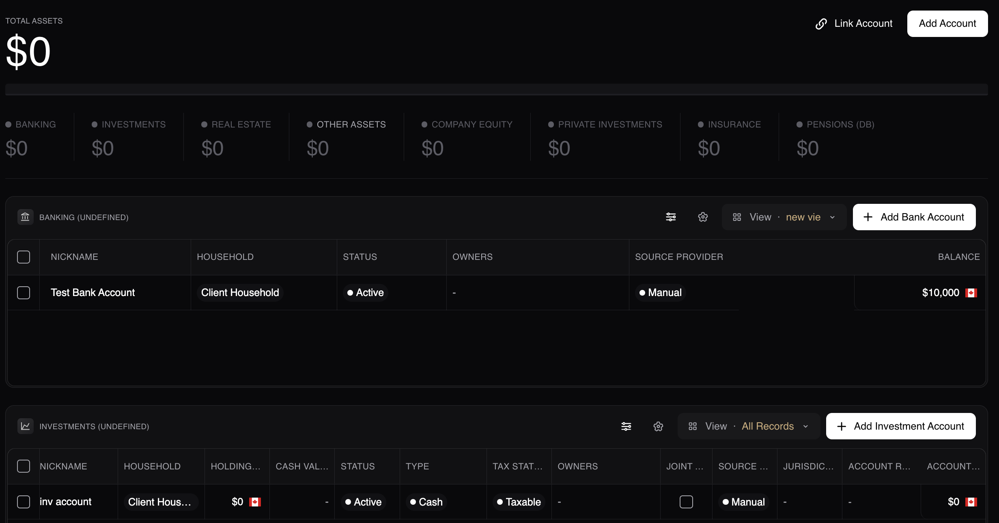
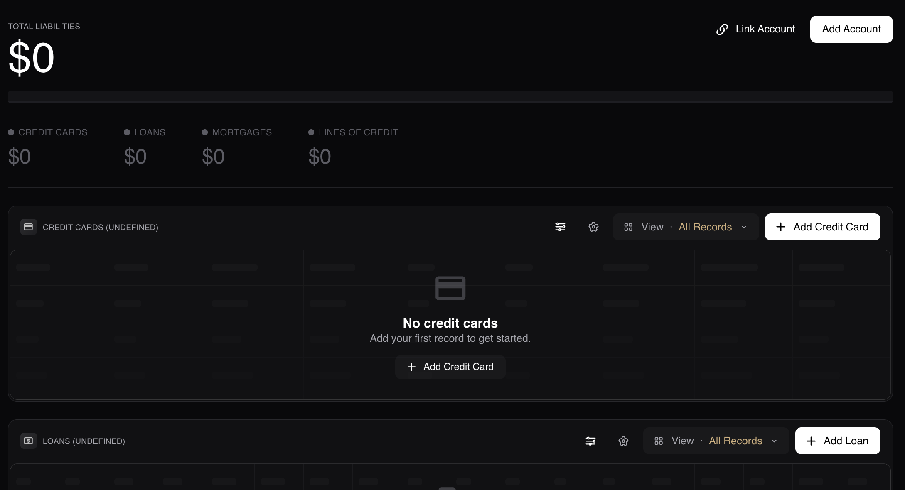
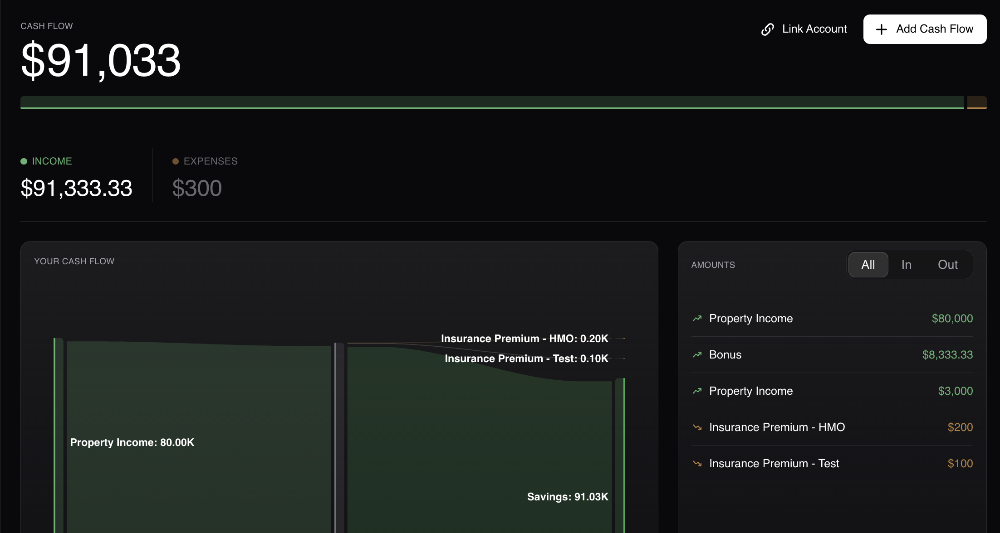
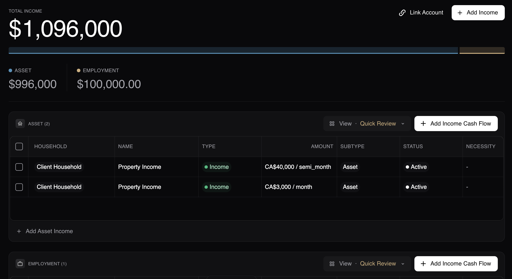
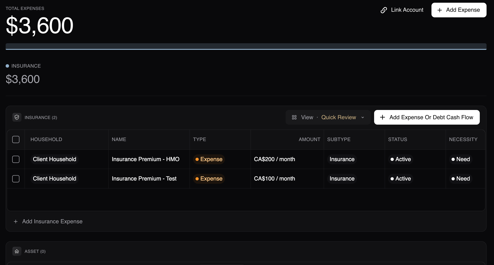
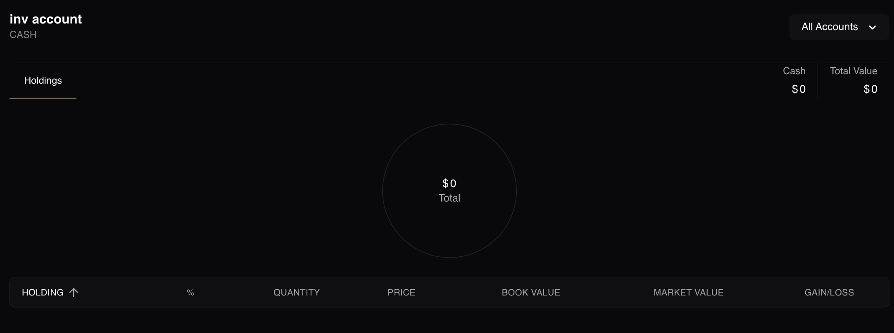
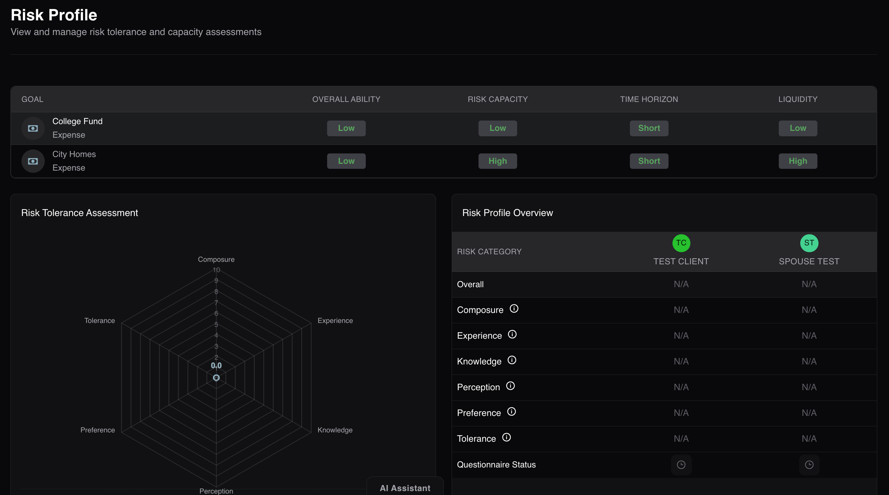

# The Financials Section

## Overview

The **Financials** section serves as the central repository for a client’s entire economic life. It consolidates fragmented data points—ranging from bank balances and investment holdings to insurance policies and real estate—into a unified, real-time database.

While deeply integrated with the [**Household**](../households) record to generate live Net Worth statements, Financials functions as a distinct module for detailed asset and liability management. By maintaining this comprehensive view, advisors can accurately identify coverage gaps, assess liquidity requirements, and deliver holistic financial advice based on a complete picture of a client's wealth.

## Accessing Financials Section

To view and manage financial data for a specific client:

1. Navigate to the specific **Household** record.
2. Locate the **Financials** tab.
3. Select the appropriate sub-page based on your task (*e.g., Net Worth, Assets, Liabilities, etc*).

The Financials module is divided into the following sections accessible via the dropdown menu:

### Net Worth

* **Net Worth:** Provides a high-level summary of the client's financial standing. It displays the overall Net Worth calculation alongside total Assets and total Liabilities. It also features visual widgets for Net Worth Flow, Asset Mix, and Liability Mix to help analyze ongoing trends and portfolio allocations.

* **Assets:** Displays the Total Assets value and provides a detailed breakdown of all individual holdings. Holdings are categorized into: Banking, Investments, Real Estate, Other Assets, Company Equity, Private Investments, Insurance, and Pensions (DB). You can view specific records, ownership details, and individual monetary values within each category.

* **Liabilities:** Displays the Total Liabilities value and breaks down the client's debt obligations. Debts are categorized into: Credit Cards, Loans, Mortgages, and Lines of Credit. You can view specific debt records and their current balances, or prompt to add your first record if none exist.

### Cash Flows

* **Cash Flow:** Provides a holistic overview of the household's budget. It displays the net cash flow calculation (Income vs. Expenses), summaries of your cash flow (e.g., Shortfalls or specific premium costs), and a filtered view of Amounts (All, In, Out). It also features a "Transactions" ledger with time-based filters (1M, 3M, 6M, YTD, 12M, 2025, All) and visual charts for the "Distribution of Income by Source" and "Distribution of Expenses by Source."

* **Income:** Displays Total Income and a detailed breakdown by source. Categories include Employment, Asset, Investment, Pension, Government, Corporation, and Other. From this dashboard, you can quick-review active records and directly log new sources using the specific addition actions (e.g., "Add Employment Income", "Add Asset Income").

* **Expenses:** Displays Total Expenses and a detailed breakdown of spending. Categories include Insurance, Asset, Debt Payments, and Other. From this dashboard, you can quick-review recorded spending and log new outflows using the specific addition actions (e.g., "Add Insurance Expense").

### Investments

* **Investments:** Displays the portfolio's active funds. It shows available Cash balances alongside the Total Value of the investments. It includes a comprehensive holdings table that breaks down individual assets by Holding name, percentage allocation (%), Quantity, Price, Book Value, Market Value, and total Gain/Loss.

### Risk Profile

* **Risk Profile:** Allows you to view and manage risk tolerance and capacity assessments for the household. It tracks associated life goals and expenses (e.g., College Fund, City Homes) alongside active Risk Tolerance Assessments. The Risk Profile Overview details psychological and financial metrics (Composure, Experience, Knowledge, Perception, Preference, Tolerance, and Questionnaire Status), providing comparative scores for individual members (e.g., Test Client, Spouse Test) as well as an Overall household rating.

