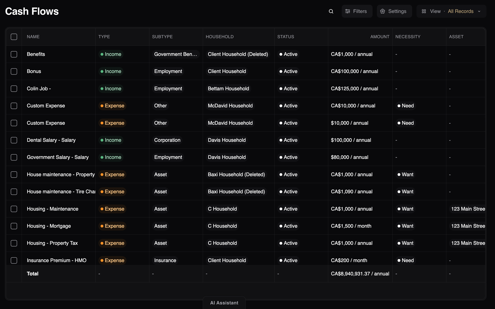

# The Financials Section

## Overview

The **Financials** section serves as the central hub for a client's entire economic life. It consolidates fragmented data points—ranging from bank balances and investment holdings to insurance policies and real estate—into a unified, real-time database.

Deeply integrated with the [**Household**](../households) record, the Financials section generates live Net Worth statements, tracks income and expenses, and provides detailed investment and risk analysis. By maintaining this comprehensive view, advisors can accurately identify coverage gaps, assess liquidity requirements, and deliver holistic financial advice based on a complete picture of a client's wealth.

### Accessing the Financials Section

To view and manage financial data for a specific client:

1. Navigate to the specific **Household** record.
2. Locate the **Financials** dropdown in the top navigation bar.
3. Select the appropriate sub-page from the dropdown menu.

The Financials section is organized into the following sub-pages:

| Group | Pages | Purpose |
|-------|-------|---------|
| **Net Worth** | Net Worth, Assets, Liabilities | Track total wealth, detailed asset breakdown, and debt management |
| **Cash Flows** | Cash Flow, Income, Expenses | Analyze budget health, income sources, and spending patterns |
| **Investments** | Investments | Manage portfolio holdings and performance |
| **Risk Profile** | Risk Profile | Assess risk tolerance and capacity |

:::danger IMAGE NEEDS UPDATE
This GIF is outdated and needs to be replaced. It shows the old navigation with "All Financials", "Accounts", and "Cash Flows" tabs, which have been replaced with the new dropdown structure described above.
:::

---

## Net Worth

The **Net Worth** page provides a high-level visualization of the household's financial health, displaying the real-time calculation of **Total Assets** minus **Total Liabilities**.

:::info IMAGE PLACEHOLDER
Add a screenshot showing the Net Worth page with the metric header, segment bar, Sankey diagram, and donut charts.
:::

### Key Elements

* **Net Worth Header:** A prominent banner displaying the total Net Worth value.
* **Segment Bar:** A horizontal bar showing the proportional split between total Assets and total Liabilities, with interactive hover states.
* **Category Tabs:** Sticky tabs for **Assets** and **Liabilities**, sorted by value (largest to smallest), allowing quick navigation between sections.
* **Net Worth Flow (Sankey Diagram):** A flow visualization showing how individual asset types contribute to Total Assets and ultimately to Net Worth.
* **Asset Mix (Donut Chart):** A breakdown of asset allocation across up to 8 categories: Banking, Investments, Real Estate, Real Assets, Company Equity, Private Investments, Insurance, and Pensions.
* **Liability Mix (Donut Chart):** A breakdown of liabilities across Credit Cards, Loans, and Lines of Credit.

### Available Actions

* **Link Account:** Connect external institutions for automated balance updates.
* **Add Accounts:** Manually add new asset or liability records.

---

## Assets

The **Assets** page provides a detailed, categorized breakdown of every asset associated with the household. Each asset category is displayed in its own section with a dedicated data table.

:::info IMAGE PLACEHOLDER
Add a screenshot showing the Assets page with the metric header, segment bar, category tabs, and one or two expanded asset sections with tables.
:::

### Key Elements

* **Total Assets Header:** Displays the aggregated value of all assets.
* **Owner Filter:** A dropdown to filter assets by ownership type—individual persons, corporations, foundations, or trusts.
* **Segment Bar:** A horizontal bar showing proportional allocation across all 8 asset categories.
* **Category Tabs:** Sticky tabs for each asset type, sorted by value, enabling quick scroll-to-section navigation.

### Asset Category Sections

Each category is displayed as a card with its own icon, record count, and data table:

| Category | Description | Links To |
|----------|-------------|----------|
| **Banking** | Checking, savings, and money market accounts | [Bank Accounts](../financial-records/assets#bank-accounts) |
| **Investments** | Brokerage, retirement, and registered accounts | [Investment Accounts](../financial-records/investments#investment-accounts) |
| **Real Estate** | Residential, commercial, and land properties | [Real Estate Properties](../financial-records/assets#real-estate-properties) |
| **Real Assets** | Physical valuables—art, vehicles, jewelry | [Real Assets](../financial-records/assets#real-assets) |
| **Company Equity** | Stock options, RSUs, and grants | [Company Equity](../financial-records/investments#company-equity) |
| **Private Investments** | Venture capital, PE, and hedge funds | [Private Investments](../financial-records/investments#private-investments) |
| **Insurance** | Life, disability, and critical illness policies | [Insurance Policies](../financial-records/pensions#insurance-policies) |
| **Pensions** | Defined benefit pension plans | [Defined Benefit Pensions](../financial-records/pensions#defined-benefit-pensions) |

### Available Actions

* **Add Record:** Each section has an **Add** button to create a new record for that specific category.
* **Table Controls:** Customize views, toggle filters, and adjust column visibility per section.
* **Owner Filter:** Filter the entire page by specific household member or entity type.

For detailed information on the specific fields and forms for each record type, refer to the linked [Financial Records](../financial-records) articles.

---

## Liabilities

The **Liabilities** page provides a detailed breakdown of all financial obligations associated with the household, organized by debt type.

:::info IMAGE PLACEHOLDER
Add a screenshot showing the Liabilities page with the metric header, segment bar, category tabs, and liability sections.
:::

### Key Elements

* **Total Liabilities Header:** Displays the aggregated value of all debts.
* **Segment Bar:** A horizontal bar showing proportional allocation across the 4 liability categories.
* **Category Tabs:** Sticky tabs for each liability type, sorted by value.

### Liability Category Sections

| Category | Description | Links To |
|----------|-------------|----------|
| **Credit Cards** | Revolving consumer debt with high interest rates | [Credit Cards](../financial-records/liabilities#credit-cards) |
| **Loans** | Non-mortgage fixed-term debts (personal, auto, student) | [Loans](../financial-records/liabilities#loans) |
| **Mortgages** | Mortgage-specific loans, separated from other loan types | [Loans](../financial-records/liabilities#loans) |
| **Lines of Credit** | Flexible borrowing instruments like HELOCs | [Lines of Credit](../financial-records/liabilities#lines-of-credit) |

:::note
Mortgages are tracked separately from other loans on this page for clarity, even though they share the same underlying Loan record type.
:::

### Available Actions

* **Add Record:** Each section has an **Add** button to create a new liability record.
* **Link Account / Add Accounts:** Header buttons to connect external institutions or manually add new accounts.
* **Table Controls:** Customize views, toggle filters, and adjust column visibility per section.

For detailed information on the specific fields and forms for each record type, refer to the linked [Financial Records](../financial-records) articles.

---

## Cash Flow Summary

The **Cash Flow** page provides a side-by-side analysis of household income versus expenses, helping advisors identify surplus liquidity for saving or pinpoint spending habits that may hinder long-term goals.

:::danger IMAGE NEEDS UPDATE
This image is outdated and needs to be replaced with a current screenshot of the Cash Flow Summary page showing the side-by-side income and expenses cards with the timeframe toggle.
:::

### Key Elements

* **Net Income Header:** Displays the calculated net income (Total Income minus Total Expenses), switching between monthly and annual values.
* **Timeframe Toggle:** Switch between **Monthly** and **Annual** views.
* **Date Range Selector:** Filter by specific periods—Last Year, Current Year, 12 Months, Year-to-Date, 90 Days, Last Month, 30 Days, or Current Month.
* **Income Card:** A table listing all income sources sorted by amount (highest first).
* **Expenses Card:** A table listing all expenses and debt payments combined, sorted by amount (highest first).

### Available Actions

* **Toggle Timeframe:** Switch between Monthly and Annual display.
* **Select Date Range:** Choose a specific reporting period.

For detailed management of individual income and expense records, use the dedicated [Income](#income) and [Expenses](#expenses) pages.

---

## Income

The **Income** page provides a detailed breakdown of all income sources flowing into the household, organized by source type.

:::info IMAGE PLACEHOLDER
Add a screenshot showing the Income page with the metric header, segment bar, income source tabs, and one or two expanded sections with tables.
:::

### Key Elements

* **Total Income Header:** Displays the aggregated annualized income value.
* **Segment Bar:** A horizontal bar showing proportional allocation across the 7 income source types.
* **Category Tabs:** Sticky tabs for each income source, sorted by value.

### Income Source Categories

| Category | Examples |
|----------|----------|
| **Employment** | Salary, bonuses, commissions |
| **Investment** | Dividends, capital gains, interest |
| **Pension** | Defined benefit payouts, annuities |
| **Government Benefit** | Social security, disability benefits |
| **Corporation** | Business distributions, shareholder income |
| **Asset** | Rental income, royalties |
| **Other** | Alimony, gifts, miscellaneous |

### Available Actions

* **Add Income:** Each section has an **Add Income** button that opens a form to create a new income cash flow record.
* **Table Controls:** Customize views and column visibility per section.

For detailed information on creating cash flow records, refer to [Cash Flows](../financial-records/pensions#cash-flows).

---

## Expenses

The **Expenses** page provides a detailed breakdown of all outflows from the household, including both recurring expenses and debt payments.

:::info IMAGE PLACEHOLDER
Add a screenshot showing the Expenses page with the metric header, segment bar, expense tabs, and sections with tables.
:::

### Key Elements

* **Total Expenses Header:** Displays the aggregated expense value.
* **Segment Bar:** A horizontal bar showing proportional allocation across the 4 expense/debt categories.
* **Category Tabs:** Sticky tabs for each expense type, sorted by value.

### Expense Categories

| Category | Description |
|----------|-------------|
| **Insurance** | Premium payments for insurance policies |
| **Asset** | Expenses associated with specific assets (e.g., property maintenance) |
| **Debt Payments** | Recurring payments toward loans, mortgages, and other liabilities |
| **Other** | Lifestyle expenses and miscellaneous spending |

### Available Actions

* **Add Expense:** Each section has an **Add** button that opens a form to create a new expense or debt payment cash flow record.
* **Table Controls:** Customize views and column visibility per section.

For detailed information on creating cash flow records, refer to [Cash Flows](../financial-records/pensions#cash-flows).

---

## Investments

The **Investments** page provides a detailed portfolio view for all investment accounts in the household, including holdings breakdowns, performance tracking, and asset class analysis.

:::info IMAGE PLACEHOLDER
Add a screenshot showing the Investments page with account tabs, donut chart, and the holdings table.
:::

### Key Elements

* **Account Tabs:** Navigate between individual investment accounts or view multiple accounts together.
* **Account Summary:** Displays the total account value, cash position, and holdings value for the selected account(s).
* **Donut Chart:** A visual breakdown of the selected account's holdings by asset class or security.
* **Holdings Table:** A detailed table showing each security held in the account.

### Holdings Table Columns

* **Security:** The name and type of the holding.
* **Quantity:** Number of shares or units held.
* **Market Value:** Current value of the holding.
* **Book Value:** Original cost basis.
* **Gain:** Unrealized gain or loss (amount and percentage).

### Available Actions

* **Select Accounts:** Choose individual accounts or select multiple accounts for an aggregated view.
* **Edit Account:** Modify account details from the header.
* **View Performance:** Access historical performance charts for individual holdings.

---

## Risk Profile

The **Risk Profile** page provides a comprehensive assessment of each household member's risk tolerance and the household's overall risk capacity relative to their financial goals.

:::info IMAGE PLACEHOLDER
Add a screenshot showing the Risk Profile page with the radar chart and the risk scores table.
:::

### Risk Tolerance

The Risk Tolerance section evaluates each household head across six dimensions, displayed as a **radar chart** for visual comparison and a **scores table** for detailed values.

**Risk Tolerance Factors:**

| Factor | Description |
|--------|-------------|
| **Tolerance** | Willingness to accept fluctuations in portfolio value |
| **Perception** | General view of financial risk and its role in investing |
| **Composure** | Emotional stability and decision-making during market volatility |
| **Knowledge** | Understanding of financial markets and investment instruments |
| **Experience** | Practical history of involvement with investments |
| **Preference** | Investment approach—conservative, balanced, or aggressive |

Each factor is scored and assigned a risk level: **High**, **Moderate**, or **Low**. The radar chart overlays each household head's profile for easy comparison.

### Risk Ability

The Risk Ability section assesses each financial goal's risk characteristics across three dimensions:

| Dimension | Description |
|-----------|-------------|
| **Capacity** | The financial resources available to absorb potential losses |
| **Time Horizon** | How far away the goal is—Immediate, Short, Intermediate, or Long term |
| **Liquidity** | The percentage of distributions needed from the portfolio |

### Available Actions

* **View Category Details:** Click any risk tolerance row to see a detailed breakdown for that factor across all household members.
* **View Full Results:** Access the complete questionnaire responses for each household head.
* **View Goal Details:** Click any goal to see its individual risk assessment.
