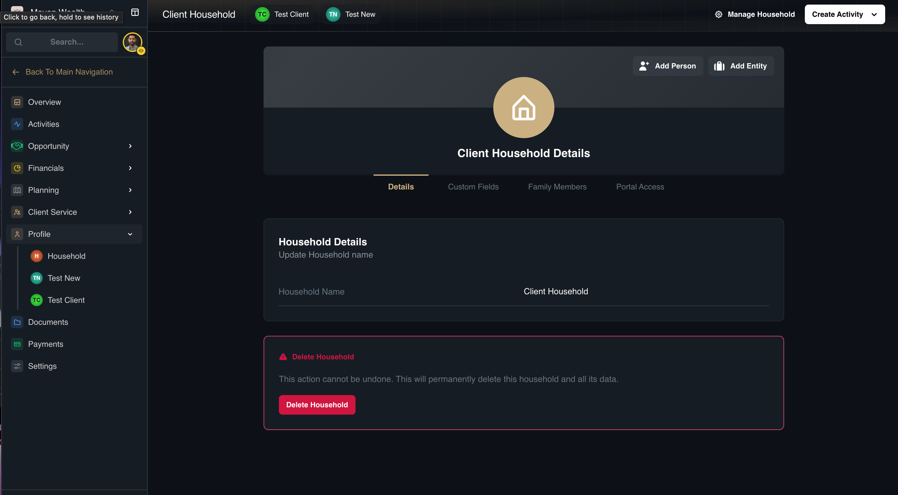
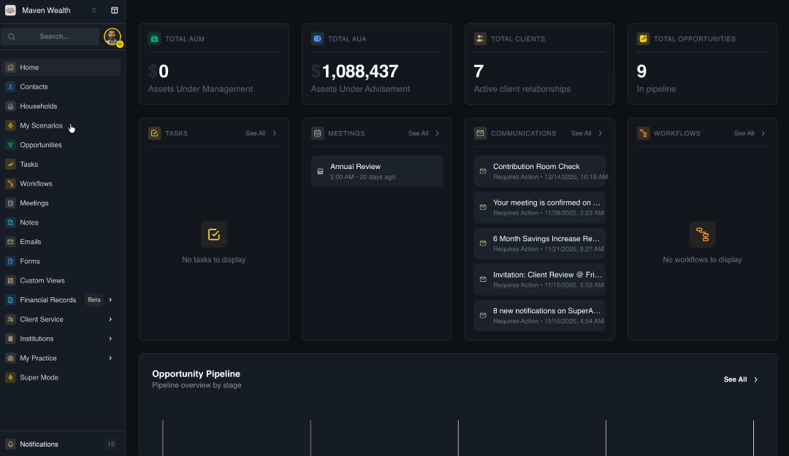
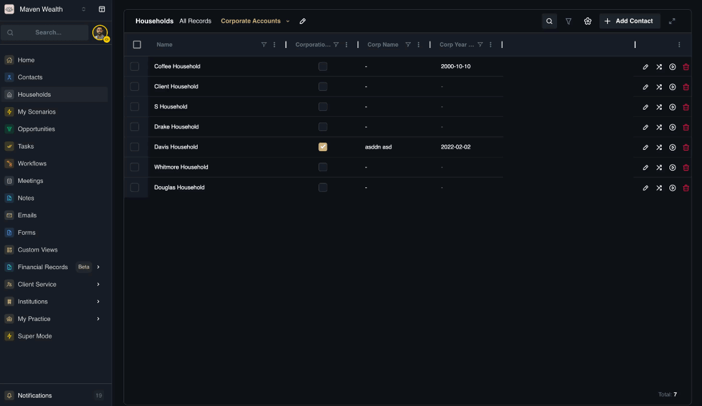

# Household Management

Tools to manage household records, including creation and merging.

## How to Search and Filter Households

1. Navigate to the Households page.
2. Click the Search bar.
3. Type a Family Name or Household Name.
4. (Optional) Click Filter to refine by Primary Advisor or Status.

## How to Create a Household

You do not need to create a household manually. The system automatically generates a "Household wrapper" whenever you add a contact.

1. Follow the steps in the [**Add a New Contact**](../../components/contacts/contact-actions#how-to-add-a-new-contact) section.
2. Once the contact is saved, navigate to the **Households** page.
3. Search for the new household name (e.g., LastName Household).
4. Open the record to update details if necessary.

## How to Navigate to Household Profile

There are two ways to view the Household Details:

**Option 1: Using the Manage Household**

Navigate to the **Households** page via the main sidebar. Locate the specific household in the list and click the **Manage Household** button on the top-right of the screen,

**Option 2: Using the Contact Profile**

Navigate to the **Households** page via the main sidebar. Locate the specific household in the list, and go to the **Profile** section and select **Household**.

### Launching Workflows from Households

Automated processes like "Annual Reviews" can be applied to the entire household unit. For step-by-step instructions, see How to Launch a Workflow in the Workflows module.

## How to Merge Duplicate Households

Use this feature to combine two household records into one, retaining specific family members and data.

1. Navigate to the **Households** list.
2. Select the checkboxes next to the duplicate households.
3. Click the **Merge** button.
4. Select the **Destination Household** (the record you want to keep).
5. Select the **Family Members** you wish to retain in the merged record.
6. Click **Confirm Merge.**

