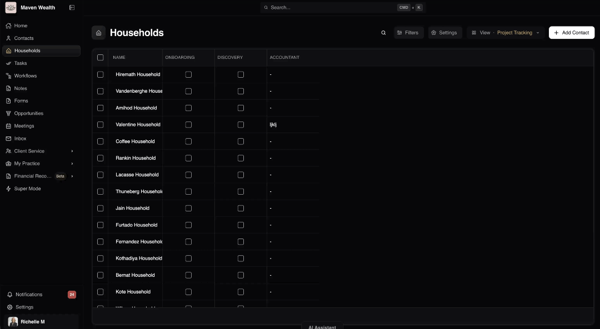
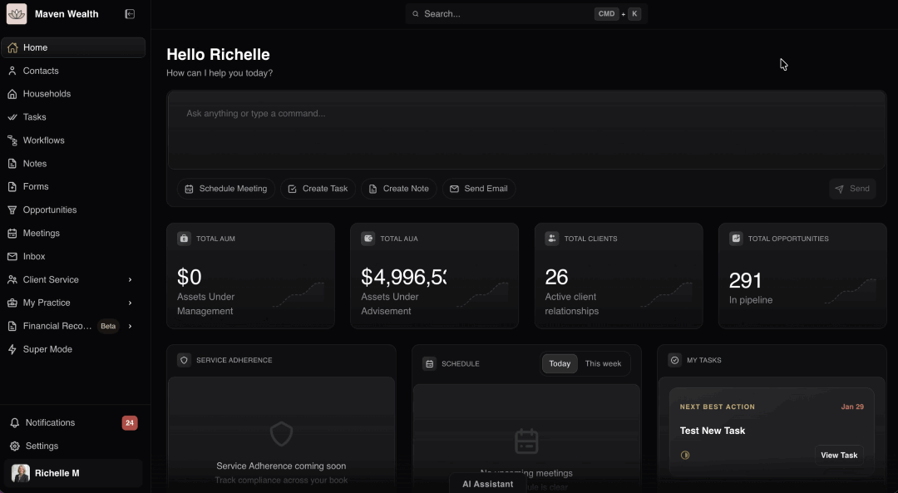
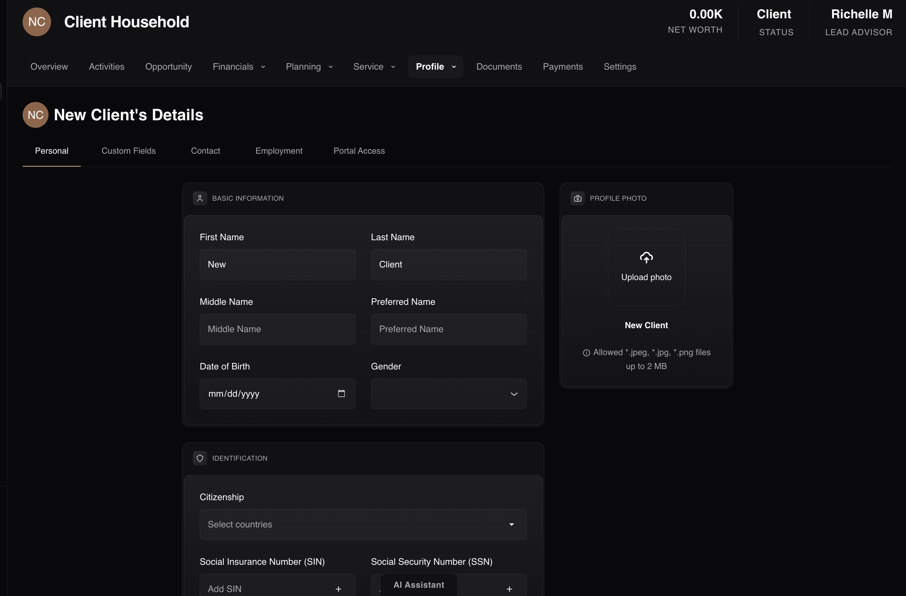
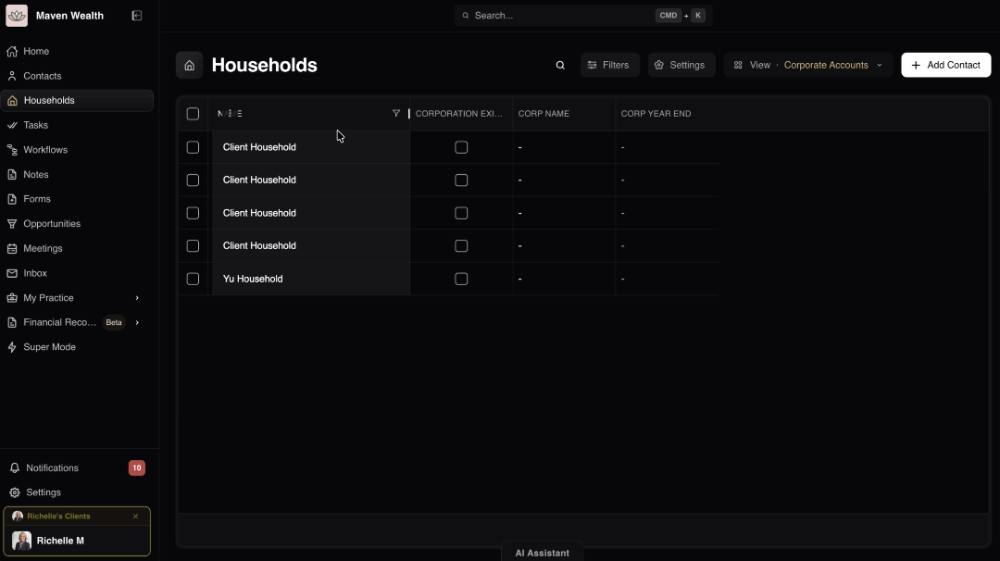
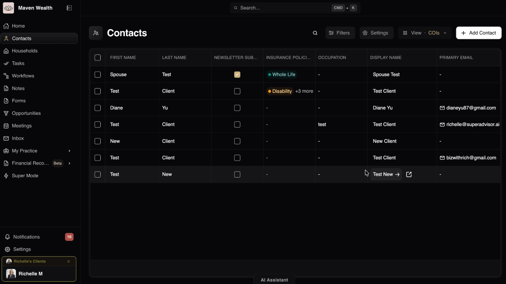
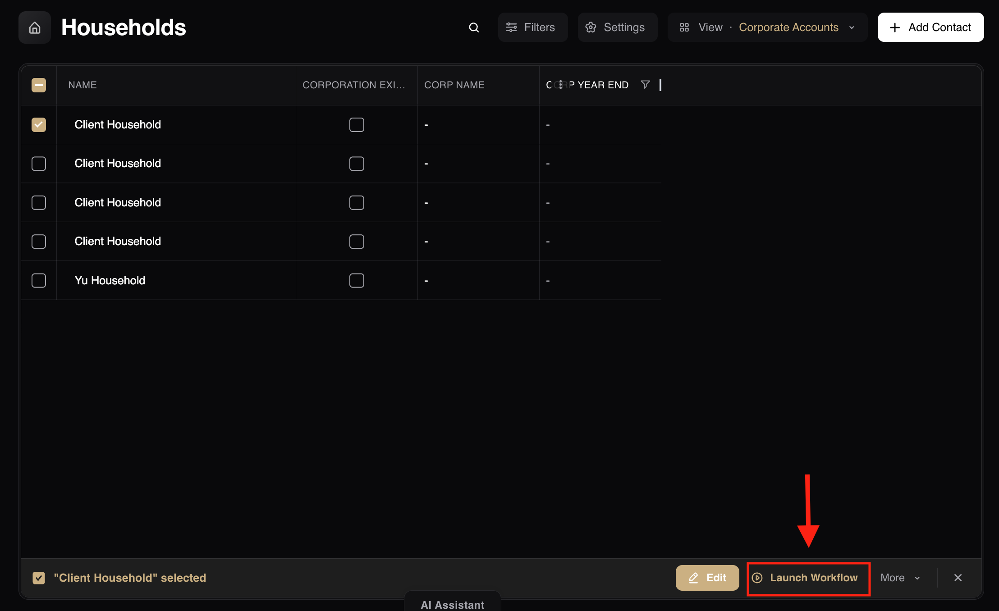
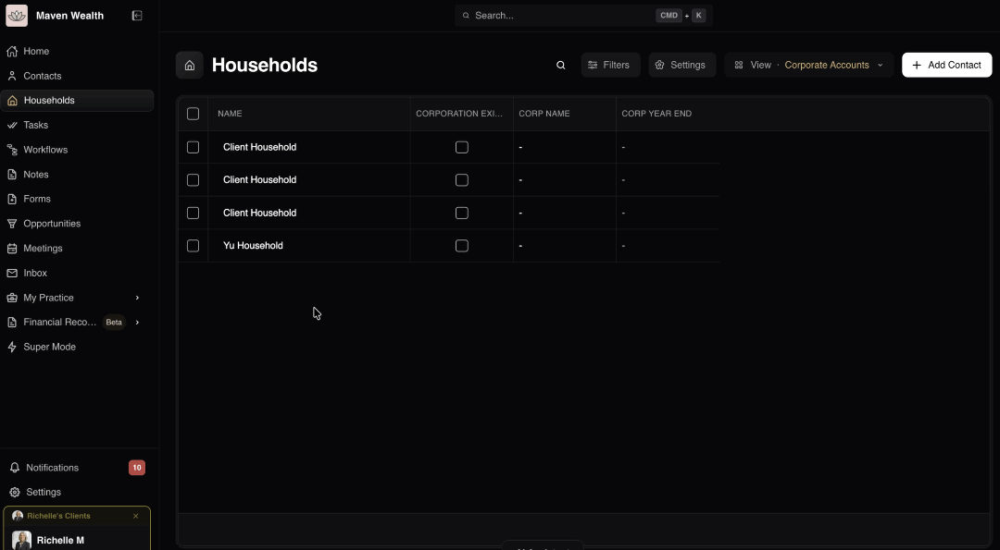

# Household Management

Tools to manage household records, including creation and merging.

## Using the Bottom Action Toolbar

The platform utilizes a fast, checkbox-driven workflow for managing records instead of horizontal scrolling.

1. Select single or multiple households using the checkboxes located on the left-hand side of the table.
2. Selecting these checkboxes automatically triggers a bottom action toolbar to appear.
3. From this toolbar, you can easily execute bulk actions including: **Edit**, **Delete**, **Merge**, and **Launch Workflow**.

### Using the Global Search (Known Contact)

*Use this when you know the exact name of the household you are looking for.*

1. Click the **Global Search** bar at the top-left of the screen.
2. Type a *Family Name* or *Household Name*.
3. Select the correct result to jump directly to their profile.

## How to Search and Filter Households

1. Navigate to the **Households** page.
2. Click the **Search** bar.
3. Type a *Family Name* or *Household Name*.
4. (Optional) Click **Filter** to refine by *Primary Advisor* or *Status*.

## How to Create a Household

You do not need to create a household manually. The system automatically generates a "Household wrapper" whenever you add a contact.

1. Follow the steps in the [**Add a New Contact**](../../components/contacts/contact-actions#how-to-add-a-new-contact) section.
2. Once the contact is saved, navigate to the **Households** page.
3. Search for the new household name (e.g., LastName Household).
4. Open the record to update details if necessary.

## How to Navigate to Household Profile

There are two ways to view the Household Details:

**Option 1: Using the Household**

Navigate to the **Households** page via the main sidebar. Locate the specific household in the list.

**Option 2: Using the Profile Tab**

Navigate to the **Households** page via the main sidebar. Locate the specific household in the list, and go to the **Profile** tab to view and manage the household record.

### Launching Workflows from Households

Automated processes like "Annual Reviews" can be applied to the entire household unit. For step-by-step instructions, see [**How to Launch a Workflow**](../workflows#how-to-launch-a-workflow) in the [**Workflows**](../workflows) module.

## How to Merge Duplicate Households

Use this feature to combine two household records into one, retaining specific family members and data.

1. Navigate to the **Households** list.
2. Select the **checkboxes** next to the duplicate households.
3. Click the **Merge** action that appears at the bottom of the table.
4. Select the **Destination Household** (the record you want to keep).
5. Select the **Family Members** you wish to retain in the merged record.
6. Click **Preview Merge**.
6. Click **Confirm** to proceed.

:::note NOTE
At least one Head of Family must be selected from the into household.
:::

