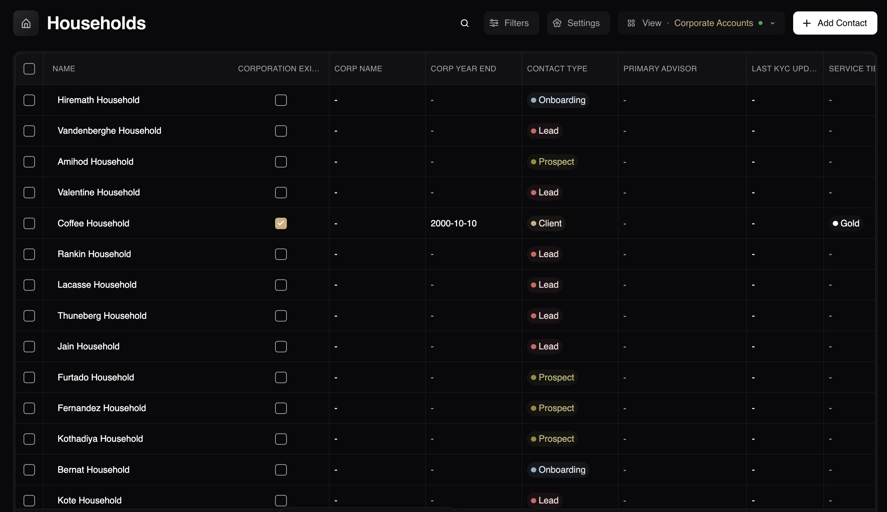
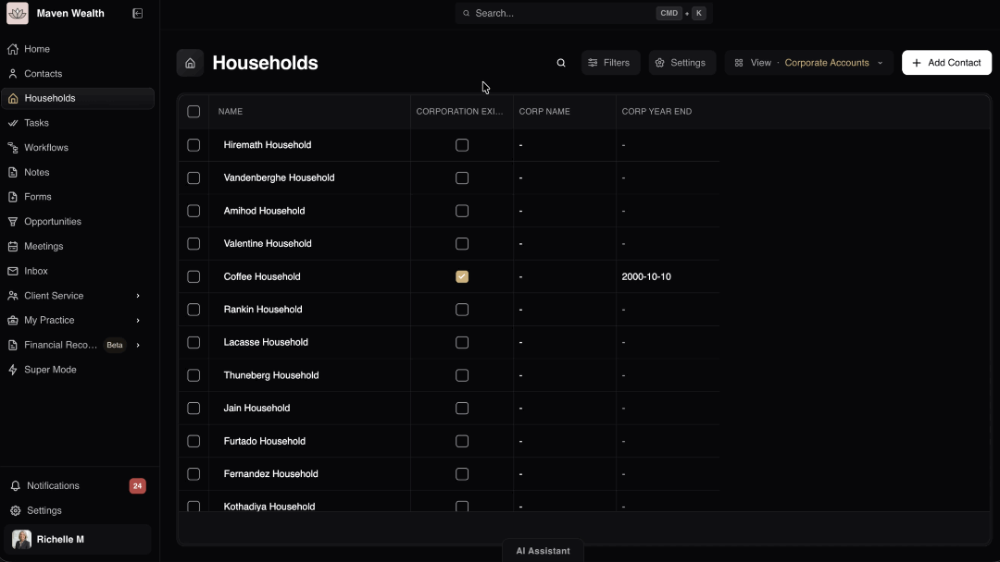
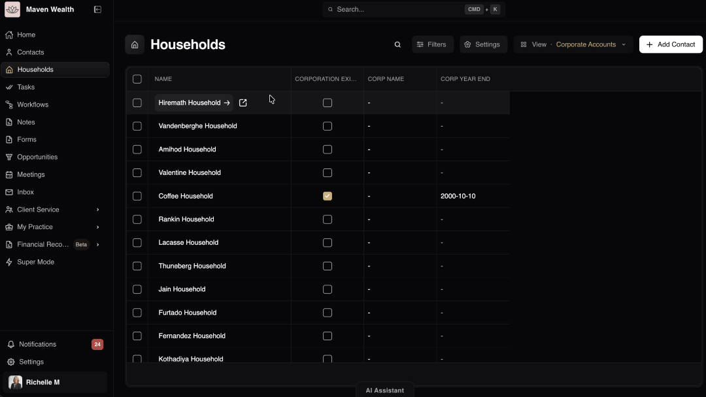
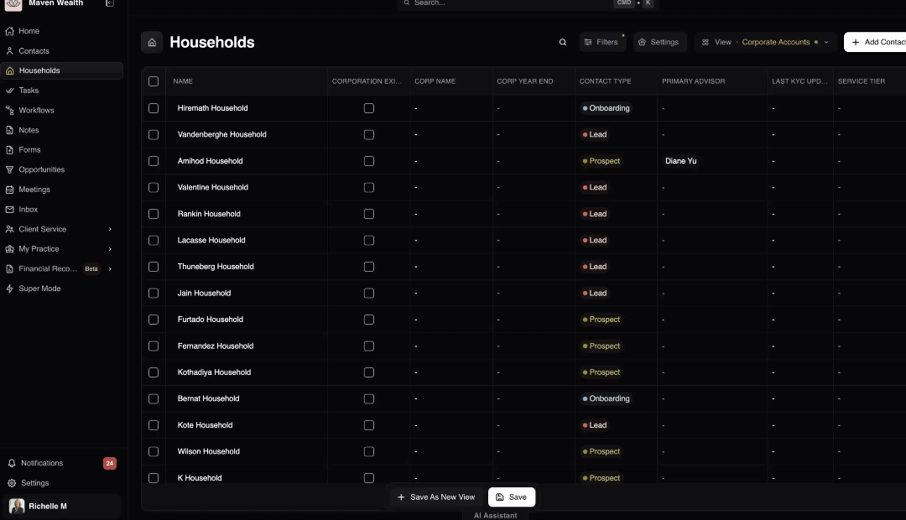
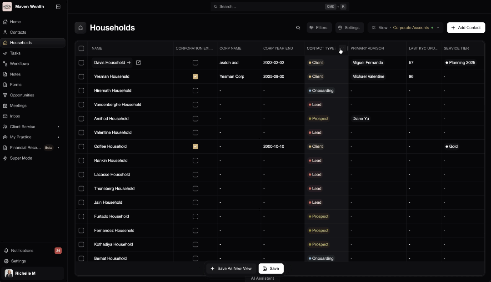
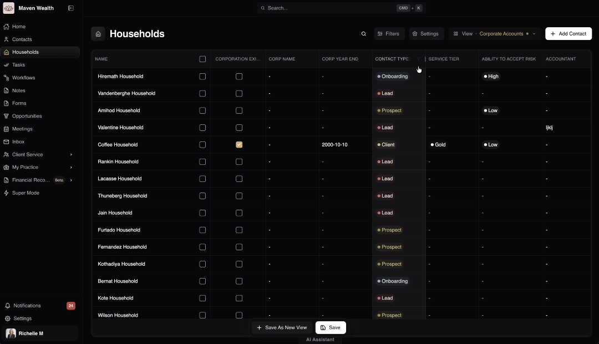
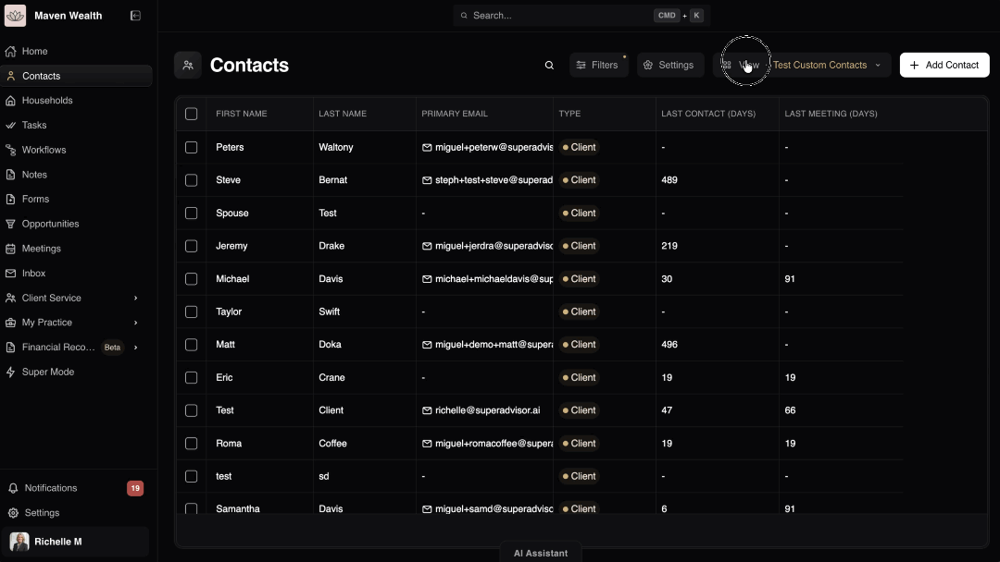
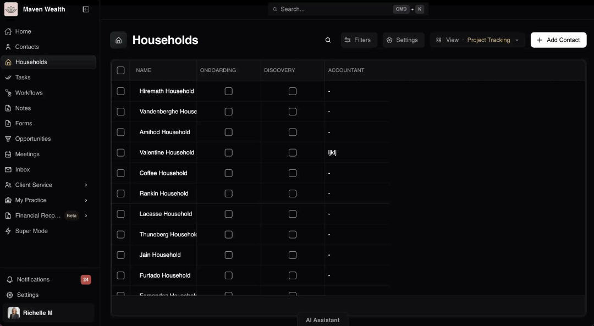

# The Households Dashboard 

## Overview

The **Households Dashboard** provides a centralized list of all family units, offering powerful sorting and filtering capabilities.

## How to Manage Your Household List

The top toolbar of your **Households** list gives you complete control over how your data is filtered and displayed.

### Using the Search Option

The search option allows you to quickly locate specific records without leaving the dashboard.

1. Locate the top toolbar on your list view.
2. Click the **Search** icon to expand the search bar. Note that this search function is exclusive to this specific list and differs from the platform-wide [**Global Search**](../about/navigation#global-search).
3. Type a name or keyword into the search field.
4. Watch as the list updates automatically in real-time as you type, instantly filtering the results to match your query.

### Applying and Managing Filters

You can apply filters directly to specific columns and manage all active filters from the top toolbar.

**Filtering a Specific Column:**

1. Move your cursor and hover over the header of the column you wish to filter.
2. Click the **Funnel** icon that appears next to the column name.
3. In the pop-up menu, choose a logical condition from the list (e.g., contains, equals, begins with, ends with, blank).
4. Type your desired criteria into the value field (e.g., select contains then type "Gold").
5. Click **Apply** to instantly update the list. To remove it, you can click **Clear** from this same menu.

**Managing Active Filters:**

Once a filter is applied, the main Filters button serves as your command center for all data restrictions.
1. Look at the **Filters** button in the top toolbar. It automatically updates to display the number of active filters currently applied to your list.
2. Click the **Filters** button to open the **Active Filters** panel.
3. Review the list to see exactly which columns have filters applied (e.g., "Display Name", "Service Tier").
4. To remove all filters at once and reset your view, click the **Clear All Filters** option.

:::note NOTE
If your selected filters do not match any records, the system will display a "No records yet.
Try adjusting your filters or add a new record to get started." message.
:::

### Customizing Column Settings

The **Settings** menu gives you full control over the data points displayed on your dashboard.

1. Click the **Settings** button located in the top toolbar to open the configuration menu.
2. Navigate between the available categories: *All*, *Standard* (default CRM fields), and *Custom* (firm-specific fields). For details on these specific fields, see [Household List Columns](#household-list-columns).
3. To make quick bulk adjustments, click the **Show All** or **Hide All** buttons at the top of a category.
4. To fine-tune your view, scroll through the list and individually check or uncheck the boxes next to specific column names.
5. The table will instantly update to reflect your chosen visibility settings, allowing you to tailor the view exactly to your current workflow.

### Using Advanced Column Actions

1. Hover over any column header and click the **More Option** (vertical dots) menu.
2. To organize the data alphabetically or numerically, select **Sort Ascending** or **Sort Descending**.
3. To freeze a column in place while scrolling horizontally, hover over **Pin Column** and select **Pin Left** or **Pin Right**. Select **No Pin** to unfreeze it.
4. To optimize readability, select **Autosize This Column** to fit its specific contents perfectly, or choose **Autosize All Columns** to adjust the entire table at once.
5. To manage column visibility directly from the table, select **Choose Columns** to open the column toggle menu.
6. If you wish to revert the table back to its default, uncustomized state, click **Reset Columns**.

### Managing Saved Views

Saved Views allow you to preserve your column and filter configurations for quick access later. There are two primary ways to create and manage your views:

**Option A: From the View Dropdown**

1. Locate the **View** dropdown menu at the top of the **Contacts** list.
2. Click the dropdown to reveal your available saved views.
3. At the bottom of this menu, you can select the **Create New View**, **Duplicate View**, or **Edit View** options to manage your configurations.
4. Click the **Star** icon next to any view name to set it as your default view every time you open the module.

**Option B: On the Fly**

1. Start making adjustments to your current list on the fly (e.g., applying a filter, sorting a column, or toggling column visibility).
2. As soon as you make a change, the **Save as New View** and ** ** buttons will automatically appear below the list.
3. Click Save as New View to turn your current configuration into a brand new saved view, or click Save to update the existing custom view with your new changes.

## Household List Columns
The table displays key information categorized into two types: Standard and Custom.

* **Standard Columns:**
  * **Name:** The display name of the household.
  * **Contact Type:** Classification of the relationship (*Prospect, Client, Lead, Onboarding, Other*).
  * **Dependents:** The number of dependents associated with the household unit.
  * **Heads of Household:** The primary individual(s) designated as the head of the family or unit.
  * **Last KYC Update (days):** The number of days since the last "Know Your Client" compliance review was completed.
  * **Managed AUM:** Assets Under Management; the total financial value of the assets managed by your firm for this household.
  * **Primary Advisor:** The team member responsible for managing this relationship.
  * **Service Tier:** The designated level of service assigned to the household (e.g., Gold, Silver, Platinum), helping you prioritize touchpoints.

* **Custom Columns:**
  * **Custom Fields:** Any firm-specific data points tracked at the household level.
