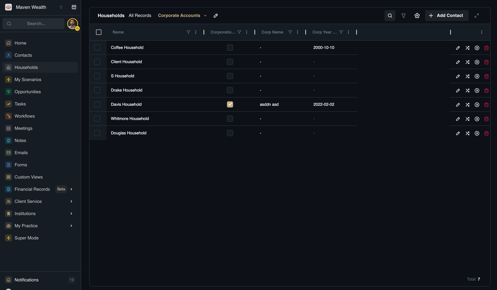

# The Dashboard

## Overview

The **Households Dashboard** provides a centralized list of all family units, offering powerful sorting and filtering capabilities.

:::note NOTE
You can customize this dashboard by filtering data, toggling columns, and saving your configurations. For detailed instructions on creating and managing these views, please refer to the Custom Views module.
:::

## View Options

  * **All Records:** Displays every household currently in the system.
  * **Custom Views:** Allows you to create saved filters (e.g., "A-Tier Households") for quick access. See the "Custom Views" topic for setup instructions.

## Search & Column Settings
  * **Search Option:** Locate specific households by family name or household name.
  * **Filter & Columns:** Like the Contacts page, you can filter the list and customize which data columns are visible.

:::note NOTE
If your selected filters do not match any records, the system will display a "No records yet.
Try adjusting your filters or add a new record to get started." message.
:::

## Household List Columns
  * **Name:** The display name of the household.
  * **Contact Type:** Classification of the relationship (*Prospect, Client, Lead, Onboarding, Other*).
  * **Primary Advisor:** The team member responsible for managing this relationship.
  * **Last KYC Update (days):** The number of days since the last "Know Your Client" compliance review was completed.
  * **Custom Fields:** Any firm-specific data points tracked at the household level.
