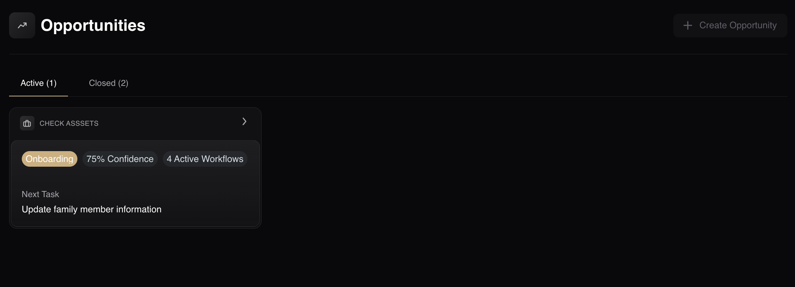
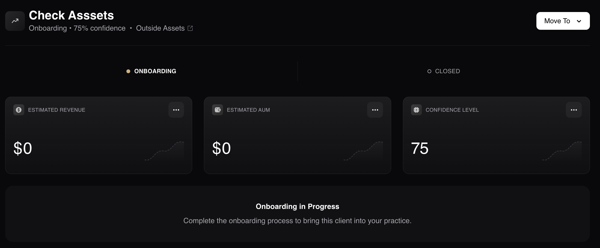
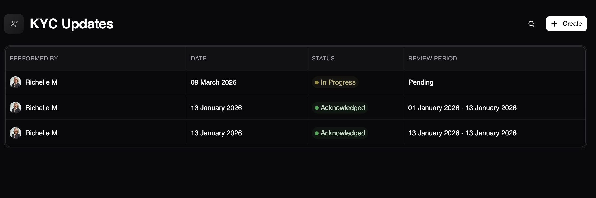
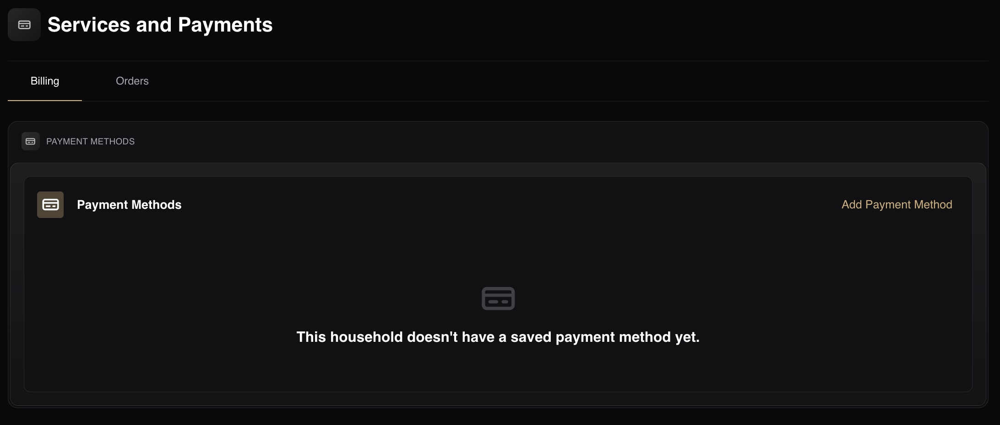
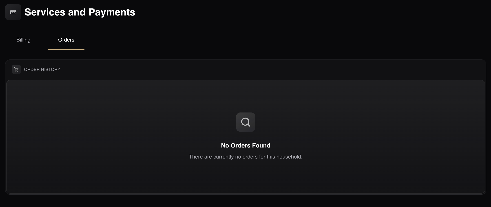
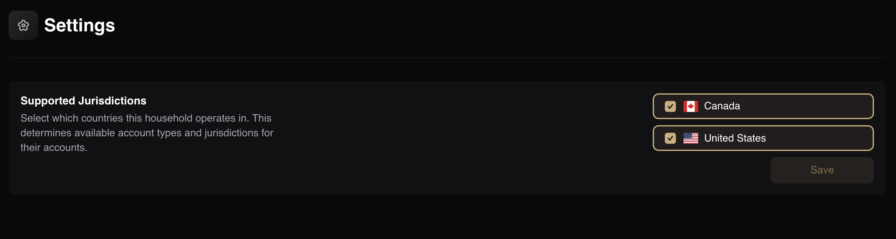

# Operations & Settings

This section covers the additional administrative tools, configurations, and auxiliary modules available within a specific Household record.

## Opportunities

### Overview

In the **Opportunity** page of the Household, you can see all the Active and Closed Opportunities (separated into each category). For more comprehensive details on creating, managing, and tracking opportunities, please see the Opportunities article.

### The Opportunity Page (Active/Closed)

Once created, the active/closed **Opportunity** page appears, showing key metrics and progress (depending on the template). For example, an Onboarding template might display:

* **Status & Confidence:** (e.g., Onboarding • 75% confidence)
* **Tags:** (e.g., Check Assets, Outside Assets)
* **Stages:** (e.g., Onboarding, Closed)
* **Estimated Revenue:** (e.g., $0)
* **Estimated AUM:** (e.g., $0)
* **Confidence Level:** (e.g., 75)
* **Current Status / Next Steps:** (e.g., "Onboarding in Progress: Complete the onboarding process to bring this client into your practice.")

### How to Create a New Opportunity

1. Navigate to the **Opportunity** tab within the Household.
2. Click on the **Create Opportunity** button.
3. In the pop-up, enter the **Opportunity Name**.
4. Select the **Opportunity Template**.
5. Click on the **Create Opportunity** button to save.

:::note NOTE
For now, you can only add 1 opportunity per household. Multiple opportunities coming soon.
:::

## Service

### Overview

When you click on the **Service** tab within the Household, the service page displays the **KYC Updates**. For more information, please refer to the [KYC Updates](../../components/my-practice/service-models) article.

### How to Create a KYC Update

1. Click on the **Create** button.
2. In the **Create KYC Update** pop-up, you will see the following information/message:
    * Create a new KYC update for this household to track changes and acknowledge compliance review.
    * Household: The name of the household.
3. Click on the **Create Update** button.
4. The KYC Updates list is now updated.

### KYC Updates List Columns

The table displays the following columns:

* Performed by
* Date
* Status
* Review Period

### Column Actions & Filtering:

* **Sorting and Sizing:** Hover over a column header and click the three-dot menu to select **Sort Ascending**, **Sort Descending**, **Pin Column**, **Autosize This Column**, or **Autosize All Columns**.
* **Filtering:** You can filter the Performed by and Status columns by clicking the funnel icon on their respective headers.

## Payments

### Overview

When you click on the **Payments** tab within the Household, you can manage all financial transactions associated with the client, including your **Billing** and **Order History**.

### Billing

The **Billing** section allows you to securely manage payment methods for the family unit.

**How to Add a Payment Method**

If you haven't added any payment methods yet, you will need to add one to process transactions:

1. Navigate to the **Payments** tab and ensure you are in the **Billing** section.
2. Click on the **Add Payment Method** button.
3. You can add a payment method specifically for your household heads. Locate the appropriate household head and click on the **Add** button.
4. Enter the card details in the pop-up window and save.

### Order History

The **Order History** section displays a record of all past transactions and orders associated with the household.

:::note NOTE
If there are no previous transactions, the page will display the following state: "No Orders Found. There are currently no orders for this household."
:::

### Settings

**Supported Jurisdictions**
Select which countries this household operates in. This determines available account types and jurisdictions for their accounts. You can select from Canada, United States, or both.

