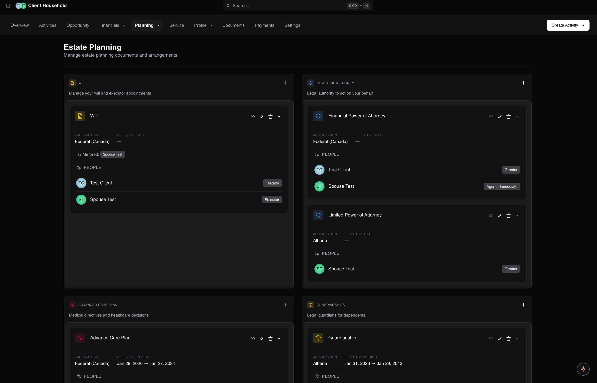
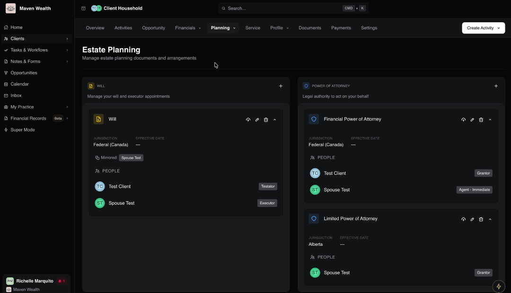
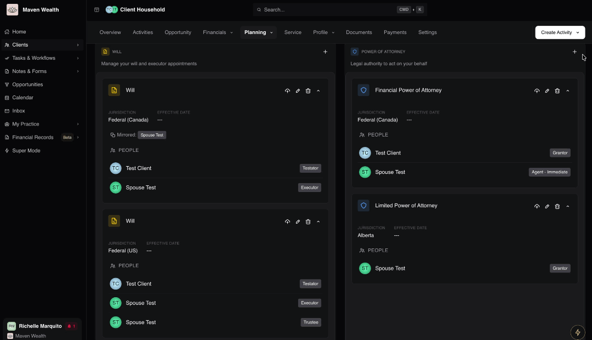
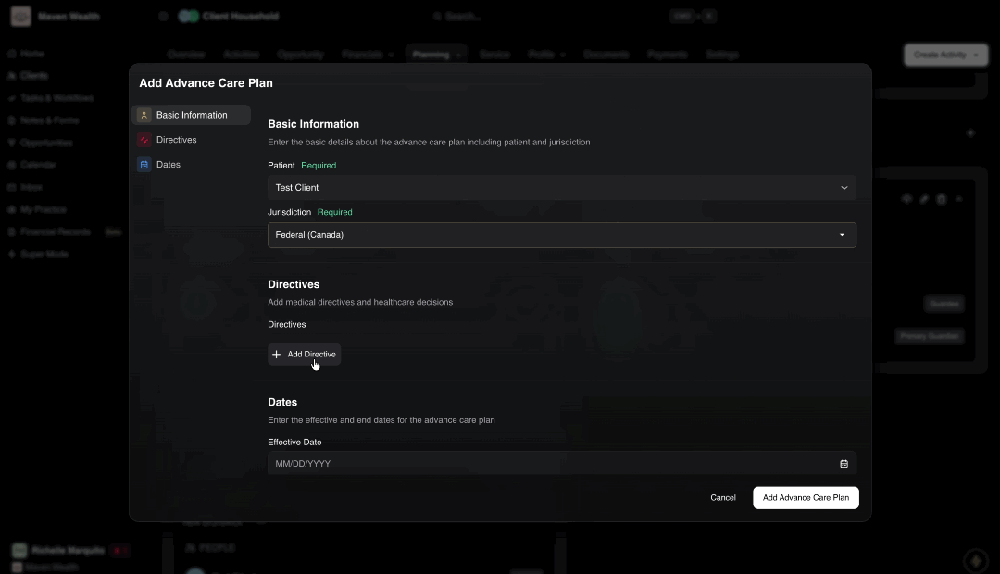
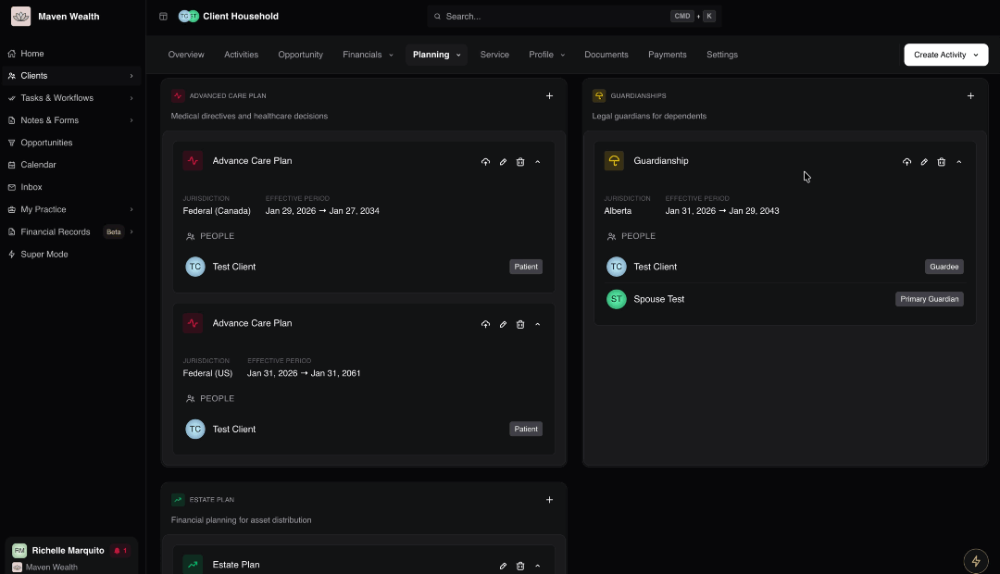
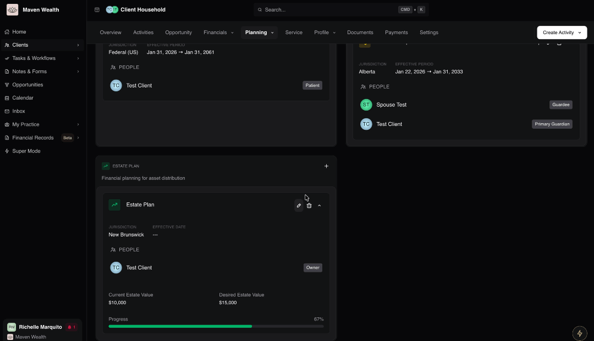
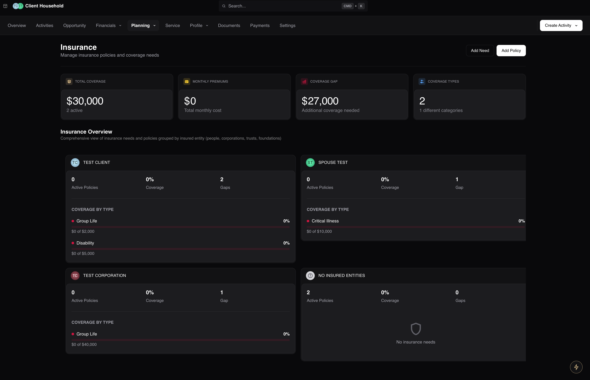
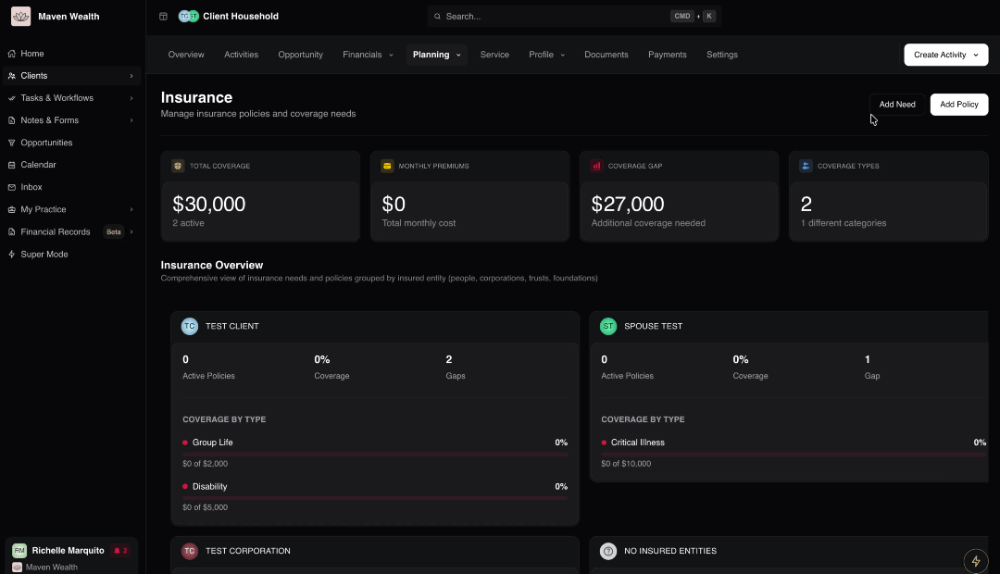
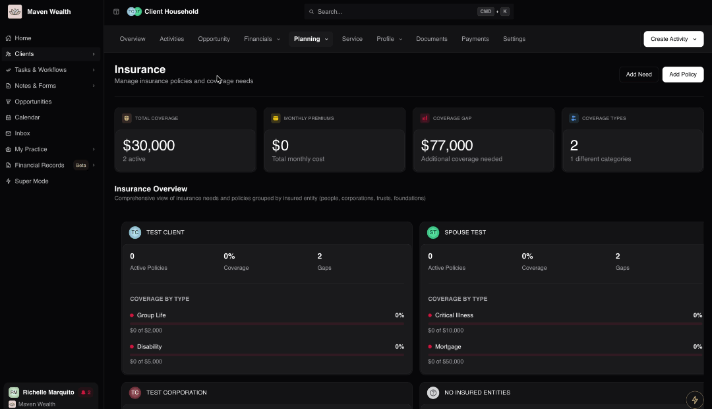

# The Planning Section

## Overview

The **Planning** module serves as the strategic roadmap for the client relationship. While the **Financials** module tracks the current state of wealth (assets and liabilities), the Planning module focuses on the future—defining objectives, analyzing coverage, and structuring the legal and financial frameworks necessary to achieve long-term success.

## Accessing the Planning Section
To view and manage planning data for a specific client:

Navigate to the specific Household record.

Locate the Planning tab (located next to the Financials section).

When you click on the dropdown, you will be able to see and select the appropriate sub-page based on your task: Goals, Financial Plan, Will & Estate, and Insurance.

The Planning module is divided into four distinct sub-modules:

* **Goals:** Define and track specific lifestyle and financial objectives.
* **Financial Plan:** Centralize strategic calculations, projections, and plan documents.
* **Will & Estate:** Manage the estate planning infrastructure, including legal documents and asset distribution strategies.
* **Insurance:** Analyze risk management, coverage needs, and active policies.

## Goals

The **Goals** section allows advisors to document, track, and manage specific milestones a client wishes to achieve. This section moves beyond simple numbers to capture the "why" behind the wealth. By defining tangible objectives—such as "Retirement at 65" or "Fund Grandchildren's Education"—you can prioritize resources (Needs vs. Wants) and monitor funding progress relative to target dates.

### Navigating the Dashboard

The **Goals** sub-page offers a consolidated view of the client's financial objectives and their current funding status.

**View Options:**

* **All Goals:** A complete list of active and completed goals.
* **Progress Tracking:** Visual indicators showing the funding status relative to the required capital.
* **Categories:** Goals are organized by type (e.g., Invest, Saving, Debt, Expense) to ensure they map correctly to the financial plan.

### How to Add a Goal

1. Navigate to **Planning**, then select **Goals**.
2. Click the **Add Goal** button.
3. In the **Add Goal** pop-up, enter the following details:
    * **Select Category:** Choose the specific goal type from the list below to ensure proper classification:
    * **Invest:** General Investing, Retirement.
    * **Saving:** Safety Net (Cash Reserves).
    * **Debt:** Debt Repayment.
    * **Expense:** Education, First Home Purchase, Investment Property Purchase, Large Purchase, Vacation Home Purchase, Charity, Dependent, Emergency, Health Care, HOA Fees, Improvement, Insurance, Maintenance, Medical Expenses, Needs, Rent, Tax, Travel, Vacation, Wants, Wedding, Other Expense.
    * **Enter Details:** Fill in the specific parameters for the goal (e.g., Target Date, Target Amount).
3. Click **Save** to add the objective to the plan.

## Financial Plan

The **Financial Plan** section acts as the central hub for the broader strategy documents and projections that tie the client's assets to their goals. This is where high-level analysis—such as retirement projections, probability of success metrics, and cash flow models—is centralized. It also serves as the repository for formal plan deliverables and strategic notes (e.g., "Roth Conversion Strategy") ensuring all team members are aligned on the current approach.

### Navigating the Dashboard

The **Financial Plan** page offers a high-level summary of the client's strategic roadmap.
* **Projections & Analysis:** View summaries of success probabilities and cash flow models.
* **Plan Documents:** Access formal deliverables (PDFs or links) presented to the client.
* **Strategy Notes:** Review documentation of core strategies currently in play.

## Will & Estate

The **Will & Estate** section functions as a comprehensive repository for a client’s estate planning infrastructure. It centralizes the management of critical legal documents—such as Wills, Powers of Attorney, or Medical Directives — while simultaneously tracking the financial parameters of the estate plan itself (Current vs. Desired Value).

### Navigating the Dashboard

The **Will & Estate** page is organized into specific sections for legal instruments and valuation.

**Legal Documents:**

* **Will:** Last Will and Testament and executor appointments.
* **Power of Attorney:** Authority for Property and Personal Care.
* **Advance Care Plan:** Medical directives and living wills.
* **Guardianships:** Custodial appointments for dependents.
* **Estate Plan:** Tracks the Jurisdiction, Effective Date, People (Stakeholders), and Valuations (Current vs. Desired Estate Value with Progress percentage).

### How to Add a Will

1. Click the **Add Will** button.
2. In the **Add Will** pop-up, complete the following sections:
* **Basic Information:** Establish the core legal details of the document.
    * **Testator:** Select the household member who is the author of the will.
    * **Jurisdiction:** Specify the legal jurisdiction (e.g., State/Province) under which the will is executed.
    * **Location:** Record the physical location where the original document is stored (*e.g., "Safety Deposit Box" or "Lawyer's Office"*).
* **Executors:** Designate the individuals or entities responsible for administering the estate.
    * **Executors:** Select from existing household contacts or click [**Add Contact to Household**]() to create a new profile. Note: You can add multiple executors.
    * **Contingent Executor:** Toggle this option if the selected individual is an alternate executor who only acts if the primary is unable to do so.
    :::note NOTE
    The **Testator** cannot be listed as their own executor.
    :::
* **Trust:** Indicate if the will creates a testamentary trust.
    * **Includes Trust:** Toggle this if the will contains provisions for establishing a trust upon death. 
    * **Trustee:** If **Includes Trust** is toggled **ON**, select a **Trustee** from the existing household members or click **Add Contact to Household** to assign a new contact.
* **Dates**: Record the timeline of the document.
    * **Effective Date:** Enter the date the will was signed and witnessed.
3. Click **Add Will** to save the record.

:::tip TIP
After adding the record, you can use the Edit function to access the **Mirror To** feature, which quickly creates a reciprocal will for a spouse or partner.
:::

### How to Add a Power of Attorney

1. Click the **Add Power Of Attorney** button.
2. In the **Add a Power of Attorney** pop-up, enter the following details:
* **Basic Information:** Establish the core legal details of the document.
    * **Grantor:** Enter the name of the individual granting the authority.
    * **Jurisdiction:** Specify the legal jurisdiction (*e.g., State/Province*).
    * **Type:** Select the specific category of power being granted (*e.g., Financial, Personal Care, General, Limited, Medical, Property*).
    * **Is Enduring:** Toggle this option if the power of attorney is intended to continue even if the grantor becomes mentally incapable.
* **Agents:** Designate the individuals authorized to act on the grantor's behalf.
    * **Agents:** Select from existing household contacts or click Add Contact to Household to create a new profile.
    * **Activation Type**: Specify when the agent's authority begins (Conditional upon a specific event or Immediate upon signing).
    * **Requires Joint Approval:** Toggle this option if multiple agents are appointed and must make decisions together (jointly) rather than independently (severally).
* **Dates:** Record the valid timeframe of the document.
    * **Effective Date:** Enter the date the document becomes valid.
    * **End Date:** Enter the date the authority expires, if applicable.
3. Click **Add Power of Attorney** to add the record.

:::tip TIP
After saving, you can use the **Mirror To** feature when editing the record to quickly create a corresponding document for a spouse.
:::

#### How to Add an Advance Care Plan

1. Click the **Add Advance Care Plan** button.
2. In the **Advance Care Plan** pop-up, enter the following details:
* **Basic Information:** Identify the subject of the care plan.
    * **Patient:** Select the individual the care plan is for.
    * **Jurisdiction:** Select the relevant legal jurisdiction.
* **Directives:** Record specific instructions regarding medical treatment.
    * **Directives:** Enter specific medical directives or healthcare decisions in the textbox. You can add multiple directives.
* **Dates:** Establish the validity period.
    * **Effective Date:** Enter the date the plan becomes effective.
    * **End Date:** Enter the date the plan expires.
3. Click on the **Add Advance Care Plan**.

:::tip TIP
You can use the **Mirror To** feature when editing.
:::

### How to Add a Guardianship

1. Click the **Add Guardianship** button.
2. In the **Add Guardianship** pop-up, enter the following details:
* **Basic Information:** Identify the individual requiring protection.
    * **Ward (Protected Person):** Select the dependent from existing household members or click **Add Contact to Household** to add a new person.
    * **Jurisdiction:** Specify the legal jurisdiction governing the guardianship.
* **Guardians:** Designate the individuals responsible for the ward's care.
    * **Guardians:** Select from existing household members or click Add Contact to Household. Note: You must assign at least one guardian.
    * **Alternate Guardian:** Use this to designate a backup guardian. If this is toggled on, you must still have at least one primary (non-alternate) guardian selected.
    
    :::note NOTE
    The Guardee cannot be listed as their own guardian.
    :::
* **Dates:** Record the legal timeframe of the guardianship.
    * **Effective Date:** Enter the start date of the legal arrangement.
    * **End Date:** Enter the date the guardianship ends (e.g., when a minor reaches adulthood).
3. Click **Add Guardianship** to save the record.

### How to Add the Estate Plan

1. Click the **Add Estate Plan** button.
2. In the pop-up, fill out the following details to structure the plan:
    * **Basic Information:** Enter the basic details regarding ownership and governance.
        * **Owner:** Select the household member who owns this estate plan.
        * **Jurisdiction:** Specify the legal jurisdiction.
    * **Estate Values:** Enter the financial targets to track progress.
        * **Estimated Estate Value Today:** Enter the current calculated value of assets involved in the estate.
        * **Desired Estate Value:** Enter the target value for the estate at the time of transfer.
3. Click **Create Estate Plan**.

:::note NOTE
The dashboard will display a **Progress** percentage, visually indicating how close the current estate value is to the desired target.
:::

## Insurance

The **Insurance** section focuses on risk management, ensuring that the client's wealth and goals are protected against unforeseen events. It provides a comprehensive view of insurance needs versus active policies, grouped by the insured entity (people, corporations, trusts, foundations).

### Navigating the Dashboard

The **Insurance** page offers a consolidated view of protection status.

**Key Metrics:**

* **Total Coverage:** Aggregate value and count of active policies.
* **Monthly Premiums:** Total monthly cost.
* **Coverage Gap:** Calculated deficit in protection.
* **Coverage Types:** Count of unique protection categories.
* **Insurance Overview:** A comprehensive view of insurance needs and policies grouped by insured entity (people, corporations, trusts, foundations).

### How to Add an Insurance Need

1. Navigate to **Planning**, then select **Insurance**.
2. Click the **Add Need** button.
3. In the **Add Insurance Need** pop-up, enter the following details:
    * **Insured Entity:** Select the person or entity requiring coverage.
    * **Policy Type:** Select the specific insurance type from the dropdown. Refer to [**Insurance Policy Types**](#insurance-policy-types) for more details.
    * **Required Coverage Amount:** Enter the calculated dollar amount needed to fully protect the entity against the specified risk (e.g., the amount required to pay off liabilities and replace income).
4. Click **Add**.

### How to Add an Insurance Policy

1. Navigate to **Planning**, then select **Insurance**.
2. Click the **Add Policy** button.
3. In the **Add Policy** pop-up, fill out the following details:
    * **Basic Information:** Enter the basic details about your insurance policy.
        * **Nickname:** Enter a descriptive name to easily identify the policy (e.g., "Client Term Life").
        * **Policy Type:** Select the specific category of insurance (e.g., Term Life, Critical Illness). For more details on available options, see [**Insurance Policy Types**](#insurance-policy-types).
        * **Policy Number:** Input the unique policy ID provided by the insurer.
        * **Insurance Company:** Select the issuing carrier. You can manage this list by clicking the **Settings** icon next to the field, which redirects to the **Carriers** page. Please refer to the [Carriers Page Tutorial](../institutions#carriers) for more details.
        * **MGA:** Select the Managing General Agent if applicable. 
        You can manage this list by clicking the **Settings** icon next to the field, which redirects to the **MGAs** page. Please refer to the [MGAs Page Tutorial](../institutions#mgas-managing-general-agents) for more details.
    * **Policy Details:** Enter the key timing and administrative details for the policy.
        * **Coverage Start Date:** Enter the date when the insurance coverage officially begins.
        * **Term (Years):** Specify the duration of the policy term in years.
        * **Rollover Date:** Indicate the date when the policy term renews or converts.
        * **Expiry Date:** Enter the date when the policy coverage is scheduled to end.
        * **Purpose Description:** Provide a brief explanation for the policy's purpose (*e.g., "Income Replacement" or "Estate Tax Coverage"*).
        * **Agent:** Record the name of the insurance agent responsible for this policy.
    * **Coverage Details:** Coverage Details: Enter comprehensive details regarding the benefits and key stakeholders.
        * **Coverage Benefit:** Enter the total face value or death benefit amount (*e.g., $1,000,000*).
        * **Insured Entities:** Select the specific individual(s) or entity whose life or health is insured under this policy.
        * **Beneficiaries:** Designate the primary recipients of the policy proceeds. You can select existing household entities or click **Add Contact to Household** to create a new record.
        * **Contingent Beneficiaries:** Assign secondary beneficiaries who will receive the proceeds if the primary beneficiaries are deceased or unable to accept them.
        * **Trustee:** Specify a trustee if the policy is held within a trust or if the proceeds are to be administered by a trustee.
    * **Premium Payment:** Enter the financial details regarding policy maintenance.
        * **Premium Payment:** Input the payment amount and frequency (*e.g., $200 Monthly*).
        * **Paid Up:** Check this box if the policy is fully paid and no further premiums are required.
    * **Policy Owners:** Identify the legal owner(s) of the policy. You can select multiple owners and assign specific Ownership percentages (*e.g., 50/50 split*).
    * **Status:** Select the current status of the insurance policy.
        * **Status:** Choose from *Active, Cancelled, Expired, Lapsed, Pending, Surrendered*.
4. Click **Add Insurance Policy**.

### Insurance Policy Types

This section defines the various insurance categories available when adding policies or calculating needs.

* **Company Owned:** Insurance policies owned by a corporate entity rather than an individual.
* **Critical Illness:** Provides a lump-sum payment if the insured is diagnosed with a specific illness covered by the policy.
* **Disability:** General coverage that provides income replacement if the insured is unable to work due to illness or injury.
* **Group Life**: Life insurance coverage provided to a group of people, typically employees of a company, under a single contract.
* **Key Person:** Life or disability insurance on a key employee or partner, payable to the business to cover financial loss arising from their death or incapacity.
* **Long Term Care:** Covers costs associated with long-term care services (e.g., nursing homes, home care) not covered by standard health insurance.
* **Long Term Disability:** Replaces a portion of income for an extended period if the insured cannot work due to a disabling injury or illness.
* **Mortgage:** A form of life insurance specifically designed to pay off a mortgage debt upon the borrower's death.
* **Rider:** An add-on provision to a basic insurance policy that provides additional benefits or adjusts the terms (e.g., accidental death).
* **Term Life:** Provides coverage for a specified term (e.g., 10, 20 years). If the insured dies during this term, the death benefit is paid.
* **Term to 100:** A permanent life insurance policy with level premiums payable to age 100, at which point coverage may continue without further premiums.
* **Universal Life:** Flexible permanent life insurance that combines a death benefit with a savings element (cash value) that can earn interest.
* **Whole Life:** Permanent life insurance that remains in force for the insured's entire lifetime, provided premiums are paid, and includes a cash value component.