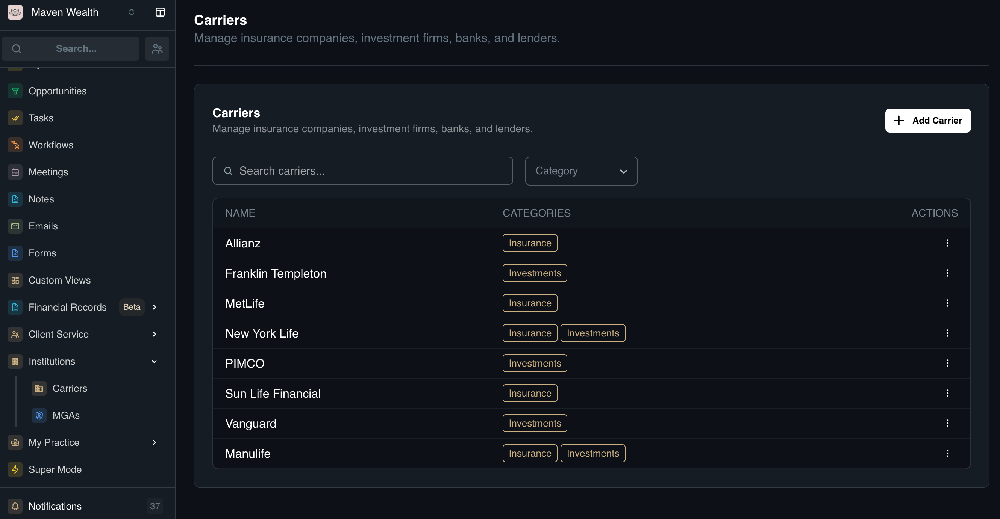
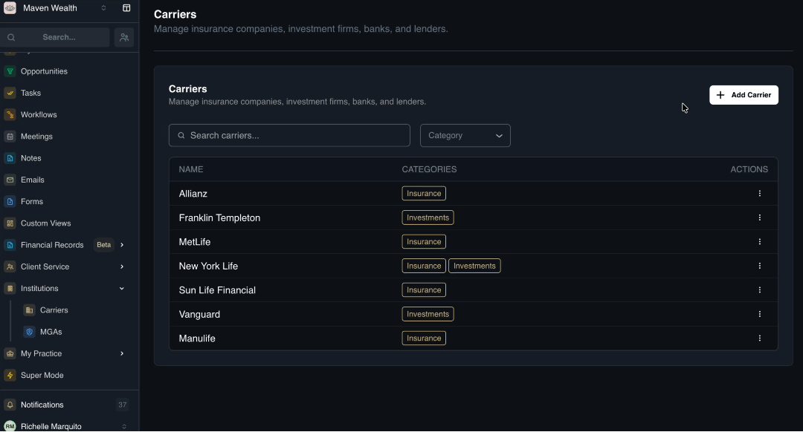
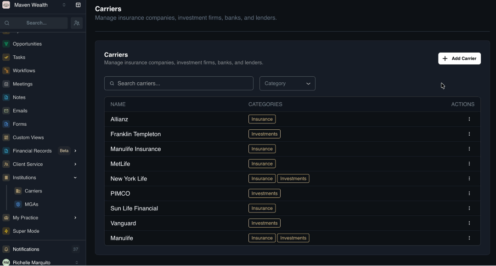
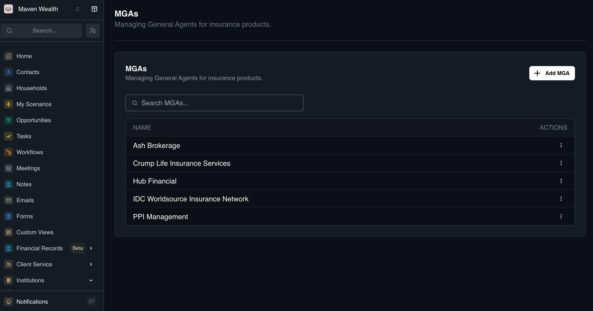

# Institutions

## Overview

The **Institutions** module acts as the central library for external entities with whom your firm conducts business. Accurate setup of this section is a prerequisite for using Products & Packages and Revenue Collection effectively.

This module is divided into two areas:

* [**Carriers:**](institutions#carriers) Insurance companies, investment firms, banks, and lenders.
* [**MGAs (Managing General Agents):**](institutions#mgas-managing-general-agents) Intermediaries or brokerage firms.

## Carriers

### Overview

**Carriers** are the financial institutions that issue the actual contracts (e.g., Manulife, RBC, Fidelity). Every product in the system must be linked to a Carrier to ensure accurate reporting in the Products & Packages module.

### Carriers Standard List Columns

* **Carrier Name:** The full name of the institution.
* **Categories:** The type of services provided (*e.g., Insurance, Investments*).

### How to Add a Carrier

1. Navigate to **Institutions** page, then **Carriers**.
2. Click the **Add Carrier** button.
3. In the **Add Carrier** pop-up, fill out the Carrier details:
    * **Carrier Name:** Enter the Institution Name.
    * **Product Categories:** Select the applicable categories (*e.g., Insurance, Investments*). Note: You can select multiple categories.
3. Click **Add Carrier**.

### How to Merge Carriers

Use this feature to consolidate duplicate records (e.g., "Manulife" and "Manulife Financial") or handle company acquisitions.

1. Navigate to **Institutions** page, then **Carriers**.
2. Locate the **Source Carrier** (the duplicate you wish to remove) in the list.
3. In the actions column, select **Merge**.
4. In the **Merge Carriers** pop-up, you will see the following:
    * **Source Carrier:** Verify this is the record you want to remove.
    * **Target Carrier:** Select the Correct Carrier from the dropdown list.
5. Click **Confirm**.

:::note NOTE
Notice: All associated records will be transferred to the target carrier.
:::

## MGAs (Managing General Agents)

### Overview

MGAs are the brokerage firms, agencies, or "uplines" through which you submit business. If you contract through a larger agency rather than directly with a carrier, you must record them here to track commission splits correctly.

### How to Add an MGA

1. Navigate to **Institutions** page, then **MGAs**.
2. Click the **Add MGA** button.
3. Fill in the required fields:
    * **MGA Name:** Enter the Legal Name of the MGA.
4. Click **Add MGA** button.