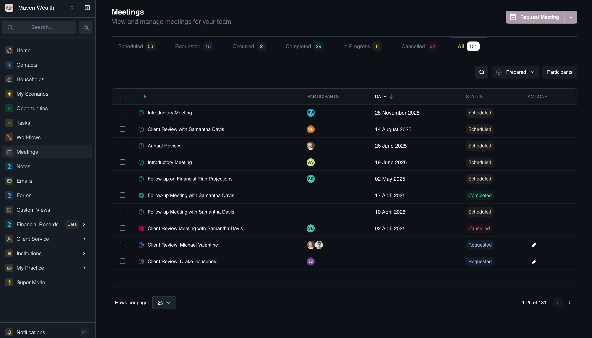
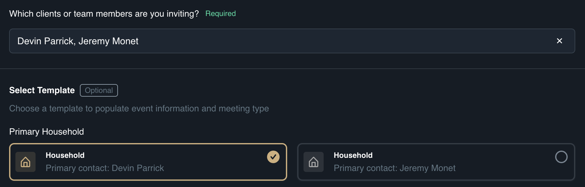
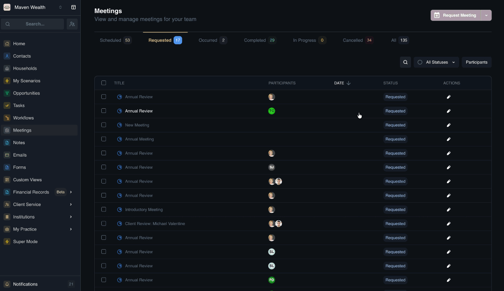

# Meetings

## Overview

The **Meetings** module streamlines your scheduling logistics by integrating calendar availability with custom meeting templates to create shareable booking links. This functionality eliminates the "email ping-pong" of finding a suitable time, allowing clients to self-book based on your real-time availability while the system automatically handles details like Zoom links and agendas.

This module connects seamlessly with other parts of the platform to keep your schedule organized. Upcoming meetings are automatically displayed on your Home dashboard for easy access, and you can incorporate a "Schedule Meeting" step directly into automated Workflows to prompt clients to book time during key processes like onboarding or reviews.

## The Meetings Dashboard

The **Meetings** page offers a clean, efficient way to manage your schedule. You can quickly filter by the state of the meeting.

### Dashboard Views & Filters
You can filter the meeting list using the status tabs located at the top of the dashboard:
* **View Options:**
    * **Scheduled:** Confirmed upcoming meetings.
    * **Requested:** Pending meetings that require your approval or action.
    * **Occurred:** Past meetings that happened but haven't been marked complete (may need follow-up notes).
    * **Completed:** Meetings that are finished and closed out.
    * **In Progress:** Meetings happening right now.
    * **Cancelled:** Meetings that were called off.
    * **All:** A comprehensive view of every meeting record.

* **Search & Filters:**
    * **All Statuses:** Further refine by preparation status (*Prepared, Unprepared*).
    * **Participants:** Filter to see meetings involving specific team members or contacts.

### The Meeting List
The main area displays your upcoming events in a list format. 
    * **Title:** The name or subject of the meeting.
    * **Participants:** The list of attendees (clients and team members).
    * **Date:** The scheduled date and time.
    * **Status:** Current state (*Scheduled, Requested, Occurred, Completed, In Progress, Cancelled*).

:::note NOTE
If your selected filters do not match any records, the system will display a "No meetings. No matching results." message.
:::

## Scheduling Meetings

### How to Request a Meeting

You can schedule meetings with prospects and clients directly from the dashboard. (client selects time)

1. Click the **Request Meeting** button located at the top of the dashboard.
2. In the **Request a Meeting** pop-up, select the Assignee:
     * **Who is the organizer of the meeting?:** Select from the **Team Members** who will be hosting the meeting.
     * **Which clients or team members are you inviting?:**  Select from **Team Members** or **Contacts** you wish to include in the meeting.
3. Choose a **Template** to automatically populate the **Event Information**, **Agenda**, and **Tasks**. You can also leave this blank to set everything up manually.
4. Select a pre-defined **Schedule Template** or create a custom one. This will automatically fill in the availability rules in the **Scheduling Info** section.
5. If a template was selected, review the pre-filled **Event Information** (Title, Duration, Timezone, Meeting Type, and Message). If no template was used, fill these details out manually.
6. If a template was selected, review the pre-filled **Meeting Agenda**. If no template was used, add specific discussion points manually.
7. If a template was selected, review the pre-filled Pre-meeting and Post-meeting **Tasks**. If no template was used, add specific tasks manually to ensure preparation and follow-up work is tracked.
8. Configure the **Scheduling Info** to define the rules for this specific booking:
    * **Available Hours:** Set the specific days and times the host is free.
    * **Buffers:** Add padding time before and after the slot to prevent back-to-back meetings.
    * **Minimum Notice:** Define how far in advance a meeting must be booked (e.g., 2 Days).
    * **Cancellation Notice:** Set the minimum time required to cancel without penalty (e.g., 24 Hours).

:::note NOTE
You will be returned to the **Meeting list** view; search for the meeting name you recently added to view the details.
:::

#### Clarification 
(need to explain this part under Request Meeting functionality)

### How to Book a Meeting (you select time)

Unlike the "Request" flow which creates scheduling options, this process books a specific time slot immediately.

1. Navigate to **Meetings**, and locate the **Book Meeting** link on the dashboard.
2. In the **Book a Meeting** pop-up, fill out the details.
    * **Select Assignee:** Choose the Meeting Host and any Participants.
    * **Select Template:** Choose a meeting template to pre-fill details.
    * **Event Information:**  Enter the details including Title, Date, Time, Duration, and Message.
    * **Meeting Agenda:** Review or edit the agenda items.
    * **Tasks:** Add any pre- or post-meeting tasks.
3. Click **Save & Exit** to confirm the appointment.

### How to Create a Manual Meeting (no calendar sync)

Use this feature to record a meeting that is not connected to a calendar.

1. Navigate to **Meetings** and select **Record Manual Meeting**.
2. In the **Create Manual Meeting** pop-up, fill out the details.
    * **Participants:** Add the attendees (clients and team members).
    * **Select Template:** Choose a template to pre-fill the agenda and structure.
    * **Event Information:** Enter the details including Title, Date, Time, and Duration.
    * **Meeting Agenda:** Outline the discussion points.
    * **Tasks:** Add any follow-up or preparation tasks associated with this record.
3. Click **Create Meeting** to log the meeting.

### How to Confirm a Requested Meeting

Once a meeting has been requested, follow these steps to confirm the time:

1. Navigate to the **Meetings** list.
2. Click on the **Requested** view option to filter for pending requests.
3. Click the Title of the meeting you just created.
4. In the meeting widget that appears, locate and click the **Schedule** link.
5. You will be redirected to the scheduler interface. Select the desired **Date** and **Time**.
6. Confirm the selection. The booking is now confirmed.

## Managing & Executing Meetings

### Meeting Details
When you click into a specific meeting record, you unlock a suite of tools to help you prepare, execute, and follow up effectively When viewing the meeting details page, you will see the following:
    
* **Summary of the Meeting:**
    * **Status:** The current state (e.g., Scheduled).
    * **Date and Time:** e.g., "Saturday, January 10 8:15 AM - 8:45 AM".
    * **Meeting Link:** The platform link (e.g., google meet).
    * **About Meeting:** A description or agenda.
    * **Hosted By:** The team member organizing the event.
    * **Attendees:** A list of contacts.
* **Linked Records:** Relevant links such as KYC Updates for quick access to household compliance data.

### How to Verify a Booking

To ensure a meeting is correctly scheduled:

1. Navigate to the **Meetings** list.
2. Select the **Scheduled** view option.
3. Find the meeting you recently booked and click on its Title.
4. In the meeting widget, verify the following:
    * **Status:** Should now display as Scheduled.
    * **Date & Time:** Confirm they match your selection.
    * **Link:** If it is a virtual meeting (e.g., Google Meet), ensure the meeting link is visible.

### How to Edit a Meeting

1. Locate the scheduled meeting you want to modify in the **Meeting List**.
2. Click the **Edit** action button next to the meeting.
3. Update the **Event Information** in the **Edit Meeting** form:
    * **Meeting Title:** (Required) Update the name or subject of the meeting.
    * **Duration & Units:** Adjust the length of time for the meeting (e.g., change from 30 to 60 minutes).
    * **Meeting Type:** Change the medium (e.g., switch from Phone to In Person).
    * **Message:** Edit the note sent to invitees.
4. Click **Save & Exit** to confirm your changes.

### How to Prepare for a Meeting

1. Navigate to the **Meeting Details** page.
2. Review the **Agenda** and update it if necessary.
3. Complete any **Pre-meeting Tasks**.
4. Click on the **Mark as Prepared** button to signal readiness.

## Meeting Configuration

The Meeting Configuration module allows advisors to document interactions, standardize meeting structures, and manage availability. This guide covers adding notes to existing meetings, creating reusable meeting templates, and setting up availability schedules for booking links.

### How to Add a Note

1. Click **Meetings** in the sidebar, then navigate to the **Meeting List**.
2. Click on the specific **Meeting Title** to open the details view.
3. Click the **Add Note** button.
4. Choose your creation method:
    * **Create Manually:** Fill out the fields from scratch.
    * **Create from Template:** Select a pre-defined note structure (if available).
5. Configure Linked Records: Associate the note with relevant entities. Multiple links are supported. You may select from:
    * **Teams**
    * **Contacts**
    * **Households**
    * **Portfolios**
    * **Securities**
6. Enter the **Note Title**.
7. Type your details in the **Note Content** area.
:::note TIP
You can @mention team members or attach files directly within the text.
:::
8. Click **Save** to add the note to the meeting record.

### How to Add a Meeting Template

1. Click **Meetings** in the sidebar, then select **Manage Meetings**.
2. Navigate to the **Meeting Templates** link and click **New Meeting Template**.
3. Complete the **Basic Information** fields:
    * **Title:** Give the template a descriptive title.
    * **Description:** Add internal notes about the purpose of this meeting.
    * **Meeting Type:** Select the platform (e.g., **Zoom**, **Google Meet**, **Microsoft Teams**, **In Person**, or **Other**).
4. Configure the Meeting Content:
    * Fill in the Meeting Title and Message fields.
5. Add **Agenda Items**:
    * Click **Add Agenda Item** to define standard talking points. Repeat this step to add multiple items.
6. Configure **Pre-Meeting Tasks** (automatic to-dos required before the session):
    * Click **Add Pre-Meeting Task**.
    * Fill out the **Task Title** and **Task Description**.
7. Configure **Post-Meeting Tasks** (follow-up actions generated after the meeting):
    * Click **Add Post-Meeting Task**.
    * Fill out the **Task Title** and **Task Description**.
8. Click Create Template.

How to Create Availability Schedules

Navigate to Manage Meetings and select the Availability Schedules link.

Click Create Meeting Schedules.

Configure the Event Information:

Schedule Name: (Required) Name the schedule (e.g., Client Review Hours).

Time Zone: Set your working time zone.

Duration & Units: Define the standard meeting length.

Advance Notice: Set how many days in the future sessions can be booked.

Configure Other Options:

Buffers: Set Before and After buffer times to prevent back-to-back bookings.

Minimum Notice: Configure the minimum booking and cancellation notice periods.

Schedule: Use the matrix to specify available days and hours.

Click Save.

    

