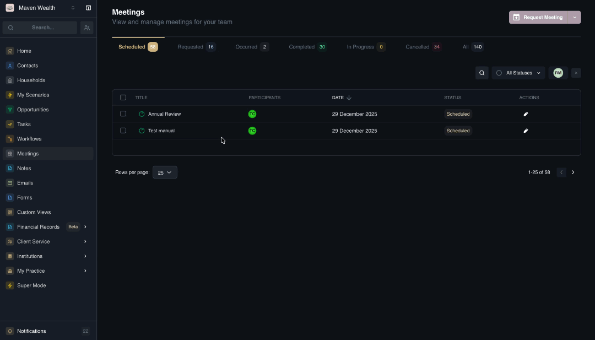
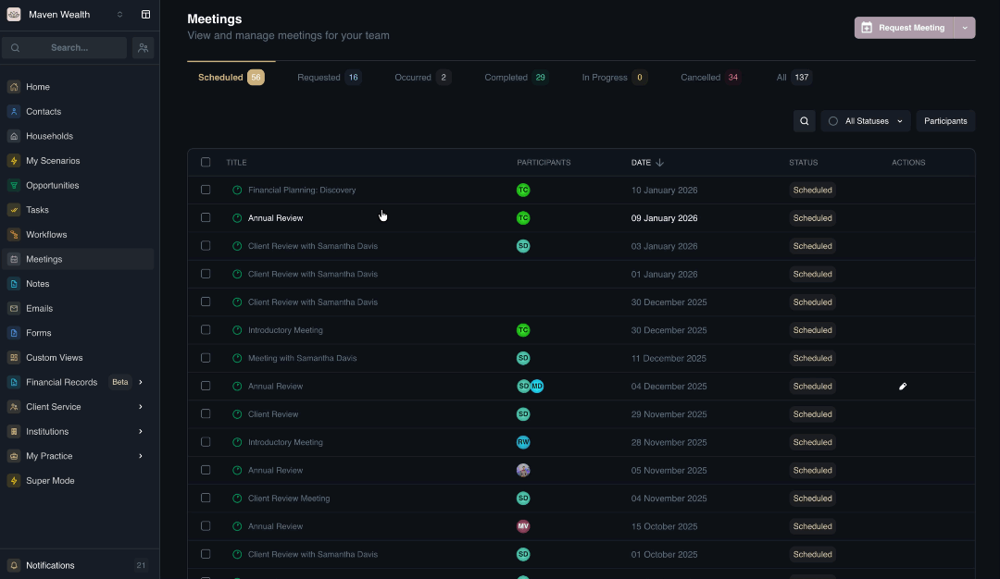
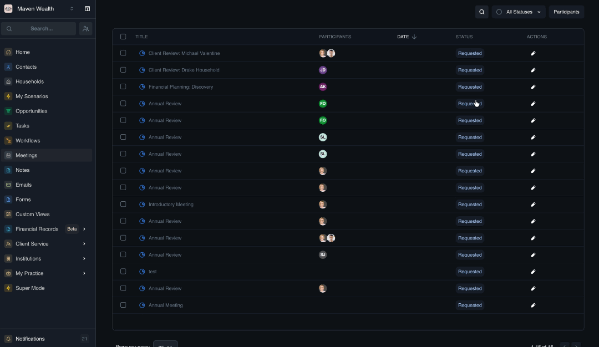
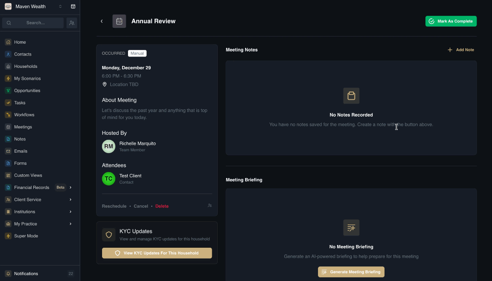
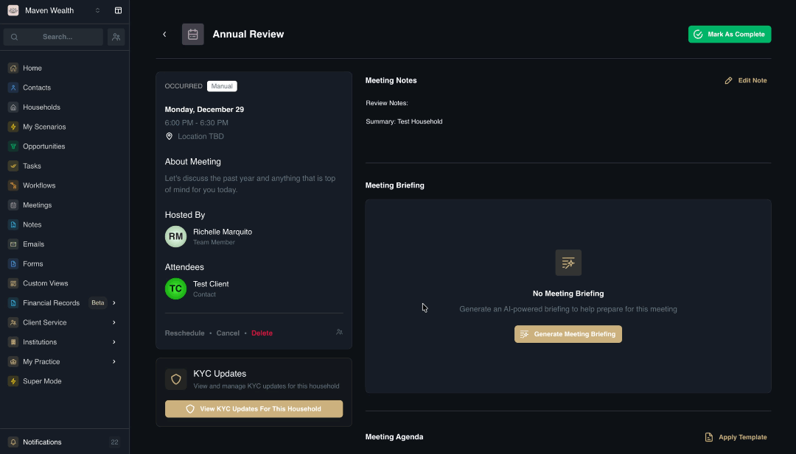

# Managing & Executing Meetings

## Meeting Details
When you click into a specific meeting record, you unlock a suite of tools to help you prepare, execute, and follow up effectively When viewing the meeting details page, you will see the following:
    
* **Summary of the Meeting:**
    * **Status:** The current state (e.g., Scheduled).
    * **Date and Time:** e.g., "Saturday, January 10 8:15 AM - 8:45 AM".
    * **Meeting Link:** The platform link (e.g., google meet).
    * **About Meeting:** A description or agenda.
    * **Hosted By:** The team member organizing the event.
    * **Attendees:** A list of contacts.
* **Linked Records:** Relevant links such as KYC Updates for quick access to household compliance data.
* **Meeting Notes:** A dedicated area to document the conversation.
* **Meeting Briefing:** Generates an AI-powered summary of the client and context to help you prepare.
* **Meeting Agenda**
* **Tasks**
* **Meeting Transcript**

### How to Verify a Booking

To ensure a meeting is correctly scheduled:

1. Navigate to the **Meetings** list.
2. Select the **Scheduled** view option.
3. Find the meeting you recently booked and click on its Title.
4. In the meeting widget, verify the following:
    * **Status:** Should now display as Scheduled.
    * **Date & Time:** Confirm they match your selection.
    * **Link:** If it is a virtual meeting (e.g., Google Meet), ensure the meeting link is visible.

### How to Edit a Meeting

1. Locate the scheduled meeting you want to modify in the **Meeting List**.
2. Click the **Edit** action button next to the meeting.
3. Update the **Event Information** in the **Edit Meeting** form:
    * **Meeting Title:** Update the name or subject of the meeting.
    * **Duration & Units:** Adjust the length of time for the meeting (e.g., change from 30 to 60 minutes).
    * **Meeting Type:** Change the medium (e.g., switch from Phone to In Person).
    * **Message:** Edit the note sent to invitees.
4. Click **Save & Exit** to confirm your changes.

### How to Add a Note

3. From the **Meeting Details** page, click the **Add Note** button.
4. Choose your creation method:
    * **Create Manually:** Fill out the fields from scratch.
    * **Create from Template:** Select a pre-defined note structure (if available).
5. Configure Linked Records: Associate the note with relevant entities. Multiple links are supported. You may select from:
    * **Teams**
    * **Contacts**
    * **Households**
    * **Portfolios**
    * **Securities**
6. Enter the **Note Title**.
7. Type your details in the **Note Content** area.
:::note TIP
You can @mention team members or attach files directly within the text.
:::
8. Click **Save** to add the note to the meeting record.

### Marking Meeting Status 
The main action button updates dynamically depending on the current time relative to the scheduled meeting:

* **Before/During Meeting:** The button displays "Mark as Prepared". Clicking it toggles the status to "Mark as Unprepared" (and vice versa) so you can signal readiness to your team.

* **Past Scheduled Time:** If the meeting time has passed, the button automatically updates to "Mark as Complete". Clicking this moves the meeting to the Completed view.

### How to Prepare for a Meeting

1. Navigate to the **Meeting Details** page.
2. Review the **Agenda** and update it if necessary.
3. Complete any **Pre-meeting Tasks**.
4. Click on the **Mark as Prepared** button to signal readiness.

