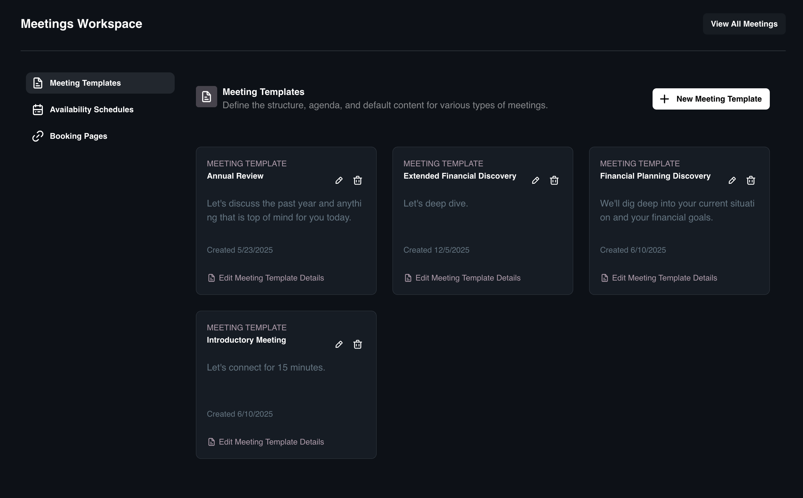
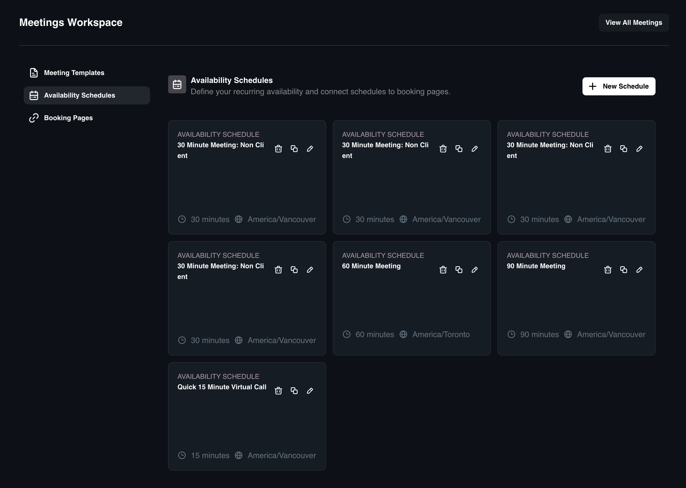
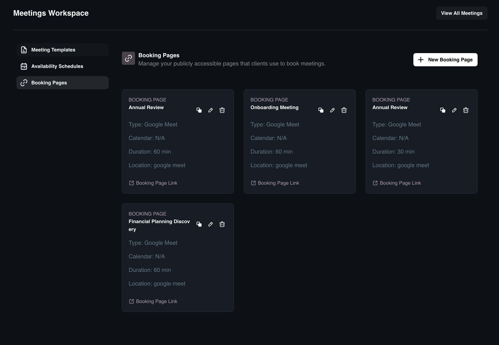

# Manage Meetings Dashboard

The Manage Meetings area allows you to configure your scheduling infrastructure.

## Meeting Templates

**Templates** provide a reusable framework for specific meeting types. By standardizing agendas, messages, and task lists, you ensure consistency across all client interactions.

### How to Add a Meeting Template

1. Click **Meetings** in the sidebar, then select **Manage Meetings**.
2. Navigate to the **Meeting Templates** link and click **New Meeting Template**.
3. Complete the **Basic Information** fields:
    * **Title:** Give the template a descriptive title.
    * **Description:** Add internal notes about the purpose of this meeting.
    * **Meeting Type:** Select the platform (e.g., **Zoom**, **Google Meet**, **Microsoft Teams**, **In Person**, or **Other**).
4. Configure the **Meeting Content**:
    * Fill in the **Meeting Title** and **Message** fields.
5. Add **Agenda Items**:
    * Click **Add Agenda Item** to define standard talking points. Repeat this step to add multiple items.
6. Configure **Pre-Meeting Tasks** (automatic to-dos required before the session):
    * Click **Add Pre-Meeting Task**.
    * Fill out the **Task Title** and **Task Description**.
7. Configure **Post-Meeting Tasks** (follow-up actions generated after the meeting):
    * Click **Add Post-Meeting Task**.
    * Fill out the **Task Title** and **Task Description**.
8. Click **Create Template**.

## Availability Schedules

**Availability Schedules** allow you to define specific time windows for different types of meetings (e.g., "Client Review Hours" vs. "Quick Syncs"). This automates your working hours, time zones, and buffer times so you don't have to manually check your calendar.

### How to Create Availability Schedule

1. Navigate to **Manage Meetings** and select the **Availability Schedules** link.
2. Click **New Schedule**.
3. Configure **Event Information**:
    * **Schedule Name:** Give it a clear name (e.g., "Client Review Hours").
    * **Time Zone:** Set your working time zone.
    * **Duration & Units:** Define the standard length of meetings for this schedule.
    * **Advance Notice:** Set how far in advance sessions can be booked.
4. Configure **Other Options**:
    * **Buffers:** Set padding time before and after meetings to prevent back-to-back booking.
    * **Minimum Notice:** Set the required notice periods for booking or cancelling.
    * **Cancellation Notice:** Set the required amount of time to cancel a meeting.
    * **Schedule:** Use the matrix to define your specific available days and hours.
5. Click **Save**.

**How to Edit, Duplicate and Delete Availability Schedule**
* **Edit:** Locate the schedule in the list and click the **Edit** icon to modify any of the settings.
* **Duplicate:** Use the **Duplicate** option to clone an existing schedule. This is useful for creating variations of a schedule without starting from scratch.
* **Delete:** Use the **Delete** option to permanently remove obsolete schedules.

## Booking Pages

**Booking Pages** allow you to generate unique, shareable URLs that clients can use to self-schedule meetings.

### How to Add a Booking Page

1. Navigate to **Manage Meetings** and select the Booking Pages link.
2. Click **New Booking Page**.
3. Configure the page details:
    * **Basics:** Select the **Assignee**, **Template**, and **Schedule**.
    * **Event Information:** Define the **Meeting Title**, **Duration**, **Timezone**, **Meeting Type**, and **Message**.
    * **Tasks:** Configure **Pre-meeting** and **Post-meeting **tasks to automate your workflow.
    * **Scheduling Info:** Set specific rules including **Buffers**, **Minimum Notice**, **Cancellation Notice**, and the **Availability Schedule**.
5. Click **Save**.

### How to Manage Booking Pages**

* **Edit:** Locate the page in the list and click the Edit icon to modify settings like the assigned host or linked schedule.
* **Duplicate:** Use the Duplicate option to clone a booking page. This is useful when setting up similar pages for different team members.
* **Delete:** Use the Delete option to permanently remove a booking page. Note: This will break any links you have previously shared with clients.
* **View Link:** Click the Link icon to copy the public URL to your clipboard or open the page to test the client experience.

