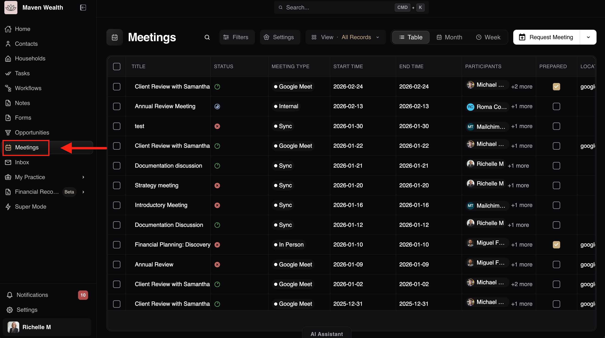

# The Meetings Dashboard

The **Meetings** page offers a clean, efficient way to manage your schedule. You can quickly filter by the state of the meeting.

## Search & Filters
    * **All Statuses:** Further refine by preparation status (*Prepared, Unprepared*).
    * **Participants:** Filter to see meetings involving specific team members or contacts.

:::note NOTE
If your selected filters do not match any records, the system will display a "No meetings. No matching results." message.
:::

