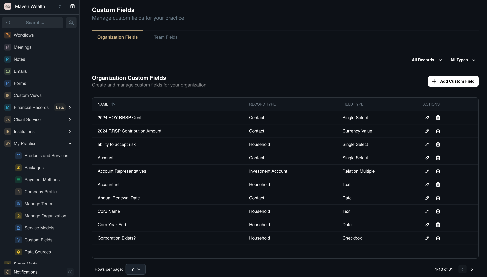

# Custom Fields

## Overview

The **Custom Fields** module, located under the **My Practice** page, allows you to extend the standard data model of SuperAdvisor to fit your firm's specific needs. Whether tracking niche client interests, unique compliance requirements, or specific financial details not covered by default fields, this module lets you define, manage, and deploy new data points across your organization.

This flexibility ensures that your CRM adapts to your practice, not the other way around. Custom fields can be applied to almost any record type—from contacts to investment accounts—and can be used to build powerful filtered views and reports, ensuring critical information is always accessible and structured.

### Dashboard Views

The **Custom Fields** management page is divided into two primary views to help you organize fields based on their scope:

* **Organization Fields:** View and manage custom fields that are available to the entire firm. These are typically standard fields used by all advisors.
* **Team Fields:** Create and manage fields specific to your immediate team or unit, allowing for granular tracking without cluttering the global system.

**List Columns:**
The dashboard displays a list of your custom fields with the following details:
* **Name:** The label of the field (e.g., "Risk Score").
* **Record Type:** The entity the field is attached to (e.g., Contact, Household).
* **Field Type:** The format of the data (e.g., Text, Date, Checkbox).

### How to Add a Custom Field

1. Navigate to **My Practice** in the main side menu and select **Custom Fields**.
2. Click the **Add Custom Field** button to open the creation pop-up.
3. **Details:**
    * **Record Type:** Select where this field will appear. Options include: 
    * Contact, Household, Insurance Policy, Bank Account, Investment Account, Loan, Credit Card, Line of Credit, Real Estate Property, Real Asset, Private Investment, Company Equity, Defined Benefit Pension, Cash Flow
    * **Name:** Enter a clear, descriptive label for the field.
    * **Field Type:** Choose the data format: Checkbox, Currency Value, Date, External URL, Frequency, Multi-Select, Number, Relation (Single/Multiple), Single Select, Text, Text Area
    * **Icon:** Select a visual icon to represent the field.
4. Click **Add Custom Field** to save and deploy the new field.

### How to Filter the Custom Fields List

To quickly find specific fields in a long list, use the dropdown filters at the top of the dashboard:
1. **Record Type:** Filter to show only fields related to a specific entity (e.g., show only "Household" fields).
2. **Field Type:** Filter by the format of the data (e.g., show only "Currency" fields).

