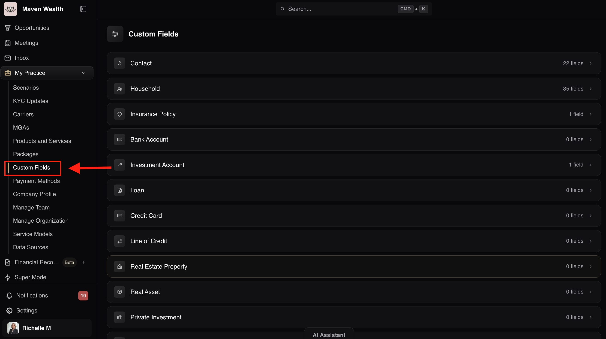
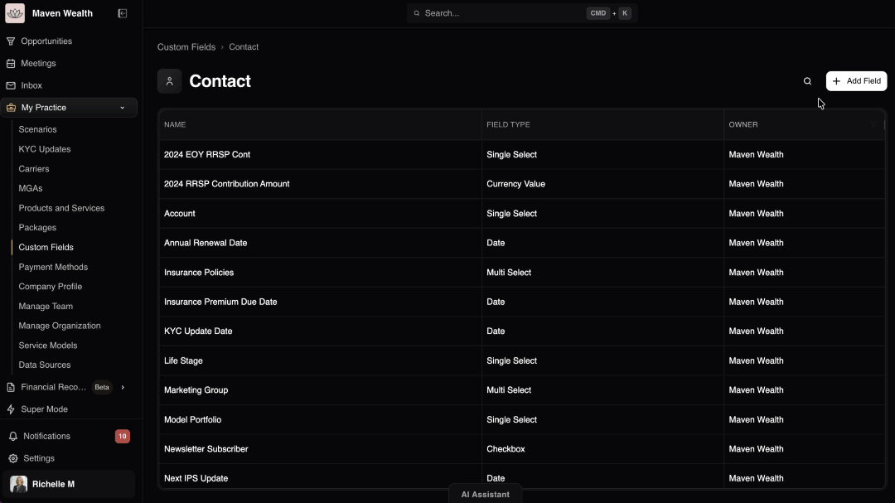

# Custom Fields

## Overview

The **Custom Fields** module, located under the [**My Practice**](../../category/my-practice) page, allows you to extend the standard data model of **Super Advisor** to fit your firm's specific needs. Whether tracking niche client interests, unique compliance requirements, or specific financial details not covered by default fields, this module lets you define, manage, and deploy new data points across your organization.

This flexibility ensures that your CRM adapts to your practice, not the other way around. Custom fields can be applied to almost any record type—from contacts to investment accounts—and can be used to build powerful filtered views and reports, ensuring critical information is always accessible and structured.

## Dashboard Views

To make managing your data easier, the **Custom Fields** dashboard is organized by category. Instead of scrolling through a single, overwhelming list, you will see a clean dashboard displaying all available Record Types alongside the total number of custom fields currently active within each.

Available categories include:

* **Client Entities:** Contact, Household, Corporation, Trust, Foundation
* **Financials:** Bank Account, Investment Account, Loan, Credit Card, Line of Credit, Cash Flow
* **Assets & Policies:** Insurance Policy, Real Estate Property, Real Asset, Private Investment, Company Equity, Defined Benefit Pension
* **Practice Management:** Workflow, Task, Meeting, Note

**The Category View**
Clicking into any specific category (for example, Contact) redirects you to a detailed table of the custom fields associated only with that record type.

This table provides a quick overview of your data architecture using the following columns:

* **Name:** The label of the custom field (e.g., "Risk Tolerance Score" or "Target Retirement Year").
* **Field Type:** The format of the data collected (e.g., Text, Date, Currency).
* **Owner:** Indicates whether the field is an Organization Field (available to the entire firm) or a Team Field (specific to your immediate unit).

### How to Add a Custom Field

1. Click the **Add Custom Field** button to open the creation pop-up.
2. Complete the field details:
    * **Owner:** Choose the visibility of this field. Select **Organization** to make it available to the entire firm, or **Team** to restrict it to your specific group.
    * **Name:** Enter a clear, descriptive label for the field.
    * **Field Type:** Choose the data format: *Checkbox, Currency Value, Date, External URL, Frequency, Multi-Select, Number, Relation (Single/Multiple), Single Select, Text, Text Area*
    * **Description:** Provide a brief explanation of what this field is for and how it should be used. This helps maintain consistent data entry across your practice.
    * **Icon:** Select a visual icon to represent the field.
3. Click **Add Custom Field** to save and deploy the new field.

### How to View and Use Your New Custom Field

Once you have added a new custom field, it is immediately available for use within its assigned module. To begin capturing data, simply navigate to a relevant record and locate the dedicated **Custom Fields** section. For specific examples on how to locate and manage these fields within different modules, you can refer to the corresponding links:

* [Household Custom Fields](../households/entity-management#custom-fields)
* [Contacts Custom Fields](../contacts/contact-profile#custom-fields)
