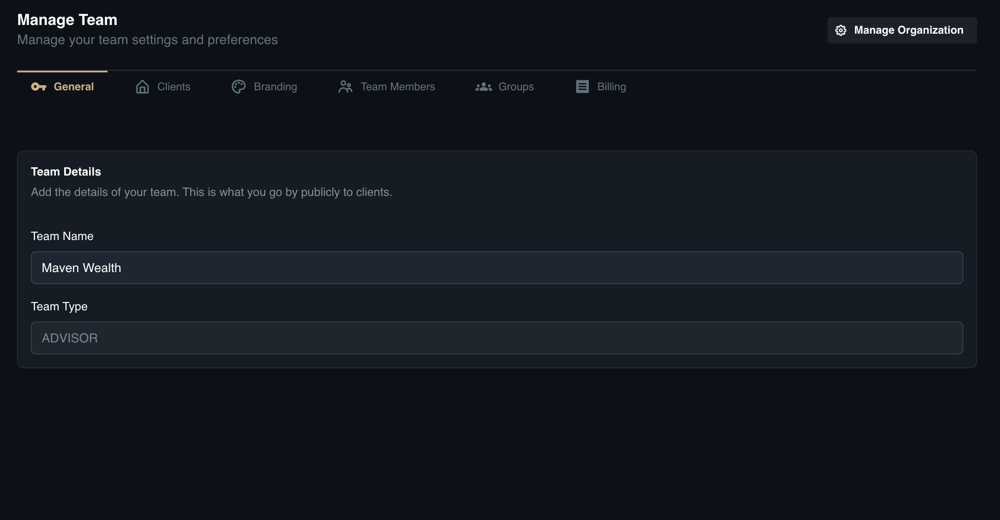
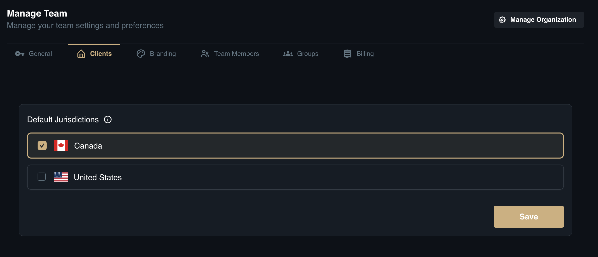
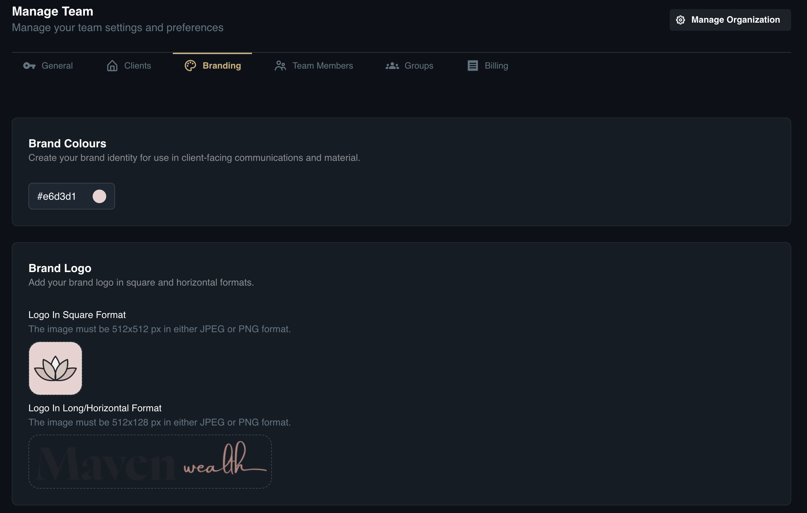
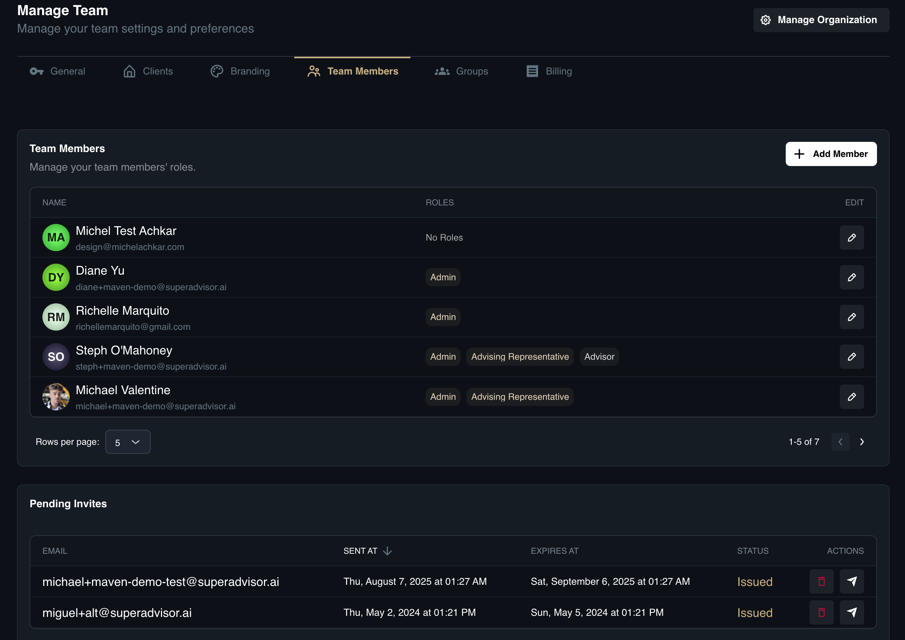
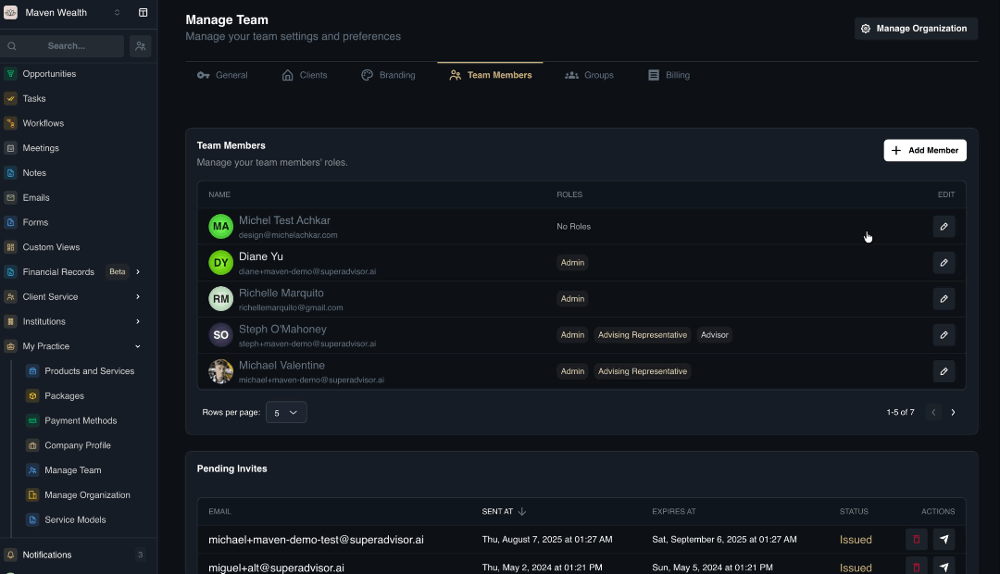
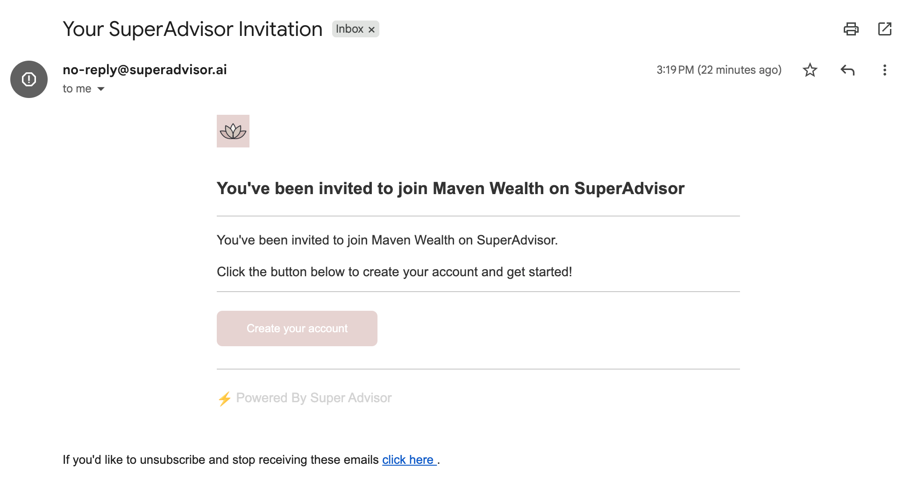
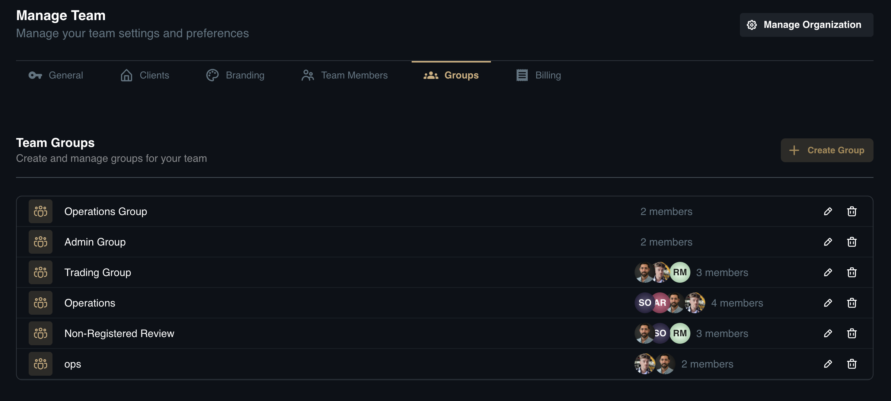
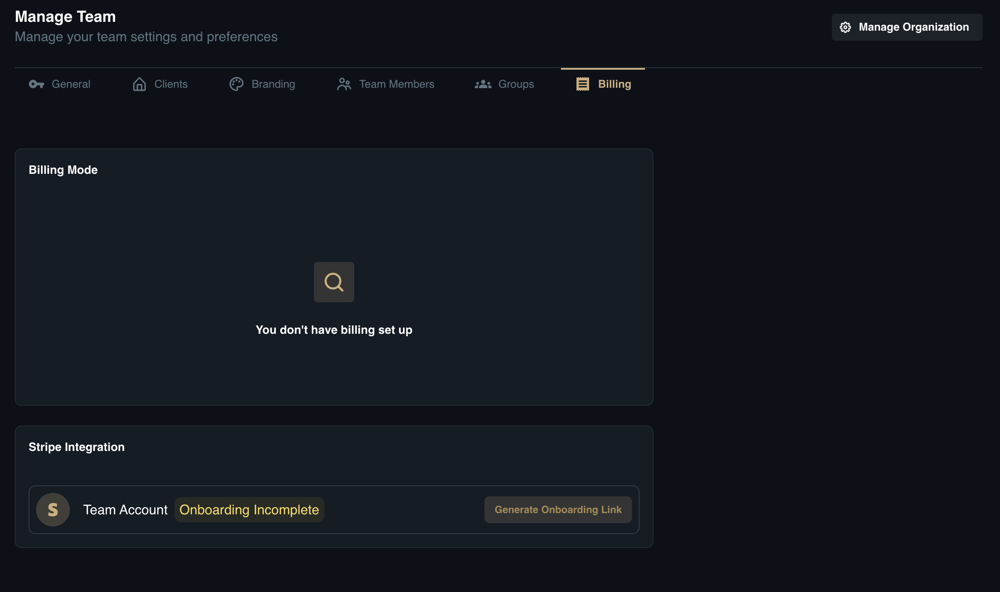

# Manage Team

## Overview
The **Manage Team** page allows you to control the settings, branding, and personnel structure of your specific team within the organization. This is the central hub for defining how your team appears to clients, managing user access, and configuring billing integrations.

## Tabs & Configuration Steps

Navigate to **My Practice** page, then **Manage Team**.

### General

This tab covers the public identity of your team.
* **Team Details:** This is where you can view or edit the **Team Name** and also see the **Team Type**. This information is what you go by publicly to clients.

### Clients

Configure the default regulatory settings for your client base.

* **Default Jurisdictions:** Select the primary region for your clients (*Options: Canada or United States*).

### Branding

Create a consistent brand identity for use in client-facing communications and materials.

* **Brand Colours:** Define your specific brand color palette.
* **Brand Logo:** Upload your logos in the required formats to ensure they display correctly across the platform:
    * **Square Format:** Image must be 512x512 px (JPEG or PNG).
    * **Long/Horizontal Format:** Image must be 512x128 px (JPEG or PNG).

### Team Members

View a list of current members (Name, Roles) and manage access.

**Add a New Member:**

1. Click **Add Member**..
2. In the **Invite a new member** pop-up, enter the **Email address** and click **Send Invitation**.
3. Alternatively: Click **Get Invite Link** to generate a URL you can share directly with the new teammate.

:::note NOTE
The teammate will receive an email granting them access to your team.
:::

Here is a sample invitation:

### Groups

Create and manage sub-groups within your team (e.g., "Admin Team" or "Planning Team") to streamline task assignments.

**Create a Group:**

1. Click **Create Group**.
2. In the **Create Group** pop-up, enter the **Group Name**.
4. Select **Team Members** you wish to include.
5. Click **Create Group** to finalize.

### Billing

Manage your team's financial integrations and subscription status.

* **Billing Mode:** View your current billing setup (e.g., Stripe Integration).
* **Team Account Status:** Check if your onboarding is complete.
* **Setup:** If onboarding is incomplete, click the Onboarding Link button to complete the Stripe integration process.