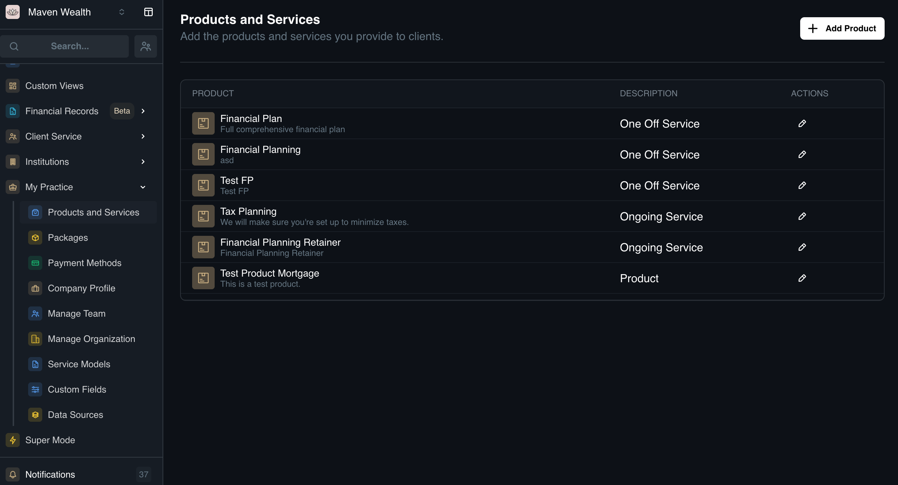
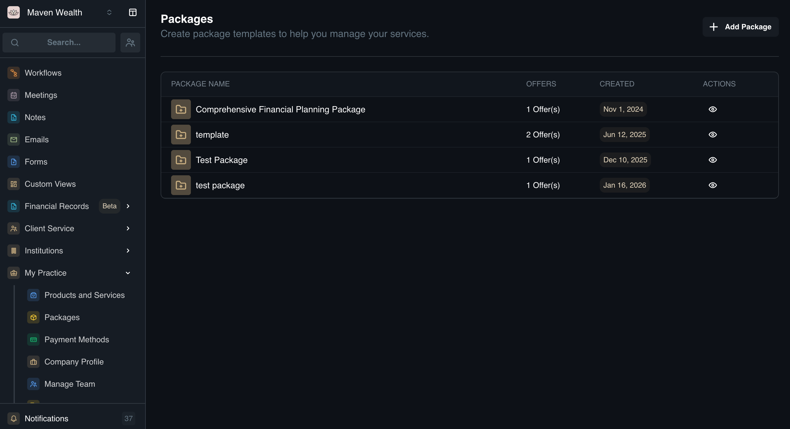

# Products, Services, and Packages

Building a streamlined billing and service model begins with two key steps: defining what you sell (**Products & Services**) and grouping those items into convenient offers (**Packages**). These two pages work together to help you manage your catalog and standard pricing efficiently.

## Products & Services

The **Products & Services** dashboard is your central catalog. Before you can create a package, you must first define the individual products or professional services you offer.

### How to Add a Product or Service

1. Go to the **My Practice** page and select **Products & Services**. The dashboard displays your existing product descriptions and allows you to edit or add new ones.
2. Click the **Add Product** button to open the creation pop-up.
3. Enter **Service Details**:
    * **Product/Service Name:** Enter a clear display name for the item.
    * **Type:** Classify the offering by selecting one of the following: *Financial Planning, Insurance, Investment Management, Mortgage, or Other*.
    * **Description:** Add details explaining what the service or product entails.
    * **Category:** Define the nature of the item: *One-off service, Ongoing service, or Product*.
4. Configure **Payment Options:**
    * **Payment Methods:** Choose whether this is handled via **Manual** entry or a **Payment Provider**.
    * **Pricing Type:** Select the fee structure (*e.g., One time fee*).
    * **Amount & Currency:** Enter the **One time amount** and select the **Currency** (*USD or CAD*).
    * **Upfront Payment:** If this item requires immediate settlement, check the **Collect This Payment** upfront box.
5. Click **Create** to save the item to your **Products and Services** list.

## Packages
Once your individual services are defined, you can use the **Packages** feature to group them. Packages allow you to create templates for bundles (e.g., a "Gold Tier" package that includes both Financial Planning and Tax Preparation) with set pricing and billing frequencies.

### How to Create a Package Template
1. Go to the **My Practice** page and select **Packages**. The dashboard shows package names, included offers, and creation dates.
2. Click **Add Package** to open the **Create a Package Template** pop-up.
3. In the **Name** field, enter a unique name for the template.
4. In the **Add Bundles** section, configure the following for each bundle:
    * **Category:** Select whether this bundle is for **One-off services and products** or **Ongoing services and subscriptions**.
    * **Select Products and Services to Include:** Choose items from the "Products & Services" list you created (*e.g., Tax Planning, Financial Planning Retainer*).
    * **Billing Start:** Choose when billing begins: **Custom date**, **On completion**, or **On start**.
    * Set **Payment Options:**
        * **Payment Methods:** Select **Manual** or **Payment Provider**.
5. Once finished, click **Add Package Template**.

:::note NOTE
 You can add more bundles if you wish to combine different billing types (*e.g., an upfront fee bundle + a monthly subscription bundle*) into a single package. 
:::