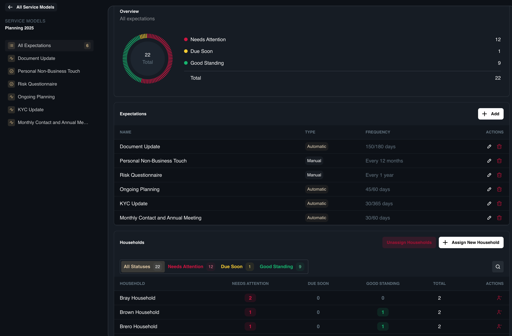
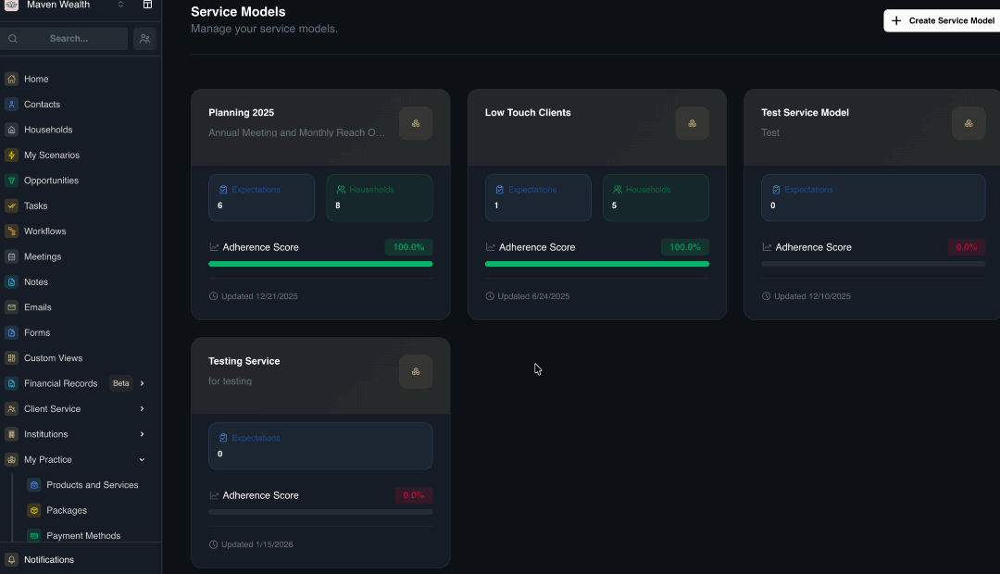
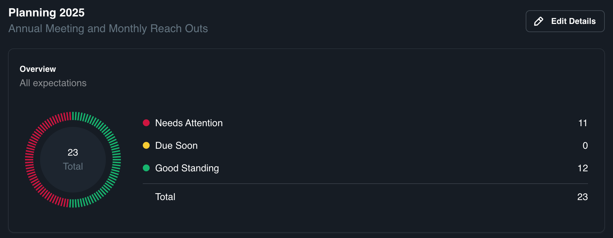

# Service Models

## Overview

The **Service Models** module is the primary tool for quantitative relationship management within SuperAdvisor. It allows advisors and support staff to track service frequency, manage deliverables (e.g., "Quarterly Reviews"), and ensure compliance with client engagement standards in a structured, searchable format.

Unlike static calendar events, **Service Models** are dynamic. They support **Entity Linking**,**Automated Alerts** for upcoming deadlines, and **Templates** for standardized service tiers (e.g., Gold, Silver, Bronze).

## Why Use Service Models?

**Service Models** function as the governance engine for your practice. By categorizing households into distinct tiers, you define a standard set of "Expectations" for each group. The system then monitors these expectations against actual activities (meetings, tasks), calculating an adherence score to show how well the firm is delivering on its promises.

Implementing **Service Models** delivers comprehensive benefits across the practice:

* **Compliance Safety Net:** It automatically creates an audit trail proving that fiduciary duties and agreed-upon service frequencies (e.g., "Annual Review every 12 months") are met, ensuring promised services are actually delivered.
* **Operational Efficiency & Scalability:** By eliminating manual spreadsheet tracking, the system proactively flags clients as "Needs Attention" or "Due Soon." This allows the practice to manage a larger client base effectively by operationalizing standards rather than relying on memory.
* **Consistent Client Experience:** Clients receive a reliable, standardized level of care, preventing "service drift" where attention might otherwise fade over time.
* **Transparency & Trust:** Clients can be confident they are receiving the specific premium touchpoints they pay for. Proactive monitoring ensures no client goes too long without contact, which helps build trust and deepen the relationship.

### Service Model Dashboard

The **Service Model** dashboard provides high-level visibility into your practice's performance. Each model is displayed as a widget containing:

* **Name and Description:** The title assigned to the service tier (e.g., "Gold Client") and a brief summary of its intended scope or target audience.
* **Households Count:** The total number of households currently assigned to this model. (This indicator is hidden by default if no households are assigned yet).
* **Expectations Count:** The total numeric count of deliverables defined for this model. Note: The detailed list of expectations is only visible when you click to open the widget.
* **Adherence Score:** A metric indicating the percentage of clients within this model who are currently meeting all defined service expectations.
* **Last Updated Date:** A timestamp showing when the service model's configuration was last modified.

## Service Model Page

When you click on a **Service Model** widget, you are redirected to the dedicated **Service Model** Page. This page serves as the command center for that specific tier and is divided into three key sub-sections: **Overview**, **Expectations**, and **Households**.

### How to Create a Service Model

If you need to establish a completely new service tier before managing it:

1. Navigate to the **My Practice** page and select **Service Models**.
2. Click the **Create Service Model** button.
3. Enter the **Name**, **Description**, and assign the appropriate **Team**.
4. Click **Create Service Model**.

### Overview

The **Overview** section provides a visual health check of your practice's performance for this specific service model. It features a detailed pie chart that categorizes all assigned clients based on their current service status.

* **Needs Attention:** Clients whose service delivery is behind schedule or missing.
* **Due Soon:** Clients with upcoming service requirements in the near future.
* **Good Standing:** Clients for whom all expectations have been met.

**How to Analyze the Overview:**

1. Navigate to the **Service Models** page and click on a specific model widget.
2. In the **Overview** tab, review the pie chart to identify the proportion of clients in each status category.
3. Use this data to prioritize your team's workload, focusing immediately on the "Needs Attention" segment to ensure compliance.

### Expectations

The **Expectations** section acts as the rules engine for the service model. It displays a list of all defined deliverables (e.g., Annual Review, Tax Planning), showing details such as **Name**, **Type**, and **Frequency**.

**How to Add a Service Expectation:**

1. Open the **Service Model** and scroll to the **Expectations** section.
2. Click the **Add** button.
3. Fill in the **Expectation Name** and **Description**.
4. Select the **Expectation Type**:
    * **Manual:** Creates tasks based on a schedule.
    * **Automatic:** Tracks specific field values automatically.
5. Set the **Recurring Schedule** (*e.g., frequency in months, years, or days*).
6. Choose a **Task Template** to standardize the work.
7. Add **Conditions** (e.g., "When [Field] equals [Value]") if the expectation applies only to specific clients.
8. Click **Create Expectations**.

### Households

The **Households** section lists all client households currently assigned to this service tier. This allows you to manage membership directly from the model itself.

**How to Manage Households:**

1. Open the **Service Model** and scroll to the **Households** section.
* **To Add:** Click **Assign New Household**. A pop-up will appear allowing you to select and add households to this model.
* **To Remove:** Select the **Unassign Households**, and in the **Unassign Households from the Service Model** pop-up, select the household that you want to remove.

