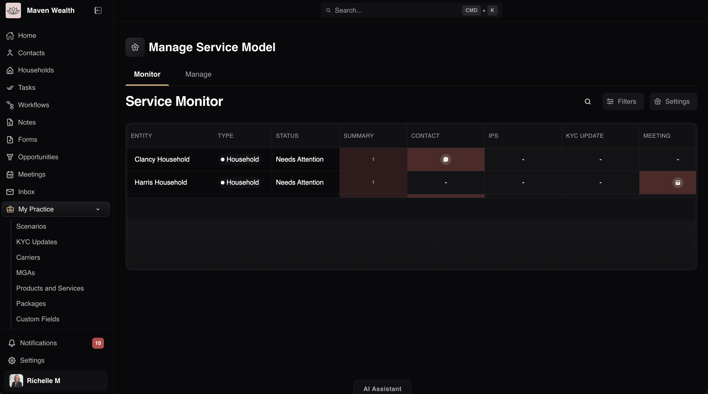
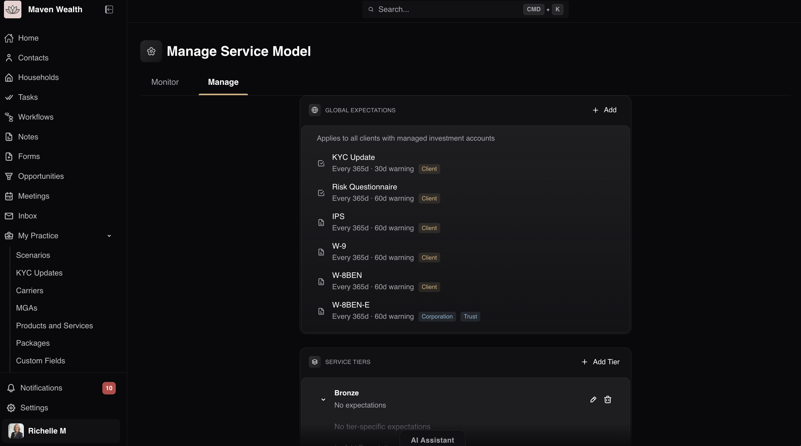

# Service Model

## Overview

The **Service Model** module is your firm's automated compliance and client engagement tracker. It ensures that no client falls through the cracks by establishing clear, trackable expectations for communication, meetings, and essential documentation.

This module is split into two primary areas: the Monitor tab, which acts as your daily action dashboard, and the Manage tab, where you define the specific engagement rules and service tiers for your book of business.

### The Monitor Tab: Tracking Client Deliverables

The **Monitor** tab is a unified dashboard designed to give you a top-down view of your service health. It displays a comprehensive table of your clients and highlights exactly where you stand on key deliverables.

The table includes the following columns:

* **Entity & Type:** Identifies the specific client, prospect, or household.
* **Status & Summary:** Provides an at-a-glance health check of the client relationship.
* **Requirement Tracking Columns:** Specific columns for **Contact**, **IPS** (Investment Policy Statement), **KYC Update**, and **Meeting**. These columns indicate whether a required action is up-to-date, due soon, or overdue.

### The Manage Tab: Setting Your Expectations

The **Manage** tab is where you build the blueprint for your client experience. It is divided into two distinct rule sets: Global Expectations and Service Tiers.

**Global Expectations**

**Global Expectations** are mandatory standards that apply universally across your firm to all clients with managed investment accounts. These are typically regulatory or foundational compliance requirements.

You can configure the frequency (e.g., Every 365 days) and the warning period (e.g., 30 or 60 days before the deadline) for standard documents such as:

* KYC Update (Applies to Clients)
* Risk Questionnaire (Applies to Clients)
* IPS (Applies to Clients)
* W-9 and W-8BEN (Applies to Clients)
* W-8BEN-E (Applies to Corporations and Trusts)

**Service Tiers**

While **Global Expectations** apply to everyone, Service Tiers allow you to segment your book of business and deliver a bespoke experience based on a client's value, complexity, or life stage. You can create customized tiers with specific, recurring expectations attached to them.

Examples of how Service Tiers can be configured include:

* **Gold Tier**: Might have 1 specific expectation, such as a formal Meeting required every 365 days (with a 60-day warning) for Clients, Leads, Onboarding, and Prospects.
* **Planning 2025 Tier:** Might require a higher touch, such as a Monthly Contact and Annual Meeting every 60 days (with a 30-day warning) across multiple entity types.
* **Low Touch Clients:** Might only require a Low Touch Contact Model every 90 days.
* **Test Service Model:** Specifically triggers a Contact task every 365 days solely for Leads.

Other tiers—such as Bronze, Silver, Platinum, Planning 2026, or High Touch Accounts—can be established and customized with no specific expectations until you are ready to define them. By assigning clients to these tiers, the system will automatically populate your Monitor tab with the exact tasks needed to fulfill your service promises.