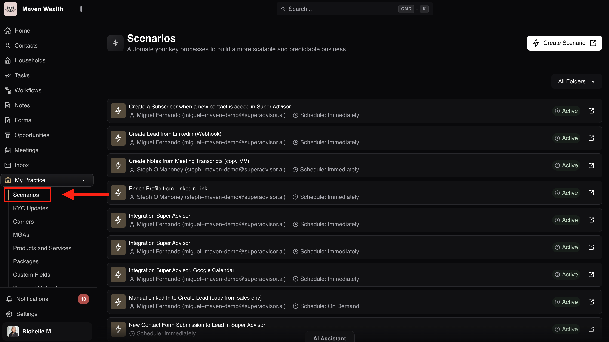
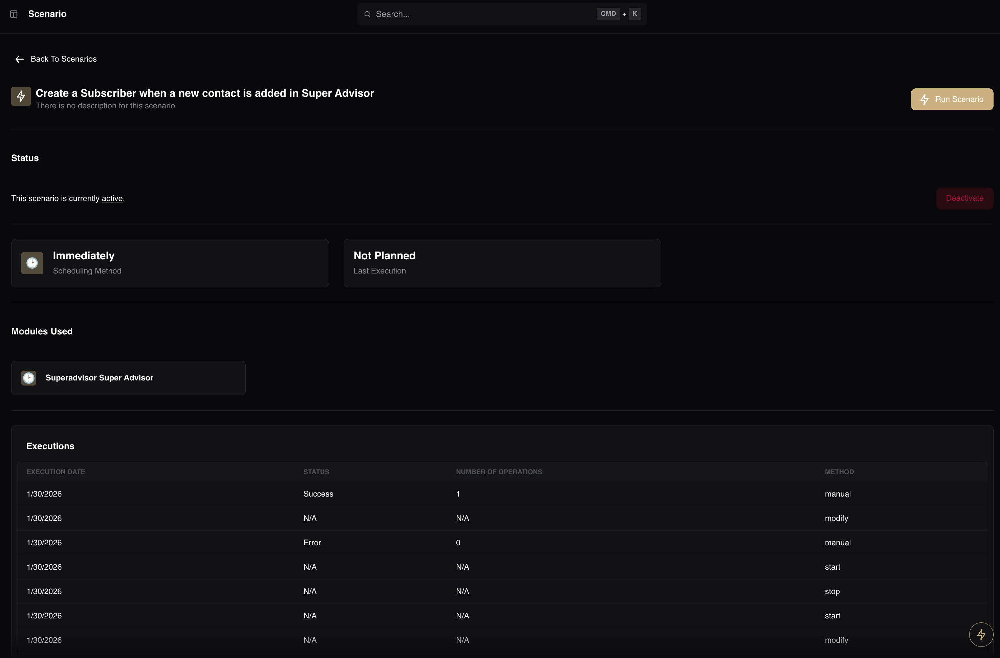

# Scenarios

## Overview

The **Scenarios** page is the central command center for your firm’s backend automations. It serves as the bridge between Super Advisor and your external tools—such as LinkedIn, Google Calendar, and Azure OpenAI—to build a scalable and predictable business.

Unlike standard workflows which require manual human action, **Scenarios** are digital triggers that execute processes automatically. From this dashboard, you can monitor the health of these integrations, verify ownership credentials, and audit operational schedules to ensure your business data flows without interruption.

## The Scenarios Dashboard

The **Dashboard** is your primary view, providing a high-level list of all configured automations running in your instance.

### How to Access the Dashboard

1. Navigate to **My Practice** in the side bar.
2. Select **Scenarios**.

### Dashboard List Columns

When viewing the main list, you will see the following standard columns:

* **Scenario Name:** The specific action the system is performing (*e.g., Enrich Profile from LinkedIn Link*).
* **Owner:** The user account (email) authenticated to run the automation. This is critical for maintaining valid integration tokens.
* **Schedule:** Indicates the trigger frequency (*e.g., Immediately, On Demand*).
* **Status:** The current state of the automation (*e.g., Active, Inactive*).

### Understanding Schedule Types

The **Schedule** defines exactly when an automation triggers.

* **Immediately** represents real-time triggers. The scenario runs the instant a specific event occurs within the platform. For example, the Creating a subscriber when a new contact is added scenario executes the moment you save a new contact record.

* **On Demand** serves as a manual trigger. These scenarios do not run automatically; they wait for a user to explicitly click a button or trigger a specific webhook. A common use case is Manually converting a LinkedIn profile to a Lead.

* **Indefinitely (Interval)** indicates recurring background checks. The system "wakes up" at a set time to check for new data. This is standard for heavy processing tasks like Azure OpenAI batch processing, which might run every 900 seconds.

## The Individual Scenario Page

To view specific configuration details or troubleshoot a specific automation, you must drill down from the dashboard into the individual scenario view.

## How to Access Scenario Details

1. From the **Scenarios** Dashboard, locate the automation you wish to inspect.
2. Click on the specific **Scenario Name** (*e.g., Integration Super Advisor, Google Calendar*).

### Scenario Detail Fields

Once inside the individual page, you will see a detailed breakdown of the automation's configuration:
* **Description:** Internal notes about the automation. If empty, you may see There is no description for this scenario.
* **Status:** Displays the toggle state, confirming if the scenario is **Active** (running) or **Inactive** (paused).
* **Scheduling Method:** Verifies the trigger type configured on the backend (*e.g., Immediately*).
* **Last Execution:** Shows the timestamp of the last successful run. This is your primary indicator that the system is working.
* **Modules Used:** Lists the specific applications connected in this automation (*e.g., Google Calendar*).
* **Executions:** A historical log located at the bottom of the page, useful for troubleshooting errors or auditing past actions.