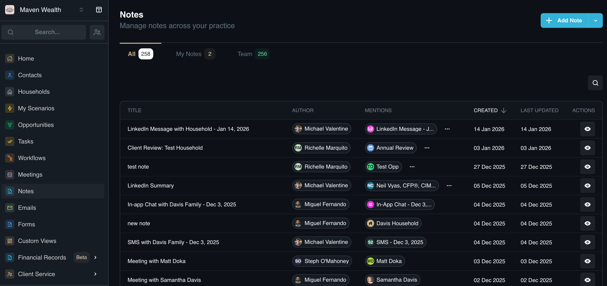
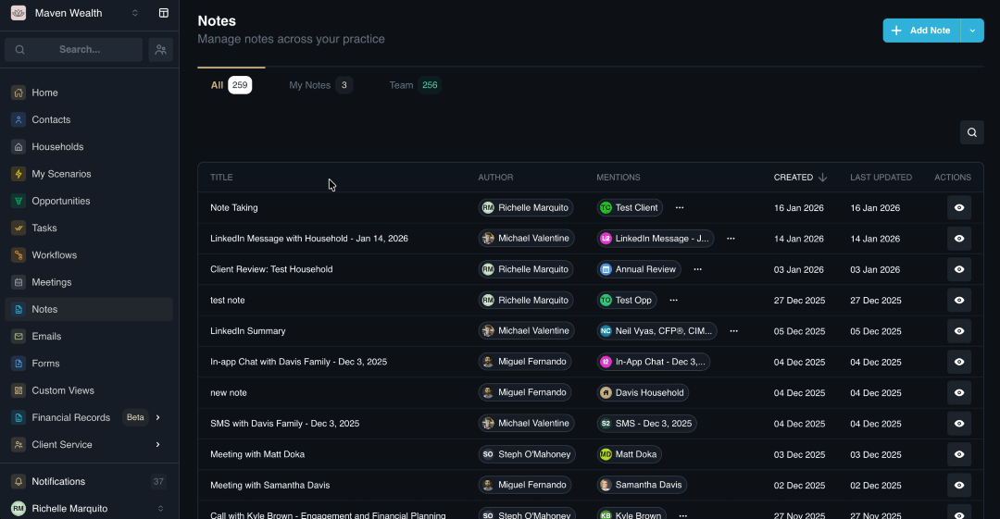
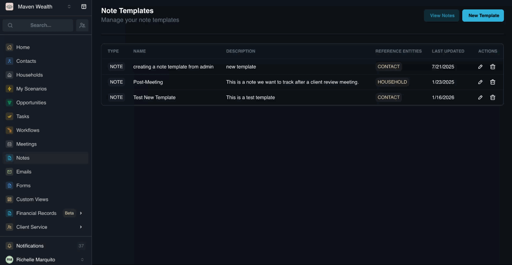
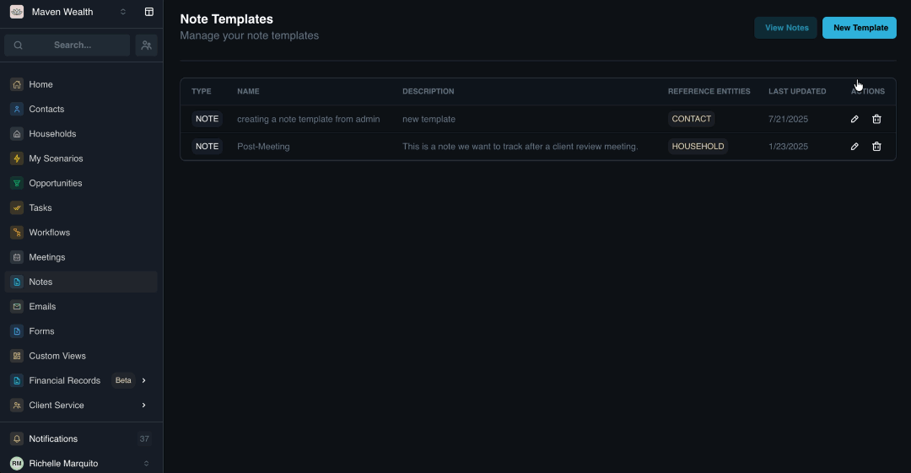

# Notes

## Overview

The **Notes** module is the primary tool for qualitative record-keeping within SuperAdvisor. It allows advisors and support staff to document interactions, observations, and meeting minutes in a structured, searchable format.

Unlike static text fields, **Notes** are dynamic. They support **Entity Linking**, **@Mentions** for team collaboration, and Templates for standardized reporting. Additionally, the platform's AI Assistant can draft notes automatically based on voice commands.

## The Notes Dashboard

The **Notes** page offers a centralized way to manage interactions across your entire practice. You can quickly filter by the creator or scope of the note.

### View Options

* **All:** Displays every note created across the firm.
* **My Notes:** Filters the list to show only notes created by you.
* **Team:** Shows notes created by other team members, useful for oversight and collaboration.

### Search

* **Search by Title:** Use the search bar at the top of the dashboard to quickly locate notes by their subject or keyword.

### Note Columns

The main area displays your documented activities in a list format.

* **Title:** The subject line of the note.
* **Author:** The team member who created the record.
* **Mentions:** Indicators if specific users were tagged in the note.
* **Created:** The date and time of original creation.
* **Last Updated:** The timestamp of the most recent edit or comment.
 
## How to Create a Note

You can create a note directly from the dashboard or from specific records.

1. Click the **Add Note** button.
2. The **Create Note** pop-up is displayed. You can fill in the following fields:
    * **Create from Template:** Select a pre-configured structure (e.g., Discovery Call) to load default headers.
    * **Linked Records:** Search and select the Contacts, Households, or Opportunities this note relates to.
    * **Note Title:** Enter a descriptive subject.
    * **Note Content:** Type your detailed observations or meeting minutes.
3. Click to confirm. The note is immediately indexed and linked to the selected records.

## How to View and Collaborate on Notes

1. Click on any note title to open the detailed view for review and team collaboration.
2. The system displays the note details:
    * **Metadata:** See exactly who created the note and when.
    * **Core Data:** View the full **Title**, **Linked Records**, and **Content**.
3. You can engage with the content using the collaboration tools at the bottom of the view:
    * **Leave a Comment:** Add follow-up thoughts or questions without altering the original text.
    * **Mentions:** Type @ followed by a team member's name in a comment to notify them directly.
    * **Add Image:** Upload screenshots, whiteboard photos, or documents directly into the comment thread for visual context.

## How to Create a Note via AI Assistant

The **SuperAdvisor Assistant** can generate notes for you using natural language processing, bypassing the manual pop-up entirely.

1. Click the **AI Assistant** icon from **Super Mode**.
2. Input your command via **Voice** or **Text** (e.g., “Create a note for [Client Name]. We discussed their new puppy and they want to see updated projections.”).
3. The AI will draft the note and display a preview.
4. Verify the content and the linked entity.
5. Confirm the action to save the note to the client's profile.

## Note Templates

**Note Templates** are pre-configured layouts designed to standardize data capture across your firm. Instead of starting with a blank page for every interaction, templates provide a consistent structure—complete with headers, default text, and attachments—ensuring that critical information is never missed during Client Reviews, Discovery Calls, or routine Check-ins.

### How to Manage Note Templates

1. Navigate to **View Templates** within the **Notes** module to access and maintain your template library.
2. The system displays a list of existing templates with the following details:
    * **Type:** The category classification of the template.
    * **Name:** The internal title of the template.
    * **Description:** Context on the template's intended use case.
    * **Reference Entities:** The specific record types this template applies to.
    * **Last Updated:** The timestamp of the most recent modification.
3. Click on any template to **Edit**. You can modify:
    * **Template Name** and **Template Description**.
    * **Attachments:** Manage any files linked to the template.
    * **Title** and **Body:** Update the default text content and structure.

### How to Create a New Note Template

You can build custom templates to standardize your notes.

1. In the **Notes Template** dashboard, click the **New Template** button.
2. The **Create Template** pop-up appears. Fill in the following fields:
    * **Template Name:** Give your template a clear, descriptive title.
    * **Record Type for Merge Fields:** Select the entity type to pull data from (*Contact, Household, Professional, or Team*).
    * **Template Description:** Add context for when this template should be used.
    * **Attachments:** Upload any standard documents or reference files.
    * **Title and Body:** Draft the default structure and content of the note.
3. Click **Save** to add the template to your library.

