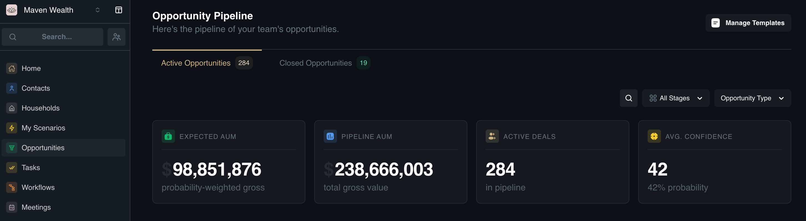
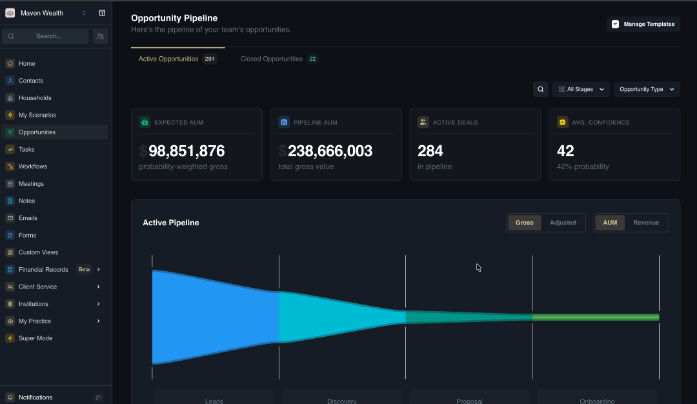
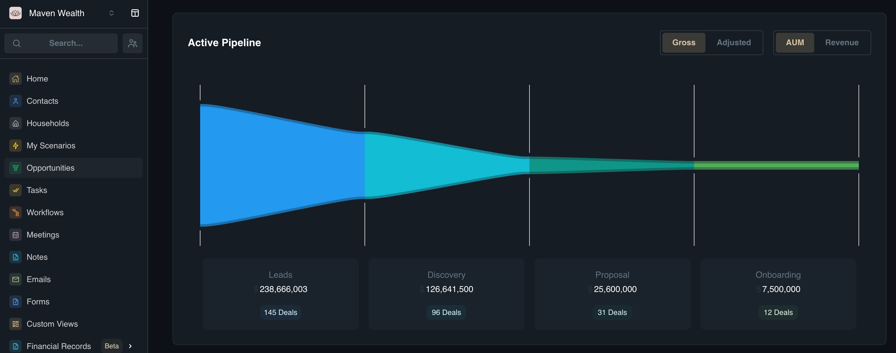
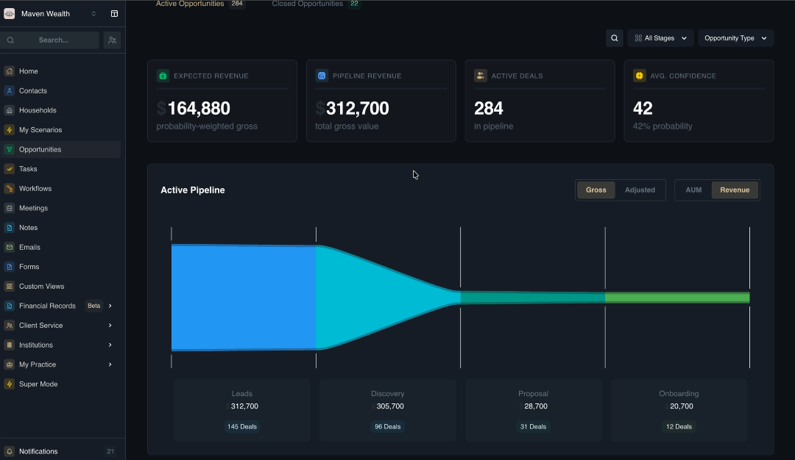
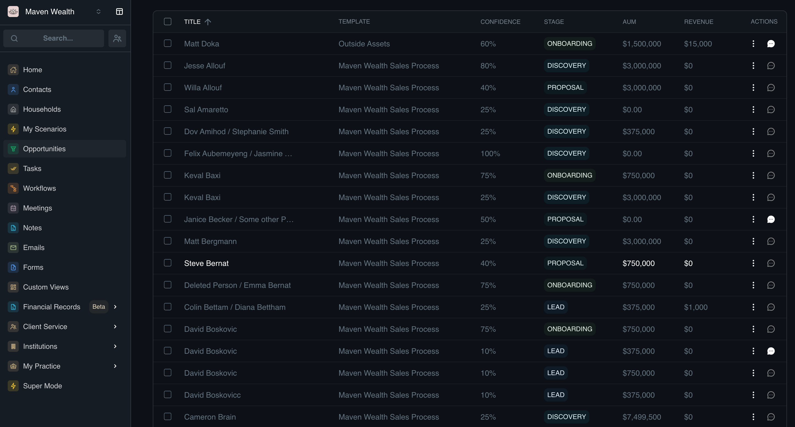
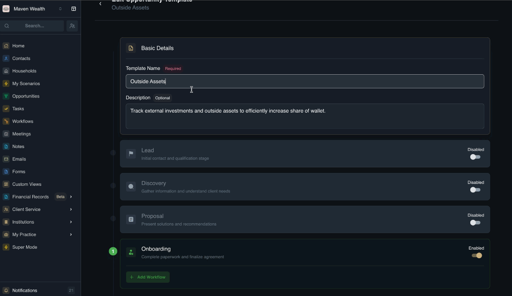

# Opportunities

## Overview

The **Opportunities** page is your central hub for managing opportunity pipelines and tracking revenue potential from initial lead to closed client. It distinguishes "Prospects" from active "Clients," allowing you to nurture deals through defined stages (e.g., Discovery, Proposal) to ensure no potential business is lost.

This module feeds directly into the Home dashboard's pipeline widget for at-a-glance revenue forecasting. Additionally, it integrates with Workflows, where successfully closing an opportunity (marking it "Closed Won") can automatically trigger subsequent processes, such as a new client onboarding workflow.

## The Opportunities Dashboard

The main dashboard provides a high-level command center for tracking revenue and deal flow.
* **View Options:**
    * **Active Opportunities:** Deals currently in progress.
    * **Closed Opportunities:** Deals that have been won or lost.
* **Search & Filters:**
    * **All Stages:** Filter deals by specific phases ().
    * **Opportunity Type:** Filter by the kind of deal.

* **Pipeline Metrics:** These metrics provide a snapshot of your pipeline's health. The specific values displayed will change based on your Toggle selections (AUM/Revenue and Gross/Adjusted).
    * **Expected AUM:** The probability-weighted value of all assets in your pipeline.
    * **Pipeline AUM:** The total raw value of all assets in your pipeline (unweighted).
    * **Expected Revenue:** The probability-weighted adjusted value of fees you expect to earn.
    * **Pipeline Revenue:** The total adjusted value of all potential fees.
    * **Active Deals:** The total number of deals currently in the pipeline.
    * **Avg. Confidence:** The average probability (confidence %) of closing across all active deals.

* **View Toggles:** The toggles allow you to shift the perspective of your data for deeper analysis:
    * **Gross / Adjusted:** 
        * **Gross (Total Value):** Shows the "best-case scenario" sum of all potential deals, regardless of likelihood.
        * **Adjusted (Probability Weighted):** Shows a realistic forecast by multiplying the Gross Value by the Confidence % of each deal (e.g., a $1M deal at 50% confidence counts as $500k).
    * **AUM / Revenue:**
        * **AUM (Assets Under Management):** Displays the value of the client assets being brought in (e.g., "Size of the book").
        * **Revenue:** Displays the actual fees or income expected from those assets (e.g., "Income generated").

### How to Understand Pipeline Metrics with Toggles

1. Locate the **Pipeline Metrics** at the top of the **Opportunities** dashboard.
2. Toggle to **AUM**. Observe the **Expected AUM** and **Pipeline AUM** to understand the total asset volume you are pitching.
3. Toggle to **Revenue**. Watch the metrics change to **Expected Revenue** and **Pipeline Revenue** to see the actual fee income impact on your business.
4. Toggle to **Adjusted**. This updates the **Expected** figures to reflect probability, giving you a conservative forecast.
5. Toggle to **Gross**. This updates figures to show the maximum potential value if every single deal closes successfully.

### Active Pipeline Visualizer

This is s graphical breakdown of your team's opportunities.
The chart breaks down the pipeline into stages: Leads, Discovery, Proposal, and Onboarding.
For each stage, you can see the Number of Deals, which is the count of active opportunities in that stage, and the total Amount ($) currently sitting in that phase.

### How to Analyze the Pipeline

1. Locate the **Active Pipeline** chart on the dashboard. This visualizes your opportunities.
2. Use the toggle buttons (Gross/Adjusted) above the chart to switch between:
    * **Gross:** The total value of all deals in the pipeline.
    * **Adjusted:** The probability-weighted value (Gross Value * Confidence %), providing a more realistic forecast.
3. Click the other toggle buttons (AUM/Revenue) to switch between:
    * **AUM:** Assets Under Management (portfolio size).
    * **Revenue:** Expected fee income.
4. Notice that the dollar amount updates dynamically based on your **Gross/Adjusted** and **AUM/Revenue** selections.

* **Opportunity List:** The detailed list of opportunities includes:
    * **Template:** The process blueprint being used (e.g., "Maven Wealth Sales Process").
    * **Actions:** Quick links to edit or update.
    * **Owner:** The advisor managing the deal.
    * **Confidence:** The likelihood of closing (e.g., "80%").
    * **Stage:** Current status ().
    * **AUM / Revenue:** The financial value associated with the deal.

## Opportunity Management

This section covers the core functions for handling your opportunities pipeline, from creating new deals to managing them through the lifecycle and customizing the templates they are based on.

### How to Create an Opportunity from a Household

1. Navigate to the specific **Household** or a **Contact** record.
2. Click on **Opportunity** in the secondary side menu.
3. Ensure there are no active deals. 
:::note[NOTE]
If an opportunity is already running, you will see an error: "An active opportunity already exists for this household."
:::
4. Click the **Create New Opportunity** link.
5. Configure the following:
    * **Opportunity Name:** Enter a descriptive title (e.g., "Walton Household - New Investment").
    * **Opportunity Template:** Select the appropriate process from the dropdown (e.g., "Maven Wealth Sales Process").
6. Once created, you will be redirected to the detailed opportunity page.

### How to Manage an Opportunity

There are two ways to update active deals, depending on where you are currently working in the platform.

* **Option 1: From the Opportunities Dashboard**

1. Navigate to **Opportunities** in the sidebar and ensure the **Active Opportunities** view is selected.
2. Find the specific deal you wish to update in the list.
3. Click on the **kebab menu** (vertical dots) to show the options: Confidence, Set Est. AUM, Set Est. Revenue.
4. Click **Confidence** option with a new probability percentage based on your latest interactions.
5. Click **Set Est. AUM** or **Set Est. Revenue** to refine the deal's financial value.
6. Click the **Notes** icon to log quick updates, such as "Client requested a revised proposal."

* **Option 2: From the Contact or Household Record**

1. Navigate to the specific **Contact** or **Household** page.
2. Open the **Opportunities** link within their record.
3. Select the active opportunity to open its detailed view. Here you can edit the Name, Template, and financial metrics (Est. Revenue, Est. AUM, Confidence).
4. View the pipeline to see exactly where the deal stands (Lead, Discovery, Proposal, Onboarding, Closed).
5. Manage any specific tasks tied to this deal.
6. Use the action buttons to move the deal forward: select **Continue to next stage** to advance, or resolve the deal by choosing **Close as Won** or **Close as Lost**.

### How to Create an Opportunity Template
You can create standardized templates to define your stages.

1. Navigate to **Opportunities** > **Manage Templates**. 
2. Click **Create Template** to start fresh, or select an existing one to make edits.
3. Enter a **Template Name** and add a **Description** to help the team understand when to use this specific process.
4. The pipeline consists of four distinct stages: Lead, Discovery, Proposal, and Onboarding. You can customize this flow by enabling or disabling specific steps to match your business needs. When you disable a stage, the system automatically adjusts the numbering sequence, counting only the active stages in their original order to ensure a continuous progression.
5. You may also select a specific Workflow Template from the dropdown menu to trigger automatically for each stage. Check the **Auto-progress** to next stage box if you want the deal to advance automatically when the work is done. 
6. Click **Save Changes** to finalize the template.

