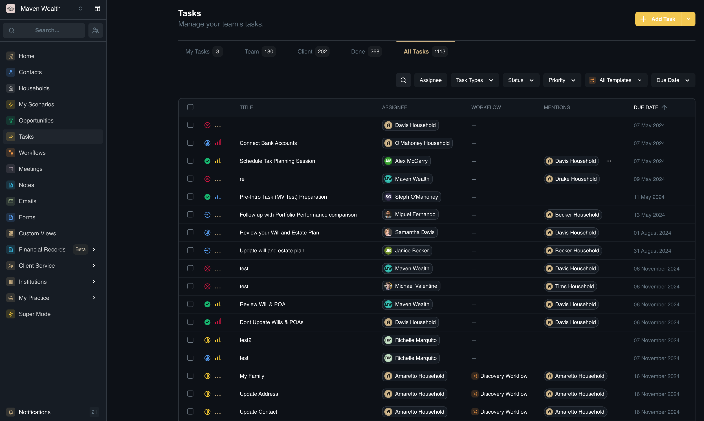
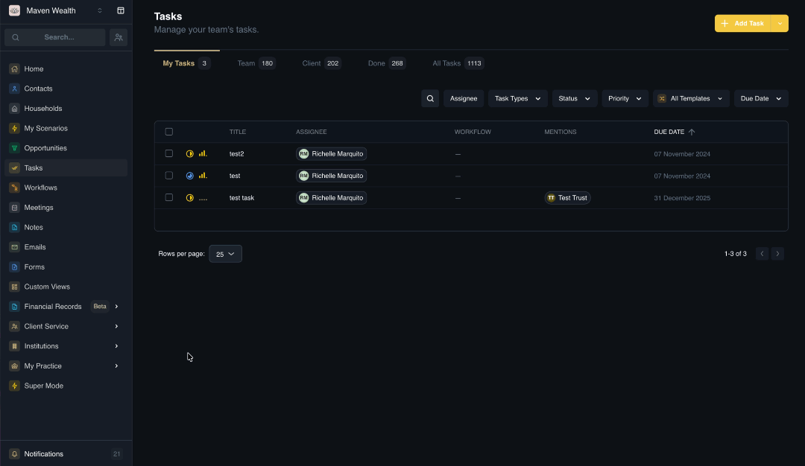
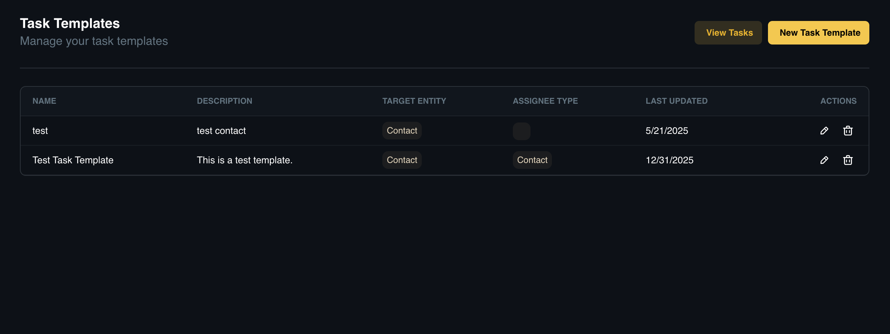
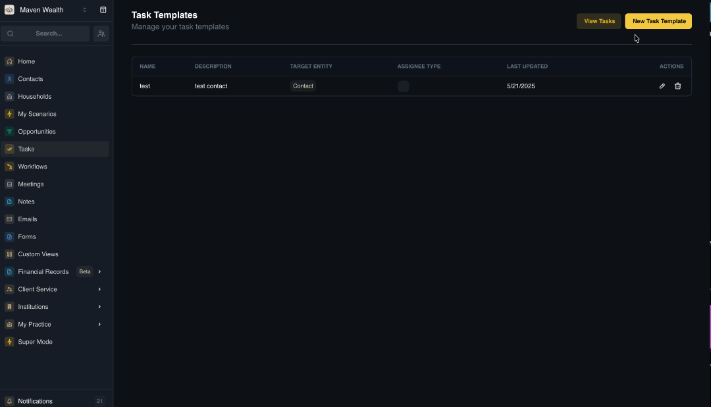
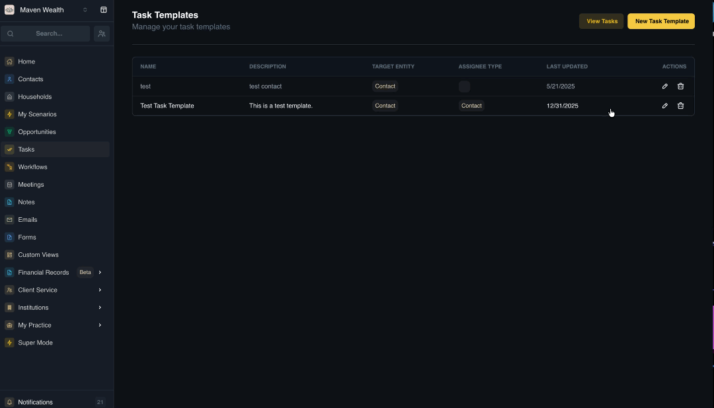
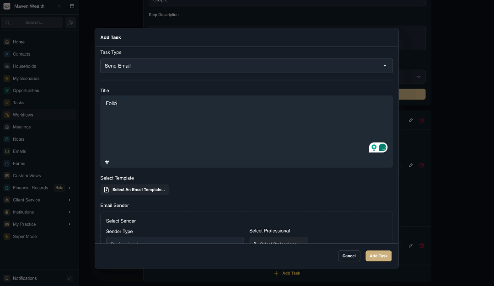
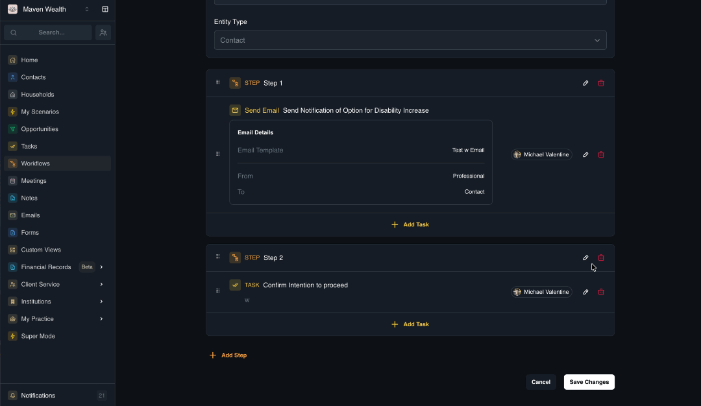
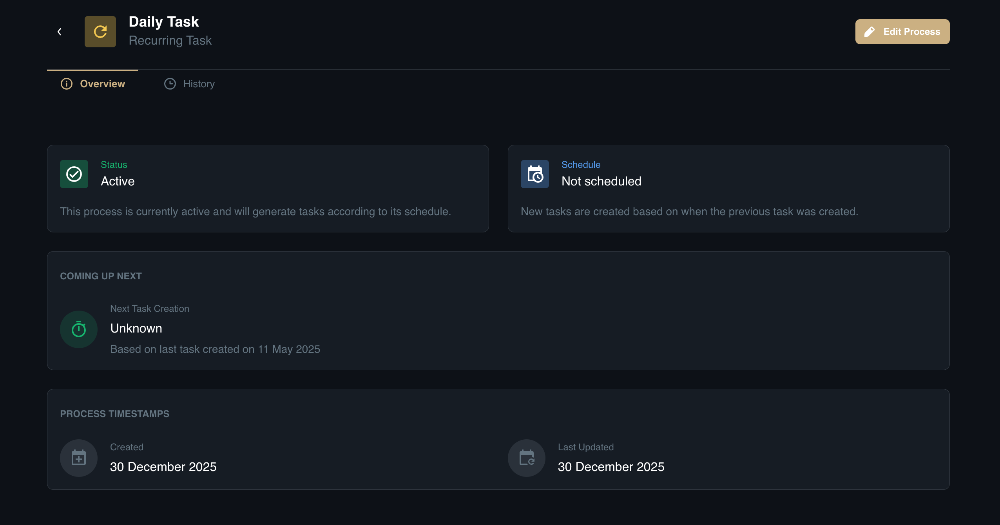
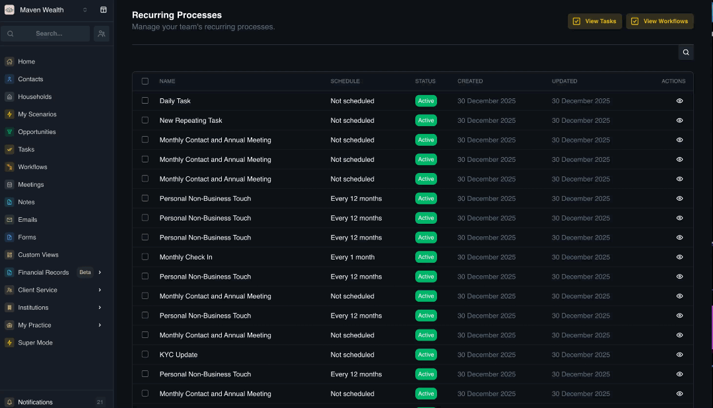

# Tasks

## Overview

The **Tasks** page serves as your team's centralized to-do list, enabling you to assign specific actions with clear deadlines to individual team members. This system ensures accountability and prevents critical client requests from being overlooked, as every task is visible to the team, linked directly to a client record, and fully trackable—unlike personal sticky notes.

Tasks are tightly integrated with other modules: Workflows automatically generate tasks (e.g., "Prepare Paperwork") as part of larger processes, and tasks appear on the Household "Activity Feed," creating a comprehensive history of work performed for that family.

This section covers:

* [**Dashboard Views:**](#dashboard) How to navigate personal and team workloads.

* [**Task Management:**](#task-management) How to create, filter, and update daily activities.

* [**Task Templates:**](#task-templates) Tools for standardizing and automating task generation.

* [**Recurring Processes:**](#recurring-processes) How to automate repeating tasks on a set schedule.

## Dashboard

The **Tasks Dashboard** acts as your central command center, providing a real-time, filterable overview of all pending and completed actions across your entire organization.

### View Options

The **Tasks** page provides a flexible interface for organizing your workload:
* **My Tasks:** Shows only work assigned to you.
* **Team:** Shows all open tasks in the organization.
* **Client:** Filters the list for specific households.
* **Done:** An archive of completed work.
* **All Tasks:** The master list of every task in the system.

### Search & Filters

You can refine the task list using the following criteria:

* **Assignee:** The team member responsible.
* **Task Types:** Task template used.
* **Status:** The state of the task (e.g., Todo, In Progress).
* **Priority:** Urgency level (e.g., High, Low).
* **Templates:** Filter tasks based on the workflow template used.
* **Due Date:** Deadlines for completion.

:::note NOTE
If your filters do not match any records, the system will display a "No tasks found. No tasks match your search criteria" message.
:::

### Task List Columns
* **Task List:** The main table displays key details to help you scan your list quickly.
    * **Title:** The name of the task.
    * **Assignee:** The team member responsible for completion.
    * **Workflow:** Indicates if the task is part of a larger automated workflow.
    * **Mentions:** Highlights if you or others have been tagged in the task comments.
    * **Due Date:** The deadline for completion.

:::note NOTE
If your selected filters do not match any records, the system will display a "No tasks found. No tasks match your search criteria" message. 
:::

## Task Management

Use this section to organize and execute daily activities, ensuring deadlines are never missed.

### How to Create a Task

Use this feature to generate a new action item and link it to a specific record for context.

1. Navigate to the **Tasks** sidebar and click the **Add Task** button.
2. Fill out the **Create a Task** pop-up:
    * **Task Title:** Enter a clear name for the activity.
    * **Select from Template:** Choose a pre-defined structure.
    * **Assigned to / Due by:** Select the team member and set the deadline.
    * **Status:** Set the current state (e.g., Todo).
    * **Linked Records:** Search and select the entity (e.g., Contact, Household, Corporation).
    * **Repetition:** Set a recurrence schedule or confirm "This task does not repeat".
    * **Description:** Add detailed context or instructions.
3. Click **Save**.

### How to Manage Your Tasks

Use this feature to track your progress and archive finished work.

1. Navigate to the **Tasks** page and click the **My Tasks** tab.
2. Select the task you want to update. 
3. Change the **Status** to *Done*.

**Result**

The task will automatically move to the **Done** tab for historical tracking.

## Task Templates

Standardize your team's output by using templates for common activities or setting up automated recurrence.

### Task Templates Page

This page serves as the management hub for all your task blueprints. The table displays:

* **Name:** The display name of the template.
* **Description:** A summary of the template's purpose.
* **Target Entity:** The record type it applies to (e.g., Contact, Household).
* **Assignee Type:** The role or group assigned by default.
* **Last Updated:** The date the template was last modified.

From this page, you can select the Edit icon to modify a blueprint or the Trash icon to delete an unnecessary template.

### How to Create a Task Template

Use this feature to build a blueprint for your most common team actions.

1. Navigate to **Tasks** and click the **View Templates** link.
2. Click the **New Task Template** button.
3. Enter the **Template Name** and **Template Description**.
4. Select the **Target Entity Type** (*Contact, Household, or Professional*).
5. Complete the **Task Configuration**:
    * **Title / Description:** Define the default task name and instructions.
    * **Due date (days after creation):** Enter the number of days until the task is due.
    * **Assignee Type:** Choose from Professional, Team, or Group.
    * **Assignee:** Select the specific user or role based on the type.
6. Click **Save**.

### How to Edit an Existing Template

1. Navigate to the **Task Templates** list.
2. Locate the specific template you wish to change and click the **Edit** icon.
3. Update the same details (*Name, Target, or Configuration*) as you would when creating a new template.
4. Click **Update** to apply your changes.

### How to Configure Task Types for Workflows

Whether you are [building a new **Workflow Template**](../components/workflows#how-to-manage-workflow-details) or updating an existing process, selecting the correct **Task Type** is essential. This setting defines how the step functions and unlocks the specific tools needed to complete that action.

**Basic Task**

*Use this for standard to-do items and simple action steps.*

1. Enter a **Title** and **Description** to provide clear instructions for the team member.
2. Set the **Due Date (days)** to establish a deadline.
3. Select the **Due After** trigger to decide if the deadline counts from the **Step Start** or the **Workflow Start**.
4. Define the **Assignee Type** (e.g., Team, Group, or Professional) and **Specify Assignee **to designate the responsible party.

**Send Email**

*Use this to automate client or internal communication.*

1. Enter a **Title** for the email step.
2. Select a pre-written message from your Email Template library.
3. Choose the **Email Sender** by selecting a **Sender Type** and specifying the individual or group.
4. Configure the **Recipient** by setting the **Assignee Type** to determine who receives the message.

**Meeting Task**

*Use this to schedule and manage client interactions.*

1. Enter a **Task Title** (e.g., "Schedule Annual Review").
2. Select the **Meeting Host** and add any **Additional Participants** required for the meeting.
3. Choose a **Meeting Template** to set the agenda and a **Schedule Template** to define the availability window.
4. Set the **Task Completion** trigger by choosing either **When Meeting is Scheduled** or **When Meeting Is Completed**.
5. Define the **Assignee Type** to determine who is responsible for managing the booking.

**Form Task**

Use this for digital paperwork and questionnaires.

1. Enter a **Title** for the task (e.g., "Complete Risk Questionnaire").
2. Choose the specific **Form Template** you want to be completed or sent.
3. Select the **Assignee Type** and **Specify Assignee** to determine which team member or role is responsible for the form's completion or review.

## Recurring Processes

Recurring Processes allow you to automate the generation of tasks based on a specific schedule (e.g., Monthly Billing Review, Quarterly Compliance Check). This ensures that routine maintenance work is never missed.

### The Recurring Processes Page

This page acts as a central hub for managing your team's repeating workloads. The list provides a quick snapshot of all automated schedules currently set up in the system.

**List Columns:**

* **Name:** The name of the process.
* **Schedule:** The frequency of task creation.
* **Status:** Indicates if the process is currently active.
* **Created / Updated:** Timestamps for the process setup.

### The Recurring Process Details Page

When you click on a specific process from the list, the system opens a detailed view divided into two tabs:

* **Overview Tab**

    *Use this tab to monitor the health and schedule of the process.*

    * **Status:** The current operational state (Active/Inactive).
    * **Schedule:** The defined repeat frequency.
    * **Coming up next:** The exact date the next task instance will be created.
    * **Process Timestamps:** Shows the Created and Last Updated dates for the process configuration.

* **History Tab**

    *Use this tab to audit past performance.*

    * **Created:** The date a specific task instance was generated.
    * **Status:** The current state of that specific task (e.g., Done, In Progress).

### How to Create and Monitor Recurring Processes

Use this to automate repeating items like "Monthly Billing Review" or "Annual Compliance Check."

1. Navigate to the **Recurring Processes** page.
2. Click on a task to open the **Details** page.
    * **Overview Tab:** Monitor the Status, Schedule, and the Coming up next (date of next task generation).
    * **History Tab:** View the status of every task instance previously created by this process.
3. Click **Edit Process** to modify it.
4. Enter or update the **Process Name**.
5. **Activate the Process:** Toggle the switch to Process is active and will generate tasks. (Turning this off pauses the automation).
6. **Set the Schedule:**
    * **Repeat Frequency:** Define how often the task repeats (e.g., Daily, Weekly, Monthly).
    * **Schedule From:** Choose whether the schedule calculates based on the Last Created task or the Last Updated date.
7. **Select Template:** Choose the **Task Template** you created in the previous step. This determines the Title, Description, Due Date, and Assignee for every instance generated.
8. Click **Save**.

