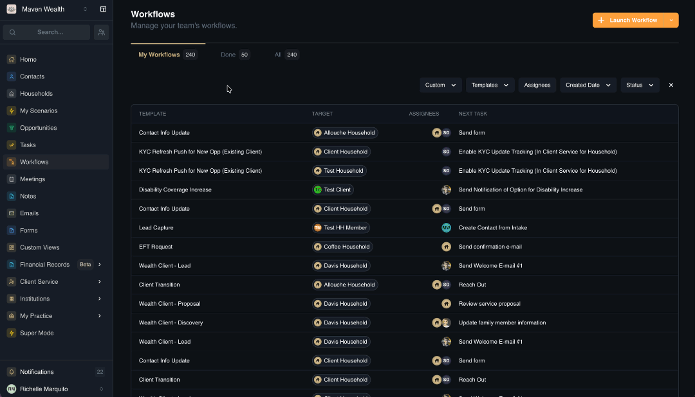

# Workflows

## Overview

Workflows serve as the platform's automation engine, enabling you to standardize complex operational processes—such as client onboarding—into repeatable, error-proof checklists of tasks and automated communications. By building a workflow template once, you ensure consistency and scalability across your practice, guaranteeing every client receives the same high-quality experience without requiring you to manually remember every step.

These workflows are deeply integrated into the platform's ecosystem to drive efficiency. They are typically launched directly from a Contact record, instantly triggering a sequence of events that populate the Tasks module for your team. This seamless connection ensures that strategic plans defined in a workflow automatically translate into actionable daily to-dos, keeping your team aligned and accountable.

This guide covers:

* [**Workflows Dashboard:**](./workflows#workflows-dashboard) Monitoring progress and identifying bottlenecks.
* [**How to Launch a Workflow:**](./workflows#how-to-launch-a-workflow) Triggering processes from profiles or the dashboard.
* [**Managing Workflow Details:**](./workflows#how-to-manage-workflow-details) Modifying steps, tasks, and data tracking.

## Workflows Dashboard
The **Workflows** dashboard provides a structured view of every automated process currently running in your system. It allows you to monitor progress at a high level, ensuring nothing falls through the cracks and helping you spot potential bottlenecks early.

### Workflow Views
* **My Workflows:** Displays only the processes assigned to you. Use this to track your active responsibilities. 
* **Done:** An archive of completed workflows. Use this to review history or confirm a process is finished. 
* **All:** The master list of every workflow in the system, regardless of status or assignee.

### Filters 
You can refine the list to find specific types of work using the dropdown filters:
* **Assignees:** View all workflows currently managed by a specific team member.
* **Templates:** Filter to see only specific processes (e.g., show only "Contact Info Update" workflows).
* **Status:** Filter by the completion state to see what is active or finished.
* **Created Date:** View workflows started within a specific timeframe.
* **Workflow Types:** Filter based on specific custom data points attached to the workflow.

### Workflows List
The dashboard table gives you a snapshot of each active workflow:
* **Template:** The name of the standard process being used (e.g., "Disability Coverage Increase").
* **Target:** The specific client or household this workflow involves (e.g., "Test Client").
* **Assignees:** The team members responsible for the current or upcoming steps.
* **Next Task:** The immediate action required to keep the process moving (e.g., "Send Notification").
* **Status:** The current state of the workflow (e.g., In Progress).
* **Created Date:** The date the process was started.

## How to Launch a Workflow

There are two primary ways to initiate a workflow, depending on where you are working in the platform.

**Option 1: From a Profile (Contact or Household)**

1. Navigate to the specific Contact or Household Profile.
2. Click the **Create Activity** button and select **Workflow**. The **Launch Workflow** pop-up will appear.
3. Select a **Workflow Template** from the dropdown menu.
4. Verify the **Select Target** field.
:::note NOTE
This is auto-populated based on the profile you are viewing. If you are on a Contact profile, it pulls associated household head contacts; if on a Household, it defaults to the current household.
:::
5. Populate any **Custom Fields** or add **Notes** specified by the template.
6. Click **Launch Workflow**.

**Option 2: From the Workflows Dashboard**

1. Navigate to the **Workflows** page from the main sidebar.
2. Click the **Launch Workflow** button to open the pop-up.
3. Select a **Workflow Template** from the dropdown.
4. In the **Select Target** field, choose from the available options (Household or Contact) depending on the template's configuration.
5. Fill in any required **Custom Fields** or **Notes** specific to this instance.
6. Click **Launch Workflow**.
**Result**
7. You will be redirected to the newly created **Workflow** page where you can view the current steps, leave a comment, or view the **Workflow Details** page.

## How to Manage Workflow Details

Use this feature to customize an active process or update its structure.

### Editing Workflow Identity and Custom Fields

**Steps**

1. Open the specific workflow and click the **Manage Workflow** icon.
2. Click **Edit Name** to open the Template Name pop-up.
3. Modify the **Template Name** as needed and click **Update Name**.
3. Select **Add Custom Field** to track unique data points specific to this workflow instance.

### Managing Workflow Steps

Use this feature to modify the lifecycle of a standardized process.

**Steps**

1. Click the **Manage Workflow** icon and select **Edit Steps**.
2. Review the **Entity Type** (**Contact, Household, Professional**).
:::note NOTE
This field is read-only and is defined during template creation.
:::
3. Click on an existing step to modify its **Name**, **Description**, or **Depends On** logic.
4. Click the **Add Step** button to insert new stages into the process.
5. Within each step, you can add new tasks, edit existing task details, or delete them.
6. Use the drag handles to reorder steps or tasks, or the **Trash** icon to delete unnecessary items.
7. Click **Save Changes**.

