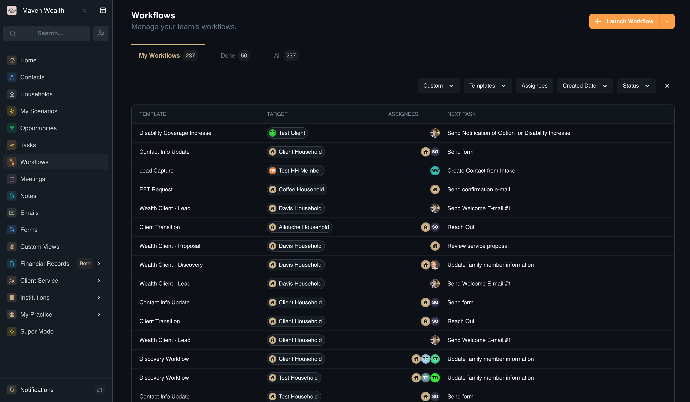
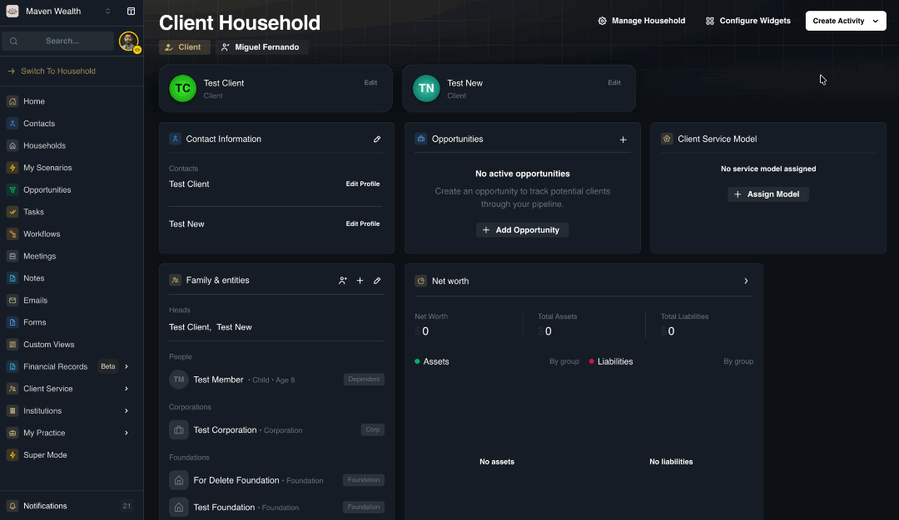
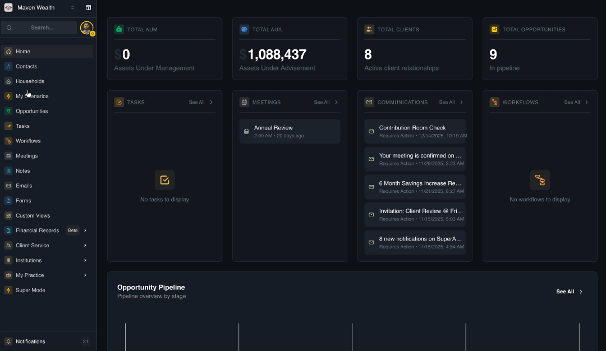

# Workflows

## Overview

Workflows serve as the platform's automation engine, enabling you to standardize complex operational processes—such as client onboarding—into repeatable, error-proof checklists of tasks and automated communications. By building a workflow template once, you ensure consistency and scalability across your practice, guaranteeing every client receives the same high-quality experience without requiring you to manually remember every step.

These workflows are deeply integrated into the platform's ecosystem to drive efficiency. They are typically launched directly from a Contact record, instantly triggering a sequence of events that populate the Tasks module for your team. This seamless connection ensures that strategic plans defined in a workflow automatically translate into actionable daily to-dos, keeping your team aligned and accountable.

This guide covers:

* [**Workflows Dashboard:**](./workflows#workflows-dashboard) Monitoring progress and identifying bottlenecks.
* [**How to Launch a Workflow:**](./workflows#how-to-launch-a-workflow) Triggering processes from profiles or the dashboard.
* [**Managing Workflow Details:**](./workflows#how-to-manage-workflow-details) Modifying steps, tasks, and data tracking.

## Workflows Dashboard
The **Workflows** dashboard provides a structured view of every automated process currently running in your system. It allows you to monitor progress at a high level, ensuring nothing falls through the cracks and helping you spot potential bottlenecks early.

### Workflow Views
* **My Workflows:** Displays only the processes assigned to you. Use this to track your active responsibilities. 
* **Done:** An archive of completed workflows. Use this to review history or confirm a process is finished. 
* **All:** The master list of every workflow in the system, regardless of status or assignee.

### Filters 
You can refine the list to find specific types of work using the dropdown filters:
* **Assignees:** View all workflows currently managed by a specific team member.
* **Templates:** Filter to see only specific processes (e.g., show only "Contact Info Update" workflows).
* **Status:** Filter by the completion state to see what is active or finished.
* **Created Date:** View workflows started within a specific timeframe.
* **Workflow Types:** Filter based on specific custom data points attached to the workflow.

### Workflows List
The dashboard table gives you a snapshot of each active workflow:
* **Template:** The name of the standard process being used (e.g., "Disability Coverage Increase").
* **Target:** The specific client or household this workflow involves (e.g., "Test Client").
* **Assignees:** The team members responsible for the current or upcoming steps.
* **Next Task:** The immediate action required to keep the process moving (e.g., "Send Notification").
* **Status:** The current state of the workflow (e.g., In Progress).
* **Created Date:** The date the process was started.

## How to Launch a Workflow

There are two primary ways to initiate a workflow, depending on where you are working in the platform.

**Option 1: From a Profile (Contact or Household)**

1. Navigate to the specific Contact or Household Profile.
2. Click the **Create Activity** button and select **Workflow**. The **Launch Workflow** pop-up will appear.
3. Select a **Workflow Template** from the dropdown menu.
4. Verify the **Select Target** field.
:::note NOTE
This is auto-populated based on the profile you are viewing. If you are on a Contact profile, it pulls associated household head contacts; if on a Household, it defaults to the current household.
:::
5. Populate any **Custom Fields** or add **Notes** specified by the template.
6. Click **Launch Workflow**.

**Option 2: From the Workflows Dashboard**

1. Navigate to the **Workflows** page from the main sidebar.
2. Click the **Launch Workflow** button to open the pop-up.
3. Select a **Workflow Template** from the dropdown.
4. In the **Select Target** field, choose from the available options (Household or Contact) depending on the template's configuration.
5. Fill in any required **Custom Fields** or **Notes** specific to this instance.
6. Click **Launch Workflow**.
**Result**
7. You will be redirected to the newly created **Workflow** page where you can view the current steps, leave a comment, or view the **Workflow Details** page.

## How to Manage Workflow Details

Use this feature to customize an active process or update its structure.

1. After creating a workflow, you are automatically redirected to the **Workflow Details** page. Here you can view the current steps and add comments.
2. Click the **Manage Workflow icon** to reveal the edit options: **Edit Name** and **Edit Steps**.
3. **Edit Name:**
    * Click **Edit Name** to open the Template Name pop-up.
    * Modify the **Template Name** as needed.
    * Click **Update Name** to save changes.
4. **Edit Steps:**
    * Click **Edit Steps** to open the full **Workflow Details** configuration screen.
    * You can modify the **Template Name** here as well.
    * View the target **Entity Type** (*Contact,Household, Team*).
    :::note NOTE
    This field is read-only and is defined during template creation.
    :::
5. **Modify Structure:**
    * Click on an existing step to modify its details (*Step Name, Step Description, Depends On*).
    * Click the **Add Step** button to insert new stages into the process.
    * Within each step, you can add new tasks, edit existing task details, or delete them.
    * Use drag-and-drop handles to reorder steps or tasks, and use the trash icon to delete unnecessary items.
6. **Custom Fields:** You can add or modify Custom Fields associated with this specific workflow instance to track unique data points.

## How to Manage Workflow Templates
This section outlines the complete lifecycle of managing workflow blueprints, from creation to refinement. You can build templates manually for precise control, use AI to generate complex structures instantly, or modify existing workflows to adapt to new business needs.

### How to Create a New Workflow Template (Manual)

*Use this method to build a workflow blueprint from scratch.*

1. Navigate to **Workflows** and select the **View Templates** option.
2. Click **New Template**.
3. Enter the **Template Name** and select the **Entity Type** (*Contact, Household, or Team*).
4. Click **Add Step** to add the first stage of the process.
5. Within each step, add specific action items.
6. Click **Create Template** to save.

### How to Generate a Workflow Template with AI

*This advanced method allows you to generate complete workflow structures using AI.*

1. Open [ChatGPT](https://chatgpt.com/share/6748d10d-90d0-8007-9fd7-3b61c3ba7dac). This gives ChatGPT the correct template that we use so it will understand how to properly format the JSON (code output for software). 
2. Use the prompt: "I want to create a workflow template for SuperAdvisor in JSON. Please use this format, group related tasks into steps, and output the JSON. Here’s what I want the workflow to do: [describe your process]."
:::note EXAMPLE
I want a workflow for onboarding a new client: step 1 is to review their profile, step 2 is to send them a documentation request...
:::
3. ChatGPT will generate the JSON text for you. Copy the full JSON output (from the first  to the last ).
:::note NOTE
If you want to change something, just tell ChatGPT: “Add another step for confirming with the client” or “Change due dates to 7 days instead of 3”. It will regenerate the JSON with your edits.
:::
4. Save the JSON File.
* **Windows (Notepad)**
    - Copy the full JSON text from ChatGPT.
    - Open **Notepad** (Start > type “Notepad”).
    - Paste the JSON into Notepad.
    - Go to **File > Save As…**
        - **File name:** `workflow.json`
        - **Save as type:** **All Files (*.*)**
        - **Encoding:** **UTF-8**
    - Click **Save**.
    :::tip TIP
    If Windows adds “.txt” by mistake (e.g., `workflow.json.txt`), right-click the file > **Rename** > remove `.txt`.
    :::
* **Mac (TextEdit)**
    - Copy the full JSON text from ChatGPT.
    - Open **TextEdit**.
    - Go to **TextEdit > Settings/Preferences** and set:
        - New Document: Plain Text
        - Turn off “Smart Quotes” and “Smart Dashes.”
    - Paste the JSON into the document.
    - Go to **File > Save As…**
        - **Save As:** `workflow.json`
        - Choose **UTF-8** encoding.
        - If it defaults to `.txt`, type `.json` manually.
    - Click **Save**.
    :::tip TIP
    If Finder hides extensions and you see `workflow.json.txt`, enable **Show all filename extensions** in Finder settings, then rename.
    :::

### Importing and Exporting Workflow Templates

* **Importing:** Use this feature to upload pre-built workflow templates (e.g., industry-standard processes shared by colleagues or SuperAdvisor). 
    1. Navigate to the **Templates** page and look for the **Import** option to upload a JSON or compatible file.
    2. Review the imported stages and assign tasks to the correct team members before saving.
    :::note TROUBLESHOOTING
    - **Invalid JSON:** Ensure you copied the entire block, including all brackets { }.
    - **File Extension:** Verify the file ends in .json and not .json.txt.
    :::

* **Exporting:** To share your custom workflows or back them up, select a template from your list and choose the Export option. This generates a file that can be imported into another SuperAdvisor instance.

### How to Edit a Workflow Template

1. Navigate to the **Workflow Templates** page.
2. Select the template you wish to modify.
3. Follow the same steps when you [customize a workflow.](../components/workflows#how-to-manage-workflow-details)